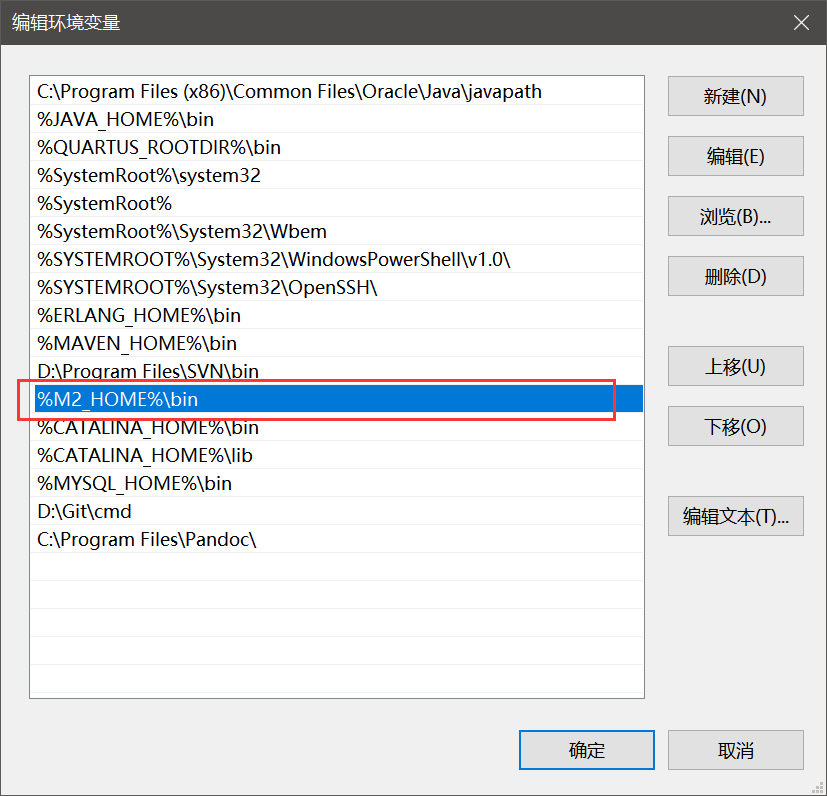
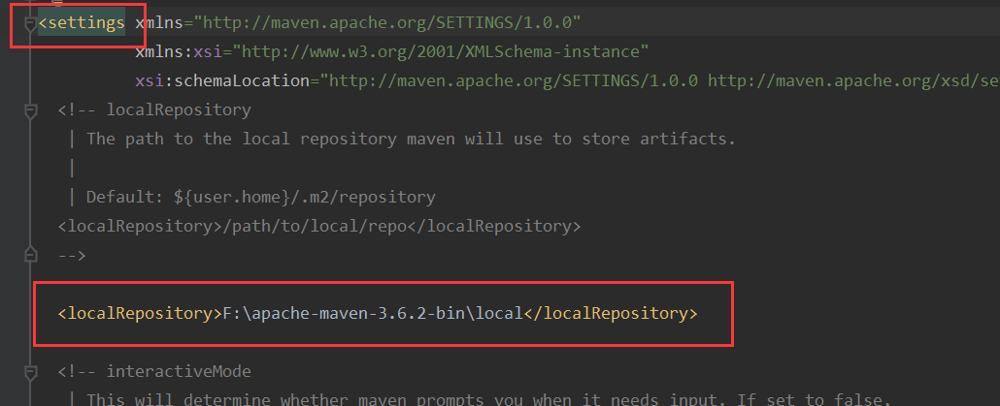
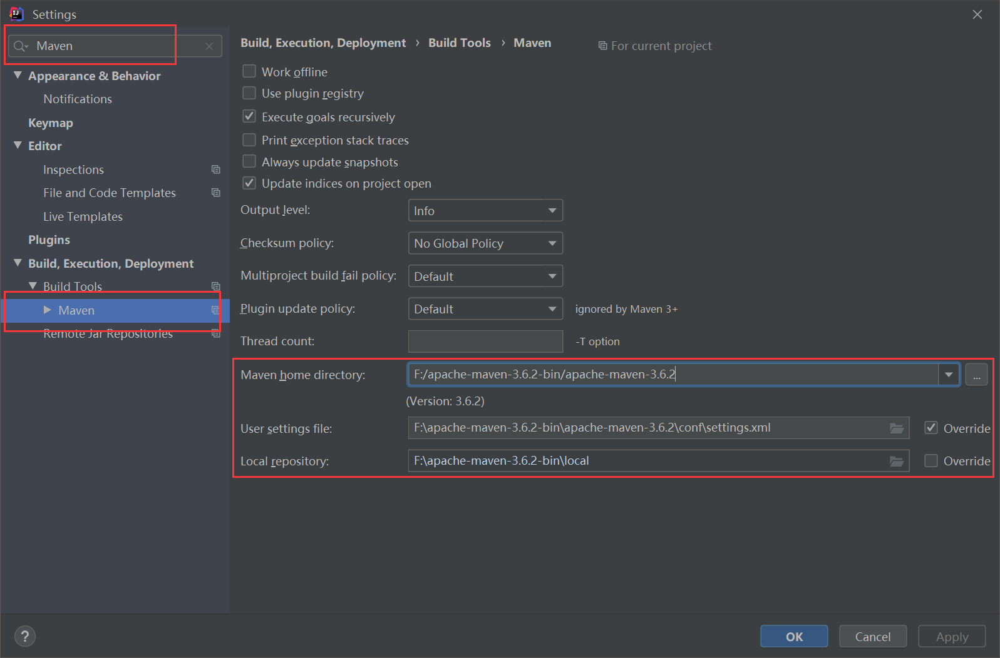
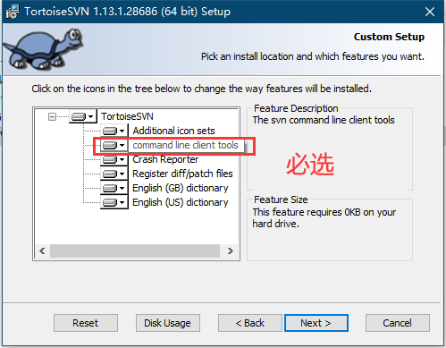
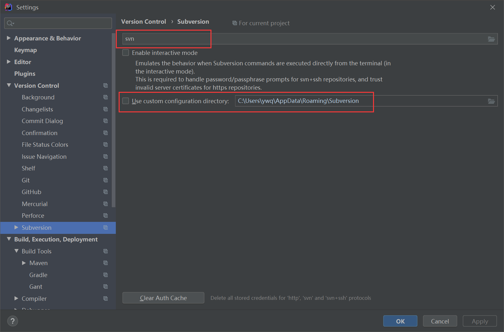
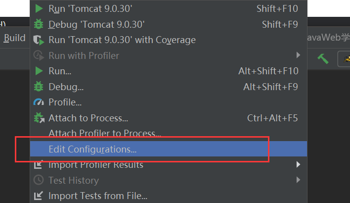
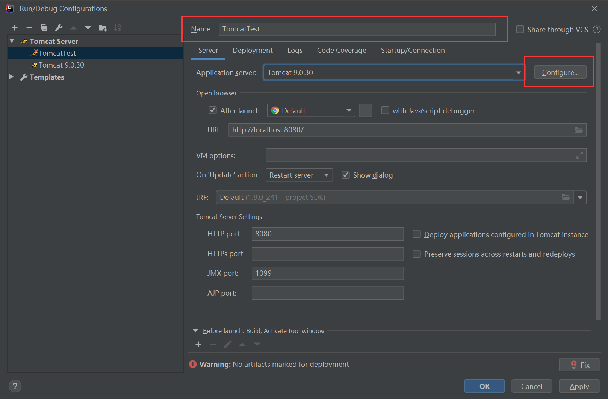
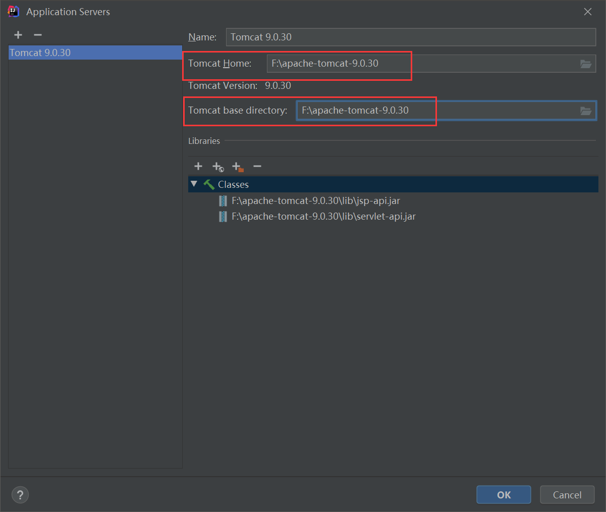

# IDEA配置

## Maven

### 1. 下载

官网下载地址：http://maven.apache.org/download.cgi


下载最新版本的即可

### 2. 安装

下载完成后，将下载到的压缩包解压即可。

文件目录：


### 3. 配置

#### 3.1 环境变量配置

添加系统变量：

- 变量名：M2_HOME
- 变量值：Maven解压目录


#### 3.2 编辑Path环境变量

在Path环境变量处，增加新的变量值：

- %M2_HOME%\bin



#### 3.3 cmd窗口测试

打开cmd，输入mvn -v检测


#### 3.4 创建本地仓库

Maven的作用可以简单的理解为下载项目所需jar包，既然需要下载jar包，那么就要指定jar包的下载目录，即本地仓库

1. 在自己选定的位置创建文件夹，作为本地仓库，来存放jar包
   
   local为我自己的本地仓库

2. 在Maven的配置文件seeting.xml文件中，添加上本地仓库的目录

   1. IDEA打开Maven目录下conf下的settings.xml文件
      可以看到，settings.xml文件中多数都为注释部分

   2. 在settings标签下添加本地仓库的绝对路径

      ```xml
      <localRepository>本地仓库的绝对路径</localRepository>
      ```

      

#### 3.5 增加国内镜像

增加国内镜像，可以大幅提高jar包下载速度

1. IDEA打开IDEA打开Maven目录下conf下的settings.xml文件

2. 在<mirrors>标签中增加如下代码：

   ```xml
   <mirror>
   <id>alimaven</id>
   <mirrorOf>central</mirrorOf>
   <name>aliyun maven</name>
   <url>http://maven.aliyun.com/nexus/content/groups/public/</url>
   </mirror>
   ```

### 4. IDEA相关设置

Ctrl + Alt + S打开设置，搜索Maven，出现下图界面：


- Maven home directory：Maven安装目录
- User settings file：Maven目录下conf下的settings.xml文件
- Local repository：本地仓库路径（如果settings.xml文件书写正常，本地仓库可被自动识别）

## SVN

### 1. 下载

官网下载地址：https://tortoisesvn.net/downloads.zh.html


选择对应32位或64位

### 2. 安装

安装过程非常简单，但需要注意一点：选择command line cilent tools



这一项默认是没有选择的，一定要自己手动选择！

### 3. IDEA相关设置

Ctrl + Alt + S打开设置，Versin Control--->Subversion


在右边，输入svn，下方的Use custom configuration directory ，IDEA会自动识别。

## Tomcat

### 1. 下载

官网下载地址：https://tomcat.apache.org/download-90.cgi


### 2. 安装

将下载得到的压缩包解压，即可完成安装。


### 3. 配置

#### 3.1 环境变量配置

添加系统变量：

- 变量名：CATALINA_HOME
- 变量值：Tomcat解压目录


#### 3.2 编辑Path环境变量

在Path环境变量处，增加新的变量值：

- %CATALINA_HOME%\bin
- %CATALINA_HOME%\lib

#### 3.3 Tomcat启动测试

双击Tomcat安装目录下bin下startup.bat


出现上图界面，即安装配置完成。

### 4. IDEA相关设置

1. 点击run下的Edit Configurations
   

2. 选择左上角的+号，然后选择local Tomcat
   

3. 在Name处，填写自己想要选取的名字，然后点击Configure
   

4. 在Tomcat Home处，选择Tomcat的安装目录；在Tomcat base directory处选择Tomcat的安装目录
   

   完成配置。
