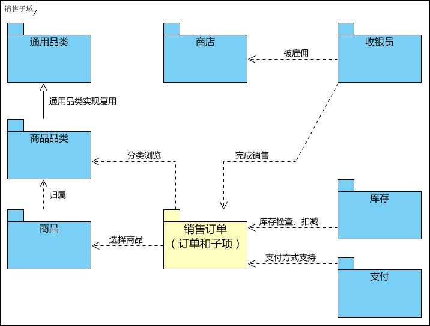
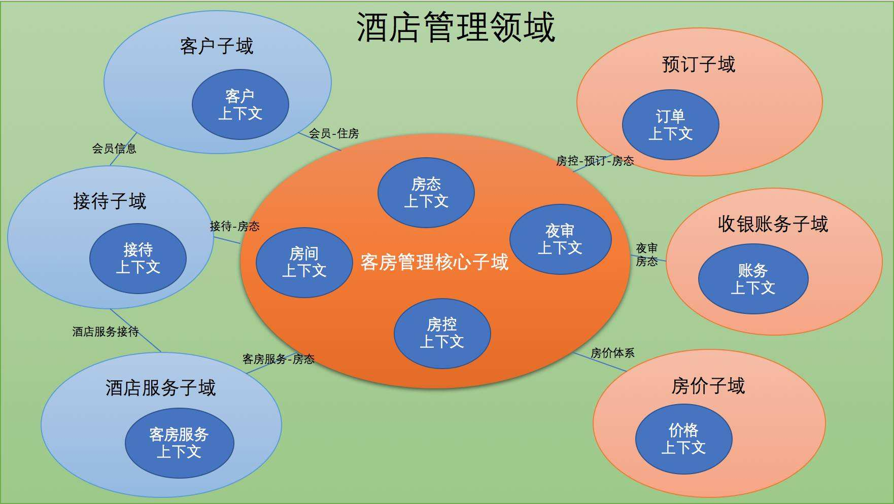
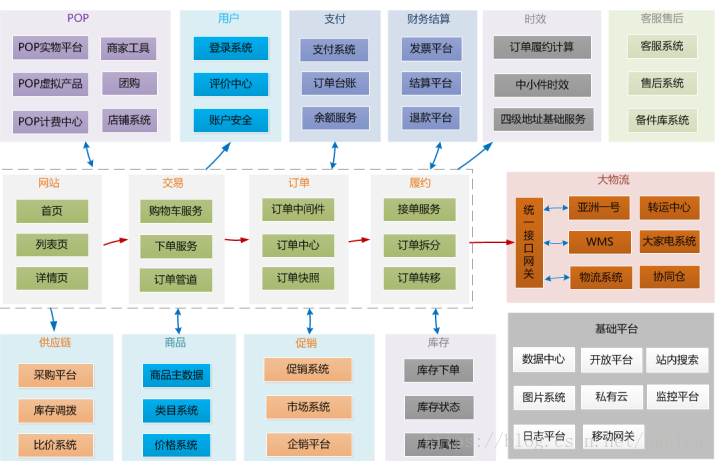
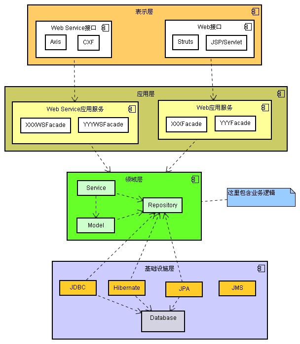
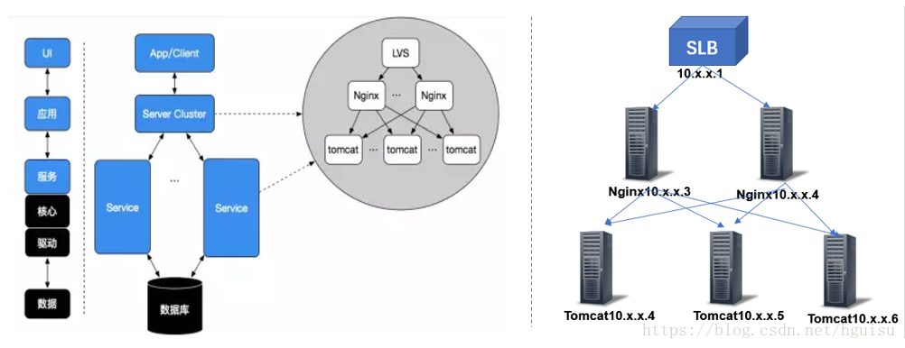
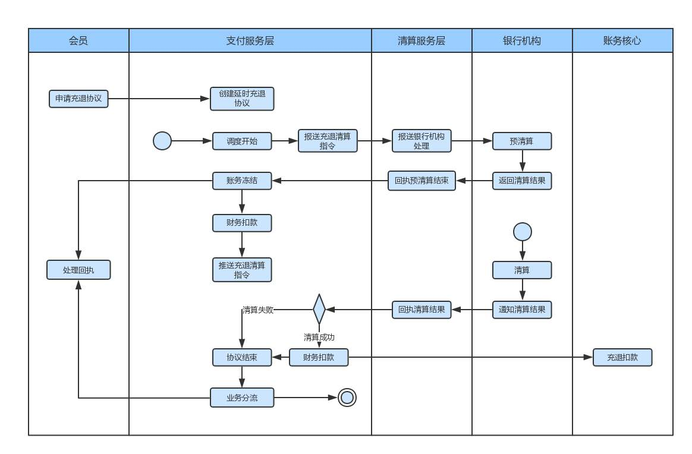

本文参考了大量的网络内容，如有侵权，请告知。

https://blog.csdn.net/hguisu/article/details/78258430

### 0.系统开发的阶段划分

### 1.需求分析

#### 1.1用例设计

#### 1.2原型界面设计

#### 1.3领域模型

按照一般的项目管理过程，“需求”之后是“分析”，那么在分析阶段对应的技术流程又是哪个？如何将需求阶段和分析阶段联系起来呢？答案就是“领域模型”。什么是“领域模型”呢？只要抓住“领域（Domain）”二字就可以理解，也就是说领域模型是帮助我们理解相关领域知识的模型。https://www.cnblogs.com/ppgeneve/p/5089113.html

单纯从用例来看，是没有类的概念的，无法完成从自然语言到面向对象语言的转换。但是，既然我们已经完成了用例模型，那么就必须基于用例模型进行分析(否则用例模型岂不是白做了)，而“领域模型”就是自然语言向面向对象语言的一座桥梁。

业务对象模型（也叫领域模型 domain model）是描述业务用例实现的对象模型。它是对业务角色和业务实体之间应该如何联系和协作以执行业务的一种抽象。业务对象模型从业务角色内部的观点定义了业务[用例](https://baike.baidu.com/item/用例)。该模型为产生预期效果确定了业务人员以及他们处理和使用的对象（“业务类和对象”）之间应该具有的静态和动态关系。它注重业务中承担的角色及其当前职责。这些模型类的对象组合在一起可以执行所有的业务用例 [1] 。

领域模型”阶段我们要做什么、该怎么做。其实很简单，简单概括就是“找名词”，分为四个步骤：（1）找出用例模型中的名词，（2）然后识别这些名词本身的相关信息，（3）以及名词之间的相互关联关系，（4）用UML画出领域模型。

https://wenku.baidu.com/view/e5ca5879773231126edb6f1aff00bed5b9f37324.html

### 2.架构设计

#### 2.1生产力与架构

架构可分为业务架构、应用架构、技术架构，业务架构是**生产力**（战略），应用架构是**生产关系**（战术），技术架构是**生产工具**（装备）。业务架构决定应用架构，应用架构需要适配业务架构，并随着业务架构不断进化，同时应用架构依托技术架构最终落地。 

1. 生产力：指具有一定生产经验和劳动技能的**劳动者**和所使用的**生产资料**结合起来, 从而在**物质资料生产过程中所发生的力量**, 也就是人类在生产过程中征服和改造自然界, 并获得适合自己需要的物质资料的能力。

2. 生产关系：指人们在物质资料生产过程中结成的**社会关系**。它的具体内容包括人们在物质资料的生产、交换、分配、消费等方面的关系。生产资料所有制是生产关系的基础。一定的生产资料所有制形式, 决定人们在生产中一定的地位和相互关系、一定的换关系、一定的产品分配和消费关系。

   生产力决定生产关系，生产关系要适应生产力的发展，生产关系是生产力发展的形式，生产关系会反作用于生产力。这是唯物史观的基本原理。 生产关系有两种基本类型：一是以[公有制](https://baike.baidu.com/item/公有制)为基础的生产关系，二是以[私有制](https://baike.baidu.com/item/私有制)为基础的生产关系

3. 生产工具：又称劳动工具，是人们在生产过程中用来直接对劳动对象进行加工的物件。它被用于劳动者和劳动对象之间，起传导劳动的作用。是劳动资料的基本的和主要的部分，是机械性的劳动资料。从原始人的石斧、弓箭，到现代化的各种各样的机器、工具、技术设备等，都同样起着传导劳动的作用，均属生产工具。

#### 2.2架构划分

1. 系统架构：指的完整系统的组成架构。**包括业务规划，业务模块、业务流程，对整个系统的业务进行拆分，对领域模型进行设计，把现实的业务转化成抽象对象。**例如系统分成几个部分？服务平台、管理门户、终端门户、ATM门户、外部系统以及接口、支撑系统等，将这些系统进行合理的划分。然后再进行功能分类细分，例如服务平台内部划分为系统管理、用户管理、帐号管理、支付管理、接口层、统计分析等逻辑功能。总之，将整个系统业务分解为逻辑功能模块，并且科学合理，就是系统架构。

   

2. 应用架构：应用架构定义系统有哪些应用、以及应用之间如何分工和合作。应用作为独立可部署的单元，为系统划分了明确的边界（生产关系，各司其职）。应用架构深刻影响系统功能组织、代码开发、部署和运维等各方面。这里所谓应用就是各个逻辑模块或者子系统。主要考虑部署，例如不同的应用如何分别部署，如何支持灵活扩展、大并发量、安全性等，需要画出物理网络部署图。按照应用进行划分的话，还需要考虑是否支持分布式SOA。

3. 技术架构：从技术层面描述，主要是分层模型，例如持久层、数据层、逻辑层、应用层、表现层等，然后每层使用什么技术框架，确定组成应用系统的实际运行组件（lvs，nginx，tomcat，php-fpm等），这些运行组件之间的关系，以及部署到硬件的策略。系统架构的设计要求架构师具备软件和硬件的功能和性能的过硬知识，这也是架构设计工作中最为困难的工作。

4. 数据架构：

5. 代码架构：

6. 部署拓扑架构（物理架构）：

#### 2.3战略设计与战术设计

系统架构的战略设计与战术设计的完美结合：

- **战略设计**：业务架构用于指导架构师如何进行系统架构设计。

- **战术设计**：应用架构要根据业务架构来设计。

- **战术实施**：应用架构确定以后，就是技术选型。

  

#### 2.4业务架构

1. 总体架构图（京东业务架构）

   

2. 业务模块（功能结构图）

3. 业务流程

#### 2.5 应用架构

1、职责划分:   明确应用（各个逻辑模块或者子系统）边界
   1）逻辑分层
   2）子系统、模块定义。
   3）关键类。
2、职责之间的协作：
   1）接口协议：应用对外输出的接口。
   2）协作关系：应用之间的调用关系。

    应用分层有两种方式：
    
    一种是水平分（横向），按照功能处理顺序划分应用，比如把系统分为web前端/中间服务/后台任务，这是面向业务深度的划分。
    
    另一种是垂直分（纵向），按照不同的业务类型划分应用，比如进销存系统可以划分为三个独立的应用，这是面向业务广度的划分。
    
     应用的合反映应用之间如何协作，共同完成复杂的业务case，主要体现在应用之间的通讯机制和数据格式，通讯机制可以是同步调用/异步消息/共享DB访问等，数据格式可以是文本/XML/JSON/二进制等。
    
     应用的分偏向于业务，反映业务架构，应用的合偏向于技术，影响技术架构。分降低了业务复杂度，系统更有序，合增加了技术复杂度，系统更无序。
    
     应用架构的本质是通过系统拆分，平衡业务和技术复杂性，保证系统形散神不散。
    
     系统采用什么样的应用架构，受业务复杂性影响，包括企业发展阶段和业务特点；同时受技术复杂性影响，包括IT技术发展阶段和内部技术人员水平。业务复杂性（包括业务量大）必然带来技术复杂性，应用架构目标是解决业务复杂性的同时，避免技术太复杂，确保业务架构落地。
#### 2.6 技术架构

#### 2.7 物理架构

 拓扑架构，包括架构部署了几个节点，节点之间的关系，服务器的高可用，网路接口和协议等，决定了应用如何运行，运行的性能，可维护性，可扩展性，是所有架构的基础。这个图主要是运维工程师主要关注的对象。

### 3.模块结构

##### 3.1 模块接口

##### 3.2 模块流程

##### 3.3 状态图

##### 3.4 类图

##### 3.5 流程图

##### 3.6 状态图

