# 附录


## 附录1：开发环境配置

### 1.  jdk安装（陈梦雅）

下载jdk，环境变量的配置()

### 2. Maven

#### 1. 1下载

官网下载地址：http://maven.apache.org/download.cgi
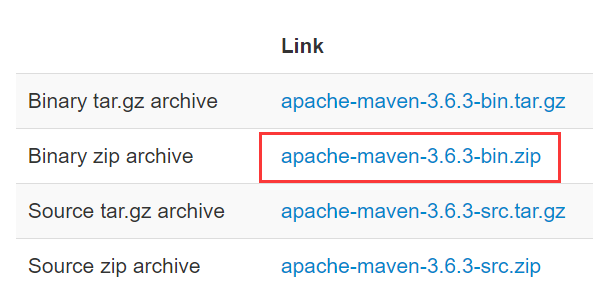

下载最新版本的即可

#### 1.2.安装

下载完成后，将下载到的压缩包解压即可。

文件目录：


#### 1.3. 配置

##### 1.3.1 环境变量配置

添加系统变量：

- 变量名：M2_HOME
- 变量值：Maven解压目录


##### 1.3.2 编辑Path环境变量

在Path环境变量处，增加新的变量值：

- %M2_HOME%\bin


##### 1.3.3 cmd窗口测试

打开cmd，输入mvn -v检测


##### 1.3.4 创建本地仓库

Maven的作用可以简单的理解为下载项目所需jar包，既然需要下载jar包，那么就要指定jar包的下载目录，即本地仓库

1. 在自己选定的位置创建文件夹，作为本地仓库，来存放jar包
   
   local为我自己的本地仓库

2. 在Maven的配置文件seeting.xml文件中，添加上本地仓库的目录

   1. IDEA打开Maven目录下conf下的settings.xml文件
      可以看到，settings.xml文件中多数都为注释部分

   2. 在settings标签下添加本地仓库的绝对路径

      ```xml
      <localRepository>本地仓库的绝对路径</localRepository>
      ```

      

##### 1.3.5 增加国内镜像

增加国内镜像，可以大幅提高jar包下载速度

1. IDEA打开IDEA打开Maven目录下conf下的settings.xml文件

2. 在<mirrors>标签中增加如下代码：

   ```xml
   <mirror>
   <id>alimaven</id>
   <mirrorOf>central</mirrorOf>
   <name>aliyun maven</name>
   <url>http://maven.aliyun.com/nexus/content/groups/public/</url>
   </mirror>
   ```

#### 4. IDEA相关设置

Ctrl + Alt + S打开设置，搜索Maven，出现下图界面：


- Maven home directory：Maven安装目录
- User settings file：Maven目录下conf下的settings.xml文件
- Local repository：本地仓库路径（如果settings.xml文件书写正常，本地仓库可被自动识别）

### 2. SVN配置

1. 下载

官网下载地址：https://tortoisesvn.net/downloads.zh.html
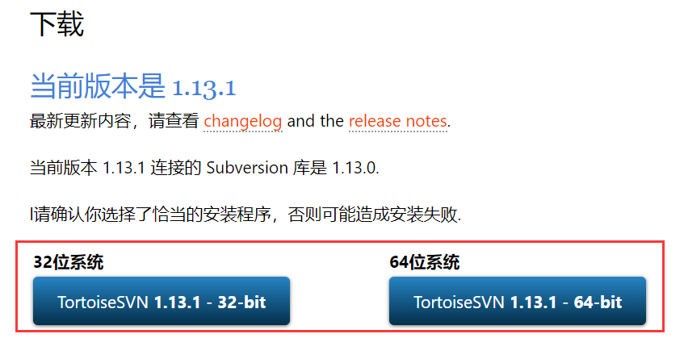

选择对应32位或64位

#### 2. 安装

安装过程非常简单，但需要注意一点：选择command line cilent tools


这一项默认是没有选择的，一定要自己手动选择！

#### 3. IDEA相关设置

Ctrl + Alt + S打开设置，Versin Control--->Subversion


在右边，输入svn，下方的Use custom configuration directory ，IDEA会自动识别。

### 3. Tomcat

#### 1. 下载

官网下载地址：https://tomcat.apache.org/download-90.cgi
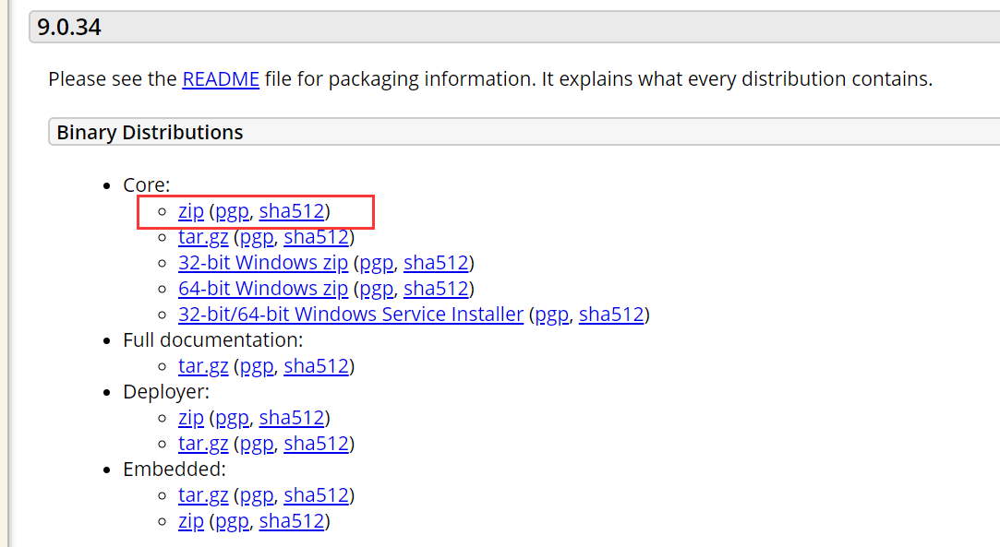

#### 2. 安装

将下载得到的压缩包解压，即可完成安装。
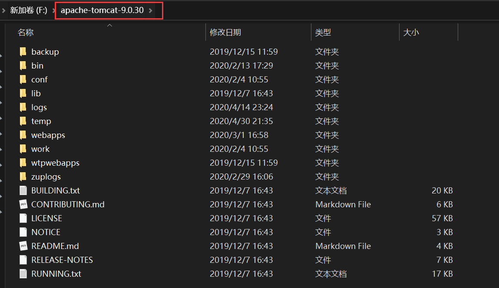


#### 3. 配置

3.1 环境变量配置

添加系统变量：

- 变量名：CATALINA_HOME
- 变量值：Tomcat解压目录


##### 3.2 编辑Path环境变量

在Path环境变量处，增加新的变量值：

- %CATALINA_HOME%\bin
- %CATALINA_HOME%\lib

##### 3.3 Tomcat启动测试

双击Tomcat安装目录下bin下startup.bat


出现上图界面，即安装配置完成。

### 4. IDEA相关设置

1. 点击run下的Edit Configurations
   

2. 选择左上角的+号，然后选择local Tomcat
   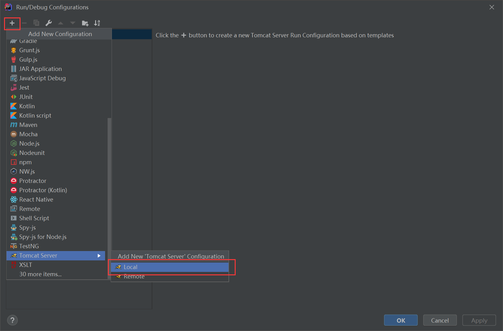

3. 在Name处，填写自己想要选取的名字，然后点击Configure
   

4. 在Tomcat Home处，选择Tomcat的安装目录；在Tomcat base directory处选择Tomcat的安装目录
   

   完成配置。

   ### Anaconda搭建Python开发环境

   参考来源：
   https://blog.csdn.net/qq_326324545/article/details/84522368
   https://blog.csdn.net/sizhi_xht/article/details/80964099
   https://zhuanlan.zhihu.com/p/37611680
   https://blog.csdn.net/ben1010101010/article/details/90897405

   欢迎讨论交流，如有侵权请联系本人！

   1. 下载并安装Anaconda：

      ```bash
      # 下载Linux平台版本Anaconda，下例网页链接版本为Anaconda 2019.03 Python 3.7 version 64-Bit (x86) Installer for Linux
      wget https://repo.anaconda.com/archive/Anaconda3-2019.03-Linux-x86_64.sh
      # 安装Anaconda，建议直接安装，不使用root权限，除非你是系统的管理员
      bash Anaconda3-2019.03-Linux-x86_64.sh
      ```

      以下为安装过程中的选项说明：

      ```text
      # 确认安装位置，默认位置为用户个人文件夹下的anaconda3文件夹
      Anaconda3 will now be installed into this location...
      [/home/current_user/anaconda3] >>>
      # 确认是否由Anaconda进行终端的初始化，一般选择是，否则无法使用虚拟环境
      Do you wish the installer to initialize Anaconda3 by running conda init? [yes|no]
      [no] >>> yes
      ```

      安装完成后，Anaconda会设置终端开启时，自动进入base虚拟环境，我们需要取消这一设置，因为虚拟环境是可嵌套的，在base环境中再进入虚拟环境可能会产生不可控的问题。使用以下命令取消这一行为：

      ```bash
      conda config --set auto_activate_base false
      ```

   2. 创建并使用虚拟环境：

      建议不要直接使用本地的Python环境，而是创建自己的虚拟环境。这样做有两点好处，一是能够在虚拟Anaconda环境中进行随意的定制而不用担心破坏原本的终端环境，二是熟悉了虚拟环境的用法之后，可以制作多个虚拟环境用于不同的任务，这样就可以使得对于依赖包的版本要求不同的项目可以共存在一个账号上。

      ```bash
      # 创建名为my_virtual_env的虚拟环境，并安装Python3.7及必要的Python库。此命令也可以不指定Python版本，但会创建一个不含Python的空环境，如果没有特殊需求，请直接指定Python版本
      conda create -n my_virtual_env python=3.7
      # 激活虚拟环境
      conda activate my_virtual_env
      # 关闭虚拟环境
      conda deactivate
      # 列出所有存在的虚拟环境名称
      conda env list
      # 删除指定虚拟环境，如果为空环境则此命令失效（也就是未指定Python版本的时候）
      conda remove -n my_virtual_env --all
      # 删除指定虚拟环境，无论此环境是否为空
      conda env remove -n my_virtual_env
      # 安装Anaconda收录的Python包，使用此命令Anaconda会自动检查新安装包与已安装包之间是否有依赖库版本冲突
      conda install package
      # 安装所有Python收录的包，包括Anaconda未收录的Python包，不会检查依赖库版本冲突
      pip install package
      # 查找相关包的所有收录版本
      conda search package
      # 导出虚拟环境配置表及使用配置表文件创建虚拟环境
      conda env export > conda_env.yaml
      conda env create -f conda_env.yaml
      ```

   3. 在`~/.bash_aliases`中添加以下内容，以便以后快速开启关闭虚拟环境：

      ```bash
      alias jumpin='conda activate my_virtual_env'
      alias crawlout='conda deactivate'
      ```

      添加完成后使用`source ~/.bash_aliases`命令重新执行该文件，之后就可以使用定制命令操作虚拟环境的激活和关闭

      

##  附录2：运行环境搭建


### 1.1 云服务环境

```
https://docs.qingcloud.com/product/quick_start/   青云帮助文档

青云提供了两种组网方式：基础网络、私有网络（VxNet）。 前者是一个由青云系统维护的全局网络，后者是用户各自自行组建的网络。

基础网络的好处是简单、无需用户做任何配置与管理，即可直接使用， 但正因为它是全局网络，所以其安全保障是依靠防火墙（Security Group）来实现的。 与之相对应，私有网络需要用户创建并管理 （当然，为了简化管理，青云提供了路由器来帮助用户）， 但私有网络之间是100%隔离的，以满足对安全的100%追求。
```


1.2 配置YUM源

yum仓库就是使用yum命令下载软件的镜像地址。

我们通常使用 yum install 命令来在线安装 linux系统的软件， 这种方式可以自动处理依赖性关系，并且一次安装所有依赖的软体包，但是经常会遇到从国外镜像下载速度慢，无法下载的情况。那么此时我们就需要把我们的yum 源改为国内的镜像。

yum的配置文件
yum 的配置文件在 /etc/yum.repos.d 目录下, 其中有多个配置文件,每一个配置文件中都可以配置一个或多个repository, 但是最终会被合并为一个交给系统，所以多个文件只是为了方便管理。

2、yum仓库配置
下面提供了 阿里和 清华大学 两个镜像仓库配置操作说明，=实际使用时，选择其中一个配置即可。

```
yum install vim   #安装VIM编辑器
yum install wget   #安装下载工具
```

1）、备份，将 CentOS-Base.repo 为CentOS-Base.repo.backup

```
mv   /etc/yum.repos.d/CentOS-Base.repo /etc/yum.repos.d/CentOS-Base.repo.backup

 cp  /etc/yum.repos.d/CentOS-Base.repo.bak /etc/yum.repos.d/CentOS-Base.repo
```

（2）、下载新的 http://mirrors.aliyun.com/repo/Centos-7.repo,并命名为CentOS-Base.repo

```
wget -O /etc/yum.repos.d/CentOS-Base.repo http://mirrors.aliyun.com/repo/Centos-7.repo
或者
curl -o /etc/yum.repos.d/CentOS-Base.repo http://mirrors.aliyun.com/repo/Centos-7.repo
```

（3）、清除缓存

```
yum clean all # 清除系统所有的yum缓存
yum makecache # 生成yum缓存
yum update

yum install vim
```

### 1.2 Docker搭建

#### 1.2.1 安装流程

1、Docker 要求 CentOS 系统的内核版本高于 3.10 ，查看本页面的前提条件来验证你的CentOS 版本是否支持 Docker 。

通过 **uname -r** 命令查看你当前的内核版本

```
 $ uname -r
```

2、使用 `root` 权限登录 Centos。确保 yum 包更新到最新。

```
$ sudo yum update
```


3、卸载旧版本(如果安装过旧版本的话)

```
$ sudo yum remove docker  docker-common docker-selinux docker-engine
```

4、安装需要的软件包， yum-util 提供yum-config-manager功能，另外两个是devicemapper驱动依赖的

```
$ sudo yum install -y yum-utils device-mapper-persistent-data lvm2
```

5、设置yum源

```
$ sudo yum-config-manager --add-repo https://download.docker.com/linux/centos/docker-ce.repo
```

 

6、可以查看所有仓库中所有docker版本，并选择特定版本安装

```
$ yum list docker-ce --showduplicates | sort -r
```


7、安装docker

```
$ sudo yum install docker-ce  #由于repo中默认只开启stable仓库，故这里安装的是最新稳定版17.12.0

```

 

8、启动并加入开机启动

```
$ sudo systemctl start docker
$ sudo systemctl enable docker
```

9、验证安装是否成功(有client和service两部分表示docker安装启动都成功了)

```
$ docker version
```


####  1.2.2 Docker常用命令

1. 列出所有容器 ID

```
docker ps -aq
```

2. 停止所有容器

```
docker stop $(docker ps -aq)
```

3. 停止单个容器

```
docker stop 要停止的容器名
```

4. 删除所有容器

```
docker rm $(docker ps -aq)
```

5. 删除单个容器

```
docker rm 要删除的容器名
```

6. 删除镜像

```
删除指定
docker rmi 6a8e2d5dd257  -f

删除所有image
docker rmi $(docker images -q)
```

7. 要让docker 的容器自动在开机启动，

```
docker run 指令中加入 --restart=always 就行。
sudo docker run --restart=always .....

如果创建时未指定 --restart=always ,可通过update 命令设置
docker update --restart=always xxx
```

8. 进入容器内部执行命令

```
 docker exec -it 6f6679679be8   /bin/bash
```


#### 1.2.3 Docker使用

```
1.镜像安装：
docker pull tomcat
docker pull nginx

2.启动容器
docker run -it --name webdemo -p 80:8080 tomcat /bin/bash
启动一个交互式的容器，名字是webdemo，-p 80:8080表示将容器的8080端口映射到主机的80端口，这样我们只要访问主机的80端口就可以访问到容器的服务了。

docker run -d -p 8088:8080 tomcat
docker run -d -p 8089:8080 tomcat
安装两个实例，端口分别为8088,8089

docker run -p 8080:80 -d docker.io/nginx
安装nginx，端口为8080。在测试的过程中，发现ubuntu上对80端口有限制，不能直接访问，所以映射为8080

3.如何将文件从主机复制到容器中：

从主机复制到容器 sudo docker cp host_path containerID:container_path
从容器复制到主机 sudo docker cp containerID:container_path host_path

长的字符串是容器的id
 
 
 4.docker 下修改参数：
 
 docker cp 3c8d188f7fb48:/etc/mysql/mysql.conf.d/mysqld.cnf /home/
修改文件内容，添加参数行 log_bin=on
docker cp /home/mysqld.cnf 3c8d188f7fb48:/etc/mysql/mysql.conf.d/mysqld.cnf
docker reload 3c8d188f7fb48
```

### 1.3搭建Maven仓库

​		maven的仓库分为本地仓库，远程仓库和私服仓库。私服仓库一般是公司内部私有的，内部进行维护的。公司员工连接私服，从私服中下载jar，或者将自身的jar传到私服上。私服还可以从中央仓库下载jar，当私服中没用jar的时候，就会从中央仓库下载。

​	常用的私服有：[Apache Archiva](http://archiva.apache.org/index.cgi)，[Artifactory](http://www.jfrog.com/home/v_artifactory_opensource_overview/)，[Sonatype Nexus](http://www.sonatype.org/nexus/)。这里我们使用 Sonatype Nexus。


```
https://www.cnblogs.com/yhaing/p/8568043.html
```


#### 1.3.1Maven 的概念


Maven是一个软件项目管理工具，通过它可便捷的管理项目的生命周期。即项目的jar包依赖，开发，测试，发布打包、版本等。虽然目前的IDE工具（如eclipse）可管理开发、发布、打包工作，但还没有形成一套完成的体系。

Maven有以下几个功能特点：

1、 jar包依赖

　　这个也许会maven最突出的特点。使用maven进行开发时，不需要上网单独下载jar包，只需要在配置文件pom.xml中配置jar包的依赖关系，就可以自动下载jar包到我们的项目中（在联网情况下，maven可自动从https://repo.maven.apache.org/maven2中下载所需要的jar包。如果无法联网，可搭建基于Nexus私服的中央库并提供jar包下载）。这样，别人开发或者使用这个工程时，不需要来回的拷贝jar包，只需要复制这个pom.xml就可以自动的下载这些jar包。而且，我们自己下载jar包，还有可能造成版本的不一致，这样在协同开发的过程中就有可能造成代码运行的不一致。通过使用maven精确的匹配jar包，就不会出现这种问题了。

以下是一个项目的pom.xml中对jar包依赖的描述：


       <!-- spring需要的jar包 --> 
       <dependency> 
           <groupId>org.springframework</groupId> 
           <artifactId>spring-context</artifactId> 
           <version>3.2.4.RELEASE</version> 
           <type>jar</type> 
        </dependency> 


2 项目坐标

Maven通过特定的标识来定义项目名称，这样既可以唯一的匹配其他的jar包，也可以通过发布，使别人能使用自己的发布产品。这个标识就被叫做坐标，长的其实很普通，就是简单的xml而已。比如，以下为一个web项目的项目坐标描述信息（在该项目的pom.xml文件的开始位置）

```
  <groupId>com.nci</groupId>
  <artifactId>first_maven</artifactId>
  <version>1.0.0</version>
<packaging>war</packaging>
```

各字段说明：

  groupId：所述的项目名称，由于有的项目并不是一个jar包构成的，而是由很多的jar包组成的。因此这个groupId就是整个项目的名称。

artifactId：包的名称。

version：版本号。

packaging：包的类型，一般都是jar，也可以是war之类的。如果不填，默认就是jar。War代表web项目。


#### 1.3.2 私服搭建

​	搭建私有仓库，放到青云上。VPN登录上来。Docker容器比较

1. 执行以下命令，会自动从hub.docker.com下载最新的nexus镜像，然后启动一个名为nexus的容器，当前电脑的8081端口被映射到容器的8081端口： 
   `docker run -idt -p 8081:8081 --name nexus -v /home/data/nexus:/sonatype-work sonatype/nexus `

2. 执行命令

   docker logs -f nexus

   查看容器日志滚动信息，显示如下信息时nexus启动成功：

    

   ```
   2018-01-20 03:37:42,187+0000 INFO [jetty-main-1] org.sonatype.nexus.webresources.internal.WebResourceServiceImpl - Discovered 1971 resources 
   2018-01-20 03:37:42,189+0000 INFO [jetty-main-1] org.sonatype.nexus.webresources.internal.WebResourceServlet - Max-age: 30 days (2592000 seconds) 
   2018-01-20 03:37:42,304+0000 INFO [jetty-main-1] org.sonatype.nexus.bootstrap.jetty.InstrumentedSelectChannelConnector - Metrics enabled 
   2018-01-20 03:37:42,348+0000 INFO [jetty-main-1] org.eclipse.jetty.server.AbstractConnector - Started InstrumentedSelectChannelConnector@0.0.0.0:8081 
   2018-01-20 03:37:42,352+0000 INFO [jetty-main-1] org.sonatype.nexus.bootstrap.jetty.JettyServer - Running 
   2018-01-20 03:37:42,352+0000 INFO [main] *SYSTEM org.sonatype.nexus.bootstrap.jetty.JettyServer - Started 
   ```

   查看当前电脑的/usr/local/work/dockermaven目录，可以看到nexus容器中应用的相关文件已经在此处创建，如下图： 
   

3. 在浏览器输入地址访问nexus：http://192.168.18.110:8081/nexus

4. 对maven私有仓库的使用者来说，完全感受不到实际安装和在docker安装私有仓库的区别，您可以像前两章的实战那样，体验此仓库的jar缓存和保存二方库的服务；

5. 发布一个二方库到nexus，deploy成功后，可以在nexus上看到新的二方库，如下图所示，(deploy之前记得在nexus上设置允许上传，并且设置deployment账号的密码，详见上一章)： 
   

至此，实战maven私有仓库三部曲系列就全部结束了，希望其中的实战和demo能够助您一臂之力；


#### 1.3.3Nexus 的仓库分类

·    要用于部署无法从公共仓库获取的构件（如 oracle 的 JDBC 驱动）以及自己或第三方的项目构件。nexus内置了三个host库。

3rd party：第三方库，如mysql 的jdbc驱动jar

Release：自己开发的release版本的jar

Snapshots：自己开发的snapshot版本的jar（可理解为测试版本）


### 1.4 搭建Gitlab服务器

#### 1.4.1 gitlab以及使用

##### 1.gitlab镜像拉取


```ruby
# gitlab-ce为稳定版本，后面不填写版本则默认pull最新latest版本
$ docker pull gitlab/gitlab-ce
```

拉取镜像

##### 2.运行gitlab镜像


```csharp
$ docker run -d  -p 8082:80 -p 8083:443 -p 8084:22  --name gitlab --restart always -v /home/data/gitlab/config:/etc/gitlab -v /home/data/gitlab/logs:/var/log/gitlab -v /home/data/gitlab/data:/var/opt/gitlab gitlab/gitlab-ce
# -d：后台运行
# -p：将容器内部端口向外映射
    22: SSH访问端口，
    80：Http 访问端口，
    443：Https 访问端口，
# --name：命名容器名称
# -v：将容器内数据文件夹或者日志、配置等文件夹挂载到宿主机指定目录
    
    
```

运行成功后出现一串字符串


运行成功:

http://192.168.18.101:8082/

8082:80 -p 8083:443 -p 8084:22


此处设置密码，用户为root，最高管理权限。


##### 3.配置

按上面的方式，gitlab容器运行没问题，但在gitlab上创建项目的时候，生成项目的URL访问地址是按容器的hostname来生成的，也就是容器的id。作为gitlab服务器，我们需要一个固定的URL访问地址，于是需要配置gitlab.rb（宿主机路径：/home/data/gitlab/config/gitlab.rb）。


```uby
# gitlab.rb文件内容默认全是注释
$ vim /home/gitlab/config/gitlab.rb
```


```ruby
# 配置http协议所使用的访问地址,8082---->80
external_url 'http://192.168.18.201:8082'   #外部IP监听端口
nginx['listen_port'] = 80    #容器监听端口，默认80
# https需要下面这句
nginx['redirect_http_to_https_port'] = 8082   

# 配置ssh协议所使用的访问地址和端口
gitlab_rails['gitlab_ssh_host'] = '192.168.18.201'
gitlab_rails['gitlab_shell_ssh_port'] = 8084 # 此端口是run时22端口映射的8084端口 

```


以下文件是自动生成的，不能进行修改。

```
修改/home/data/gitlab/data/gitlab-rails/etc/gitlab.yml

vi gitlab.yml

找到关键字 * ## Web server settings *
将host的值改成映射的外部主机ip地址和端口
```


修改好后保持，退出，进入容器内，应用重新配好的配置并重启GitLab,然后查看GitLab的状态。

```
docker exec -ti gitlab /bin/bash

gitlab-ctl reconfigure #花时间比较多
gitlab-ctl restart
gitlab-ctl status

```


支持ssl(未测试)

```
vi /etc/gitlab/gitlab.rb

nginx['ssl_certificate'] = "/var/opt/gitlab/elooyoo.com/fullchain.pem"
nginx['ssl_certificate_key'] = "/var/opt/gitlab/elooyoo.com/privkey.pem"
nginx['redirect_http_to_https'] = true

```


```ruby
# 重启gitlab容器
$ docker restart gitlab
```

此时项目的仓库地址就变了。如果ssh端口地址不是默认的22，就会加上ssh:// 协议头
 打开浏览器输入ip地址(因为我的gitlab端口为80，所以浏览器url不用输入端口号，如果端口号不是80，则打开为：ip:端口号)

##### 4.创建一个项目

第一次进入要输入新的root用户密码，设置好之后确定就行


gitlab页面

下面我们就可以新建一个项目了，点击Create a project


Create a project

创建完成后：


创建完成！

#### 1.4.2 gitlab-runner安装


### 1.5 搭建Jenkins服务器


1. 使用docker 安装jenkins

```
docker run -p 8086:8080 -p 8087:50000 -v /home/data/jenkins/data:/var/jenkins_home jenkinsci/blueocean
```

docker 运行后， 执行docker logs -f myjenkins时报错：

touch: cannot touch ‘/var/jenkins_home/copy_reference_file.log’: Permission denied
Can not write to /var/jenkins_home/copy_reference_file.log. Wrong volume permissions?

需要修改下目录权限, 因为当映射本地数据卷时，/home/docker/jenkins目录的拥有者为root用户，而容器中jenkins user的uid为1000
执行如下命令即可：

chown -R 1000:1000 /home/docker/jenkins


2. 访问jenkins地址 8086


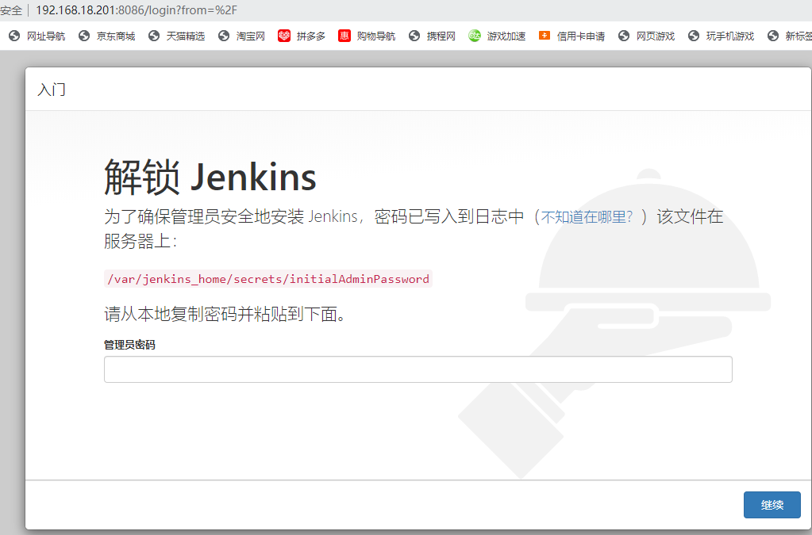

 

注意：第一次启动的时候正在加载jenkins大概会等待3-10分钟。

3.解锁jenkins

 


```
[root@i-qvtplnds data]# docker exec -it jenkisci/blueocen /bin/bash
Error: No such container: jenkisci/blueocen
[root@i-qvtplnds data]# ls
com.cloudbees.hudson.plugins.folder.config.AbstractFolderConfiguration.xml  jenkins.telemetry.Correlator.xml  secret.key.not-so-secret
config.xml                                                                  jobs                              secrets
copy_reference_file.log                                                     logs                              updates
hudson.model.UpdateCenter.xml                                               nodeMonitors.xml                  userContent
hudson.plugins.git.GitTool.xml                                              nodes                             users
identity.key.enc                                                            plugins                           war
jenkins.install.UpgradeWizard.state                                         secret.key                        workflow-libs
[root@i-qvtplnds data]# cd sercrets
-bash: cd: sercrets: No such file or directory
[root@i-qvtplnds data]# cd secret
-bash: cd: secret: No such file or directory
[root@i-qvtplnds data]# cd secrets
[root@i-qvtplnds secrets]# ls
filepath-filters.d    jenkins.model.Jenkins.crumbSalt  org.jenkinsci.main.modules.instance_identity.InstanceIdentity.KEY  whitelisted-callables.d
initialAdminPassword  master.key                       slave-to-master-security-kill-switch
[root@i-qvtplnds secrets]# cat initialAdminPassword 
87eab010550c42bba8b479e5b50955de
[root@i-qvtplnds secrets]# 

```

 


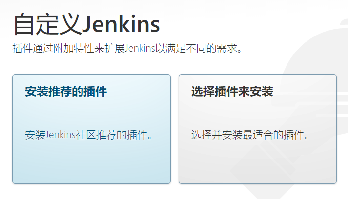

 

 

docker exec -it 7f485bd95c3b  /bin/bash 进入jenkins容器 

cat /var/jenkins_home/secrets/initialAdminPassword

### 1.6 搭建Tomcat服务器

3. 获取Tomcat8版本

   docker pull tomcat:8  

   

4. 启动tomcat

```
 docker run -d -p 8088:8080 tomcat
```

 -d表示后台运行，-p端口映射，前面的8088是外围访问端口（也就是本机ip对外开放的端口），后面8080是docker容器内部的端口。


http://localhost:8080

出现以下错误：**资源服务器未能找到目标资源的表示或者是不愿公开一个已经存在的资源表示。**

这是容器中的webapps为空导致的，执行以下命令进入容器交互模式：

```
 docker exec -it 6f6679679be8   /bin/bash
```


```
root@6f6679679be8:/usr/local/tomcat# cd webapps
//将webapps.dist内容拷贝过来
root@6f6679679be8:/usr/local/tomcat/webapps# cp -r ../webapps.dist/*  ./
root@6f6679679be8:/usr/local/tomcat/webapps# ls
ROOT  docs  examples  host-manager  manager  webapps.dist


```

执行正常：


挂在宿主机器目录到容器，持久化存储：

1. tomcat 容器 webapps 路径：/usr/local/tomcat/webapps

2. 在宿主目录下新建目录 /home/data/tomcat/webapps

3. 停止 tomcat 容器并删除该容器

   1. 查找容器的 CONTAINER ID

      ```
      docker ps -a 
      ```

   2. 停止容器

      ```
       docker stop CONTAINER_ID
      ```

   3. 删除容器

      ```
      docker rm CONTAINER_ID 
      ```

4. 重新跑一个 tomcat 容器并挂载宿主目录

   ```
   docker run --name tomcat-service -d -p 8080:8080 -v /home/data/tomcat/webapps:/usr/local/tomcat/webapps tomcat  
   
   docker run --name tomcat-service1 -d -p 8090:8080 -v /home/data/tomcat/webapps:/usr/local/tomcat/webapps tomcat
   
   docker run --name tomcat-service2 -d -p 8091:8080 -v /home/data/tomcat/webapps:/usr/local/tomcat/webapps tomcat
   
   
   docker run --name tomcat-service3 -d -p 8092:8080 -v /home/data/tomcat/webapps:/usr/local/tomcat/webapps tomcat
   ```


   5.此时访问仍然出错**资源服务器未能找到目标资源的表示或者是不愿公开一个已经存在的资源表示。**

进入容器内容拷贝内容

```
root@1a8599cd150c:/usr/local/tomcat# cd webapps
root@1a8599cd150c:/usr/local/tomcat/webapps# cd webapps
bash: cd: webapps: No such file or directory
root@1a8599cd150c:/usr/local/tomcat/webapps# cp ../webapps.dist/* ./
cp: -r not specified; omitting directory '../webapps.dist/ROOT'
cp: -r not specified; omitting directory '../webapps.dist/docs'
cp: -r not specified; omitting directory '../webapps.dist/examples'
cp: -r not specified; omitting directory '../webapps.dist/host-manager'
cp: -r not specified; omitting directory '../webapps.dist/manager'
root@1a8599cd150c:/usr/local/tomcat/webapps# cp -r ../webapps.dist/* ./
root@1a8599cd150c:/usr/local/tomcat/webapps# ls
ROOT  docs  examples  host-manager  manager
root@1a8599cd150c:/usr/local/tomcat/webapps# 

```

回到宿主机下面，进行webapps，发现内容实际拷贝到宿主机器下面

```
[root@i-s21hd6yt tomcat]# ls
webapps
[root@i-s21hd6yt tomcat]# cd webapps/
[root@i-s21hd6yt webapps]# ls
docs  examples  host-manager  manager  ROOT
[root@i-s21hd6yt webapps]# 

```

访问http://localhost :8080 可以正常访问。


### 1.7搭建Mysql数据库

```
https://blog.csdn.net/weixin_39791387/article/details/93375560
```


```
docker run -p 3306:3306 --name mysql  -v /home/data/mysql/conf:/etc/mysql  -v /home/data/mysql/logs:/var/log/mysql  -v /home/data/mysql/data:/var/lib/mysql  -e MYSQL_ROOT_PASSWORD=123456  -d mysql:5.7


docker run -p 3307:3306 --name mysql3307  -v /home/data/mysql3307/conf:/etc/mysql  -v /home/data/mysql3307/logs:/var/log/mysql  -v /home/data/mysql3307/data:/var/lib/mysql  -e MYSQL_ROOT_PASSWORD=123456  -d mysql:5.7


docker run -p 3308:3306 --name mysql3308  -v /home/data/mysql3308/conf:/etc/mysql  -v /home/data/mysql3308/logs:/var/log/mysql  -v /home/data/mysql3308/data:/var/lib/mysql  -e MYSQL_ROOT_PASSWORD=123456  -d mysql:5.7


docker run -p 3309:3306 --name mysql3309  -v /home/data/mysql3309/conf:/etc/mysql  -v /home/data/mysql3309/logs:/var/log/mysql  -v /home/data/mysql3309/data:/var/lib/mysql  -e MYSQL_ROOT_PASSWORD=123456  -d mysql:5.7

测试库：

docker run -p 3310:3306 --name mysql3310  -v /home/data/mysql3310/conf:/etc/mysql  -v /home/data/mysql3310/logs:/var/log/mysql  -v /home/data/mysql3310/data:/var/lib/mysql  -e MYSQL_ROOT_PASSWORD=123456  -d mysql:5.7

docker run -p 3311:3306 --name mysql3311  -v /home/data/mysql3311/conf:/etc/mysql  -v /home/data/mysql3311/logs:/var/log/mysql  -v /home/data/mysql3311/data:/var/lib/mysql  -e MYSQL_ROOT_PASSWORD=123456  -d mysql:5.7


docker run -p 3312:3306 --name mysql3311  -v /home/data/mysql3312/conf:/etc/mysql  -v /home/data/mysql3312/logs:/var/log/mysql  -v /home/data/mysql3312/data:/var/lib/mysql  -e MYSQL_ROOT_PASSWORD=123456  -d mysql:5.7

```


### 1.8搭建WEB服务器集群

​    nginx +tomcat   


​		搭建Nginx

```
docker pull nginx
docker run --name nginx-test -p 8080:80 -d nginx
```

运行结果如下：


### 1.9 安装可视化工具grafana


```
docker run -d -p 8085:3000 --name=grafana -v /home/data/grafana/data:/var/lib/grafana -v /home/data/grafana/conf:/usr/share/grafana/conf grafana/grafana
```

选择挂载数据文件(/var/lib/grafana)和配置文件(/usr/share/grafana/conf)。前者存放panels、datasoure、页面等数据，后者为配置文件，挂载后可以直接在宿主机器上修改，重启容器后生效


### 1.10 Redis安装部署


##### 4.1 安装redis


###### 第一步：下载redis安装包

wget http://download.redis.io/releases/redis-4.0.6.tar.gz

[](javascript:void(0);)

```
[root@iZwz991stxdwj560bfmadtZ local]# wget http://download.redis.io/releases/redis-4.0.6.tar.gz
--2017-12-13 12:35:12--  http://download.redis.io/releases/redis-4.0.6.tar.gz
Resolving download.redis.io (download.redis.io)... 109.74.203.151
Connecting to download.redis.io (download.redis.io)|109.74.203.151|:80... connected.
HTTP request sent, awaiting response... 200 OK
Length: 1723533 (1.6M) [application/x-gzip]
Saving to: ‘redis-4.0.6.tar.gz’

100%[==========================================================================================================>] 1,723,533    608KB/s   in 2.8s   

2017-12-13 12:35:15 (608 KB/s) - ‘redis-4.0.6.tar.gz’ saved [1723533/1723533]
```

[](javascript:void(0);)

 

###### 第二步：解压压缩包

tar -zxvf redis-4.0.6.tar.gz

```
[root@iZwz991stxdwj560bfmadtZ local]# tar -zxvf redis-4.0.6.tar.gz
```

 

###### 第三步：yum安装gcc依赖

yum install gcc

```
[root@iZwz991stxdwj560bfmadtZ local]# yum install gcc
```

遇到选择,输入y即可

 

###### 第四步：redis解压目录下

cd redis-4.0.6

```
[root@iZwz991stxdwj560bfmadtZ local]# cd redis-4.0.6
```

 

###### 第五步：编译安装

make MALLOC=libc　　

```
[root@iZwz991stxdwj560bfmadtZ redis-4.0.6]# make MALLOC=libc
```

 

将/usr/local/redis-4.0.6/src目录下的文件加到/usr/local/bin目录

cd src && make install

[](javascript:void(0);)

```
[root@iZwz991stxdwj560bfmadtZ redis-4.0.6]# cd src && make install
    CC Makefile.dep

Hint: It's a good idea to run 'make test' ;)

  

```

[](javascript:void(0);)

 

#### 4.2启动redis的三种方式

 

先切换到redis src目录下

```
[root@iZwz991stxdwj560bfmadtZ redis-4.0.6]# cd src
```

 

##### 1、直接启动redis

./redis-server

[](javascript:void(0);)

```
[root@iZwz991stxdwj560bfmadtZ src]# ./redis-server
18685:C 13 Dec 12:56:12.507 # oO0OoO0OoO0Oo Redis is starting oO0OoO0OoO0Oo
18685:C 13 Dec 12:56:12.507 # Redis version=4.0.6, bits=64, commit=00000000, modified=0, pid=18685, just started
18685:C 13 Dec 12:56:12.507 # Warning: no config file specified, using the default config. In order to specify a config file use ./redis-server /path/to/redis.conf
                _._                                                  
           _.-``__ ''-._                                             
      _.-``    `.  `_.  ''-._           Redis 4.0.6 (00000000/0) 64 bit
  .-`` .-```.  ```\/    _.,_ ''-._                                   
 (    '      ,       .-`  | `,    )     Running in standalone mode
 |`-._`-...-` __...-.``-._|'` _.-'|     Port: 6379
 |    `-._   `._    /     _.-'    |     PID: 18685
  `-._    `-._  `-./  _.-'    _.-'                                   
 |`-._`-._    `-.__.-'    _.-'_.-'|                                  
 |    `-._`-._        _.-'_.-'    |           http://redis.io        
  `-._    `-._`-.__.-'_.-'    _.-'                                   
 |`-._`-._    `-.__.-'    _.-'_.-'|                                  
 |    `-._`-._        _.-'_.-'    |                                  
  `-._    `-._`-.__.-'_.-'    _.-'                                   
      `-._    `-.__.-'    _.-'                                       
          `-._        _.-'                                           
              `-.__.-'                                               

18685:M 13 Dec 12:56:12.508 # WARNING: The TCP backlog setting of 511 cannot be enforced because /proc/sys/net/core/somaxconn is set to the lower value of 128.
18685:M 13 Dec 12:56:12.508 # Server initialized
18685:M 13 Dec 12:56:12.508 # WARNING overcommit_memory is set to 0! Background save may fail under low memory condition. To fix this issue add 'vm.overcommit_memory = 1' to /etc/sysctl.conf and then reboot or run the command 'sysctl vm.overcommit_memory=1' for this to take effect.
18685:M 13 Dec 12:56:12.508 # WARNING you have Transparent Huge Pages (THP) support enabled in your kernel. This will create latency and memory usage issues with Redis. To fix this issue run the command 'echo never > /sys/kernel/mm/transparent_hugepage/enabled' as root, and add it to your /etc/rc.local in order to retain the setting after a reboot. Redis must be restarted after THP is disabled.
18685:M 13 Dec 12:56:12.508 * Ready to accept connections　　
```

[](javascript:void(0);)

 

如上图：redis启动成功，但是这种启动方式需要一直打开窗口，不能进行其他操作，不太方便。

 

按 ctrl + c可以关闭窗口。

　　

##### 2、以后台进程方式启动redis

第一步：修改redis.conf文件

将

```
daemonize no
```

 

修改为

```
daemonize yes
```

　

第二步：指定redis.conf文件启动

```
./redis-server /usr/local/redis-4.0.6/redis.conf
[root@iZwz991stxdwj560bfmadtZ src]# ./redis-server /usr/local/redis-4.0.6/redis.conf 
18713:C 13 Dec 13:07:41.109 # oO0OoO0OoO0Oo Redis is starting oO0OoO0OoO0Oo
18713:C 13 Dec 13:07:41.109 # Redis version=4.0.6, bits=64, commit=00000000, modified=0, pid=18713, just started
18713:C 13 Dec 13:07:41.109 # Configuration loaded
```

 

第三步：关闭redis进程

首先使用ps -aux | grep redis查看redis进程

```
[root@iZwz991stxdwj560bfmadtZ src]# ps -aux | grep redis
root     18714  0.0  0.1 141752  2008 ?        Ssl  13:07   0:00 ./redis-server 127.0.0.1:6379
root     18719  0.0  0.0 112644   968 pts/0    R+   13:09   0:00 grep --color=auto redis
```

 

使用kill命令杀死进程

```
[root@iZwz991stxdwj560bfmadtZ src]# kill 18714
```

　 

##### 3、设置redis开机自启动

1、在/etc目录下新建redis目录

mkdir redis

```
[root@iZwz991stxdwj560bfmadtZ etc]# mkdir redis
```

 

2、将/usr/local/redis-4.0.6/redis.conf 文件复制一份到/etc/redis目录下，并命名为6379.conf　　

```
[root@iZwz991stxdwj560bfmadtZ redis]# cp /usr/local/redis-4.0.6/redis.conf /etc/redis/6379.conf
```

 

3、将redis的启动脚本复制一份放到/etc/init.d目录下

```
[root@iZwz991stxdwj560bfmadtZ init.d]# cp /usr/local/redis-4.0.6/utils/redis_init_script /etc/init.d/redisd
```

 

4、设置redis开机自启动

先切换到/etc/init.d目录下

然后执行自启命令

```
[root@iZwz991stxdwj560bfmadtZ init.d]# chkconfig redisd on
service redisd does not support chkconfig　
```

 

看结果是redisd不支持chkconfig

解决方法：

使用vim编辑redisd文件，在第一行加入如下两行注释，保存退出

```
# chkconfig:   2345 90 10
# description:  Redis is a persistent key-value database
```

 

注释的意思是，redis服务必须在运行级2，3，4，5下被启动或关闭，启动的优先级是90，关闭的优先级是10。


 

再次执行开机自启命令，成功

```
[root@iZwz991stxdwj560bfmadtZ init.d]# chkconfig redisd on
```

　

现在可以直接已服务的形式启动和关闭redis了

启动：

service redisd start　

```
[root@izwz991stxdwj560bfmadtz ~]# service redisd start
Starting Redis server...
2288:C 13 Dec 13:51:38.087 # oO0OoO0OoO0Oo Redis is starting oO0OoO0OoO0Oo
2288:C 13 Dec 13:51:38.087 # Redis version=4.0.6, bits=64, commit=00000000, modified=0, pid=2288, just started
2288:C 13 Dec 13:51:38.087 # Configuration loaded
```

 

关闭：

方法1：service redisd stop

```
[root@izwz991stxdwj560bfmadtz ~]# service redisd stop
Stopping ...
Redis stopped
```

 

方法2：redis-cli SHUTDOWN

　 

#### 4.3TimeSerials安装

安装信息

```
https://github.com/RedisTimeSeries/RedisTimeSeries
```


```
[root@i-wsad3ybt RedisTimeSeries]# ./system-setup.py 
/bin/python2 -m pip --version
pip 20.1.1 from /usr/lib/python2.7/site-packages/pip (python 2.7)
/bin/python2 -m pip install --disable-pip-version-check wheel
/bin/python2 -m pip install --disable-pip-version-check setuptools --upgrade
yum install -q -y git jq curl
yum groupinstall -y 'Development Tools'
yum install -q -y redhat-lsb-core
yum install -q -y lcov
Error: Nothing to do

```


解决办法 ：

```
方法一、更换源
mv /etc/yum.repos.d/CentOS-Base.repo /etc/yum.repos.d/CentOS-Base.repo.backup1
wget -O /etc/yum.repos.d/CentOS-Base.repo http://mirrors.aliyun.com/repo/Centos-7.repo
运行 yum makecache 生成缓存

方法二、
用EPEL方式安装nginx：
sudo yum install epel-release
yum update
yum install -q -y lcov


```

————————————————
重新安装

```
[root@i-wsad3ybt RedisTimeSeries]# yum install -q -y lcov
Package lcov-1.13-1.el7.noarch already installed and latest version
[root@i-wsad3ybt RedisTimeSeries]# ./system-setup.py 
/bin/python2 -m pip --version
pip 20.1.1 from /usr/lib/python2.7/site-packages/pip (python 2.7)
/bin/python2 -m pip install --disable-pip-version-check wheel
/bin/python2 -m pip install --disable-pip-version-check setuptools --upgrade
yum install -q -y git jq curl
yum groupinstall -y 'Development Tools'
yum install -q -y redhat-lsb-core
yum install -q -y lcov
/bin/python2 -m pip install --disable-pip-version-check git+https://github.com/RedisLabs/RAMP@master
/bin/python2 -m pip install --disable-pip-version-check -r tests/requirements.txt
/bin/python2 -m pip install --disable-pip-version-check jinja2

```

build

```
[root@i-wsad3ybt RedisTimeSeries]# make build
Compiling chunk.c...
Compiling compressed_chunk.c...
Compiling config.c...
Compiling compaction.c...
Compiling generic_chunk.c...
Compiling gorilla.c...
Compiling indexer.c...
Compiling module.c...
Compiling parse_policies.c...
Compiling rdb.c...
Compiling tsdb.c...
Building rmutil...
parse_policies.c: In function ‘parse_string_to_millisecs’:
parse_policies.c:26:5: warning: format ‘%llu’ expects argument of type ‘long long unsigned int *’, but argument 3 has type ‘u_int64_t *’ [-Wformat=]
     if (sscanf(timeStr, "%llu%c%c", &timeSize, &interval_type, &should_be_empty) != 2) {
     ^
Compiling ../../deps/RedisModulesSDK/rmutil/util.c...
Compiling ../../deps/RedisModulesSDK/rmutil/strings.c...
Compiling ../../deps/RedisModulesSDK/rmutil/sds.c...
Compiling ../../deps/RedisModulesSDK/rmutil/alloc.c...
Compiling ../../deps/RedisModulesSDK/rmutil/vector.c...
Compiling ../../deps/RedisModulesSDK/rmutil/periodic.c...
Creating ../../bin/linux-x64-release/rmutil/librmutil.a...

```

生成 /Timeserials/bin/TimeSerials.so 文件，需要加载到Redis server。ls 

#### 4.4  Redis加载模块TimeSerials

##### 4.4.1 通过普通方式加载

模块有两种加载方式，一是在配置文件redis.conf中使用
 `loadmodule /path/to/TimeSerials.so` 在 Redis 启动时加载。

查看加载的模块:


file

另一种方式在运行时使用命令 `MODULE LOAD /path/to/panda.so` 加载。


file

使用MODULE UNLOAD panda卸载。


file

在载入的模块的时候可以传入参数，如：loadmodule panda.so hello panda 1234，
 参数会被传入模块的OnLoad方法中。


##### 4.4.2通过Docker 加载

You can either get RedisTimeSeries setup in a Docker container or on your own machine.

To quickly try out RedisTimeSeries, launch an instance using docker:

```
docker run -p 6379:6379 -it --rm redislabs/redistimeseries

```


进入容器内部访问命令：

```
[root@i-s21hd6yt ~]# docker  exec -it c0c2613ab7dd  /bin/bash
root@c0c2613ab7dd:/data# redis-cli
127.0.0.1:6379> ls
(error) ERR unknown command `ls`, with args beginning with: 
127.0.0.1:6379> MODULES
(error) ERR unknown command `MODULES`, with args beginning with: 
127.0.0.1:6379> modules
(error) ERR unknown command `modules`, with args beginning with: 
127.0.0.1:6379> MODULE LIST
1) 1) "name"
   2) "timeseries"
   3) "ver"
   4) (integer) 10207
127.0.0.1:6379> 

```


##### 4.4.3 代码访问TimeSerials

```
 RedisTimeSeries rts = new RedisTimeSeries("localhost", 6379);
   
   Map<String, String> labels = new HashMap<>();
   labels.put("country", "US");
   labels.put("cores", "8"); 
   rts.create("cpu1", 60*10 /*10min*/, 100, labels);
   
   rts.create("cpu1-avg", 60*10 /*10min*/, 100, null);
   rts.createRule("cpu1", Aggregation.AVG, 60 /*1min*/, "cpu1-avg");
   
   rts.add("cpu1", System.currentTimeMillis()/1000 /* time sec */, 80);
   
   // Get all the timeseries in US in the last 10min average per min  
   rts.mrange(System.currentTimeMillis()/1000 - 10*60, System.currentTimeMillis()/1000, Aggregation.AVG, 60, "country=US")
```


#### 6.基于Docker 安装 reids

You can either get RedisTimeSeries setup in a Docker container or on your own machine.

To quickly try out RedisTimeSeries, launch an instance using docker:

```
sudo docker run -p 6379:6379 --name=redis --restart=always  redislabs/redistimeseries

如果不在服务器上：
redis-server --loadmodule /home/RedisTimeSeries/bin/redistimeseries.so
```


```
创建容器时没有添加参数  --restart=always ，导致的后果是：当 Docker 重启时，容器未能自动启动。

现在要添加该参数怎么办呢，方法有二：

1、Docker 命令修改

docker container update --restart=always 容器名字
```


## 附录3：配置库Git使用


https://www.jianshu.com/p/25e5e07b2464  如果看不到图片，请参考


### 1 GitHub工作流程与介绍

github是通过Git进行版本控制的软件源代码托管服务平台。github除了Git代码仓库托管及基本的Web管理界面以外，它还提供了一些方便社会化共同软件开发的功能，即一般人口中的社群功能，包括允许用户追踪其他用户、组织、软件库的动态，对[软件代码](https://baike.sogou.com/lemma/ShowInnerLink.htm?lemmaId=4196027&ss_c=ssc.citiao.link)的改动和bug提出评论等。


#### 1.1 工作流程


上图展示了git的整体架构，以及和各部分相关的主要命令，其中涉及的各部分。

1. ***工作区(working directory)，***简言之就是你工作的区域。对于git而言，就是本地工作目录。工作区的内容会包含提交到暂存区和版本库(当前提交点)的内容，同时也包含自己的修改内容。

   git add 【文件名】或者【 . (全部)】：将文件从工作去提交到暂存区

   git pull：将远程仓库的改动更新到本地工作区

2. ***暂存区(stage area, 又称为索引区index)，***是git中一个非常重要的概念。是我们把修改提交版本库前的一个过渡阶段。查看GIT自带帮助手册的时候，通常以index来表示暂存区。在工作目录下有一个.git的目录，里面有个index文件，存储着关于暂存区的内容。git add命令将工作区内容添加到暂存区。

   git commit -m "提交描述"：将暂存区提交到本地仓库

3. ***本地仓库(local repository)，***版本控制系统的仓库，存在于本地。当执行git commit命令后，会将暂存区内容提交到仓库之中。在工作区下面有.git的目录，这个目录下的内容不属于工作区，里面便是仓库的数据信息，暂存区相关内容也在其中。这里也可以使用merge或rebase将***远程仓库副本***合并到本地仓库。图中的只有merge，注意这里也可以使用rebase。

   git push：将本地仓库提交到远程仓库

4. ***远程库(remote repository)***与本地仓库概念基本一致，不同之处在于一个存在远程，可用于远程协作，一个却是存在于本地。通过push/pull可实现本地与远程的交互；

   git pull：将远程仓库的改动更新到本地工作区

   

   其他命令：

   git remote -v：查看origin和upstream源

   git remote add origin/upstream git地址：添加origin/upstream源

   git fetch upstream：获取upstream源仓库的提交和改变

   git checkout master：切换到master

   git merge upstream/master：合并远程的master

#### 1.2 栏目介绍


- code：代码所在地
- issues：讨论、bug跟踪
- pull request：提交请求，进行code view
- project：项目管理、工作计划
  1. To Do：待完成任务
  2. Doing：正在进行中
  3. Done：已完成的
- Wiki：项目介绍，资料存放处（可放md格式）

#### 1.3 GitHub创建主程序仓库

1. 创建主程序仓库helloworld，账户liuxinfengabc,属性为public


2. 仓库名字helloworld,属性public，任何人可见，初始化一个readme文件。

   

3. 创建成功 https://github.com/liuxinfengabc/helloworld

   

#### 1.4  GitHub 创建开发者仓库

1. 创建开发人员账号  


2. 创建开发账户 ，申请新的QQ邮箱 1871418434@qq.com进行账户的创建。

3. 登录Github进行邮箱验证

4. 前往 https://github.com/liuxinfengabc/helloworld，点击Fork，复制代码到自己的开发者仓库

   

5. Fork成功

   

6. 回到自己的界面github.com,看到自己Fork的代码


#### 1.5 GitHub中提交文件

​    在github中可以进行简单操作，创建文件，提交文件，如何复杂的操作，需要在本地仓库进行操作，提交。


### 2. Git安装与配置

####  2.1  准备工作

1. Git官网（https://git-scm.com/）下载Git。
2. GitHub官网（https://github.com/）注册账号。
3. 测试仓库 https://github.com/liuxinfengabc/cultivate.git 

#### 2.2 安装Git

1. 点击安装，选择目录为根目录，文件夹为Git，然后Next->默认安装。
2. 安装完成后打开根目录，找到Git文件夹，右键git-bash.exe可执行文件将其固定的工具栏，点击git-bash.exe运行。
3. 输入指令 ls 查看文件目录。


**正常安装完成！**

#### 2.3 运行Git注册用户

1. 设置用户名和邮箱。

   设置用户名：$ git config --global user.name "Your Name"。

   设置邮箱：  $ git config --globaluser,email "email@example.com"。

   设置用户名和邮箱，修改后提交到远程仓库能够看到是提交者，用于在团队合作开发中，表明代码作者。

   ```
   1. 查看当前登录账号：
   git config user.name
   2. 查看当前登录邮箱：
   git config user.email
   3. 修改用户名和邮箱：
   git config --global user.name "Your_username"
   git config --global user.email "Your_email"
   ```

   

2. 输入 $ git init 启动Git。

#### 2.4 GitHub设置公钥免密提交

1. .新建/连接主存储库。

2. 输入 $ ssh-keygen -t rsa -C "[email@example.com](mailto:"13963639551@163.com")" 按三次回车生成公钥，在C:\Users\Administrator\.ssh下找到id_rsa.pub文件，记事本打开复制公钥。或则

   

3. 在GitHub上新建密钥，自定义标题（title）将公钥粘贴保存。

   1. 选择设置

      

   2. 知道到SSH and GPS keys 菜单，点击 New SSH key

   

   

   3. 复制生成的key
   4. 收到邮件

   


#### 2.5 常用git命令

1. 文件操作

   - mkdir 文件名：创建文件夹
   - cd 文件夹名：进入文件夹
   - touch 文件名：创建文件
   - git rm 文件名

2. 复制仓库

   - git init：在本地初始化，创建Git仓库
   - git clone：  复制仓库到本地仓库。
   - git status：查看当前状态

3. 提交信息

   - git add 【文件名】或者【 . (全部)】：将文件从工作去提交到暂存区

   - git commit -m "提交描述"：将暂存区提交到本地仓库

   - git push：将本地仓库提交到远程仓库

     ```
     在使用git commit命令将修改从暂存区提交到本地版本库后，只剩下最后一步将本地版本库的分支推送到远程服务器上对应的分支了
      git push的一般形式为 git push <远程主机名> <本地分支名> <远程分支名> ，
      
      例如 git push origin master：refs/for/master ，即是将本地的master分支推送到远程主机origin上的对应master分支， origin 是远程主机名。第一个master是本地分支名，第二个master是远程分支名。
     
     git push origin master
     如果远程分支被省略，如上则表示将本地分支推送到与之存在追踪关系的远程分支（通常两者同名），如果该远程分支不存在，则会被新建
     git push origin ：refs/for/master
     如果省略本地分支名，则表示删除指定的远程分支，因为这等同于推送一个空的本地分支到远程分支，等同于 git push origin –delete master
     git push origin
     如果当前分支与远程分支存在追踪关系，则本地分支和远程分支都可以省略，将当前分支推送到origin主机的对应分支
     git push
     如果当前分支只有一个远程分支，那么主机名都可以省略，形如 git push，可以使用git branch -r ，查看远程的分支名
     ```

     

4. 更新仓库信息

   - git pull：将远程仓库的改动更新到本地工作区
   - git remote -v：查看origin和upstream源
   - git remote add origin/upstream git地址：添加origin/upstream源
   - git fetch upstream：获取upstream源仓库的提交和改变
   - git checkout master：切换到master
   - git merge upstream/master：合并远程的master


### 3. Git本地仓库操作

​	1. 本文假定：主程序员GitHub地址：https://github.com/liuxinfengabc/helloworld

​	2.  开发人员登录，先从主程序员GitHub（https://github.com/liuxinfengabc/helloworld）中进行fork，然后再clone到自己的Github中：

​	开发人员GitHub地址：https://github.com/github-develop/helloworld

3. 获取项目地址

   https://github.com/github-develop/helloworld.git

   


#### 3.1 创建本地库

　　**git init**  主要用来初始化一个空的`git`本地仓库。执行完上面的命令，当前目录下会自动生成`.git`隐藏文件夹，该隐藏文件夹就是`git`版本库。

​	   使用方法：进入某个空的文件夹下，打开`Git Bash`命令窗口输入

1. git init  

   2. git clone https://github.com/github-develop/helloworld.git


3. 下载结果

   

#### 3.2  向远程仓库添加文件

开发者在本地修改内容后，需要进入要操作的文件夹内进行git操作

1. git add .  # .   表示当前文件夹
2. git commit -m "注释信息“
3. git push  #推送到开发者仓库

##### 3.2.1 开发者工作区-->开发者远程仓库

  命令操作，打开 git bash 命令：

- cd test   #进入文件夹
- touch one.js   
- git add one.js  #添加需要提交的文件
- git status  #查看状态
- git commit    -m "修改XXXXXX"  #提交到本地仓库
- git push  #从本地仓库推送到远程仓库

**这时候只是在自己的GitHub仓库，还没有到主程序员的GitHub仓库**

**解决git push代码到github上一直提示输入用户名及密码的问题**

在github系统上克隆代码的地址默认采用的是http的方式，我们一般这样clone代码：
git clone https://github.com/yychuyu/linux-system-programming.git
而如果采用ssh方式的话，是这样clone代码的：
git clone git@github.com:yychuyu/linux-system-programming.git

解决办法很简单，将http方式改为ssh方式即可。

1 先查看当前方式：
git remote -v

2 把http方式改为ssh方式。先移除旧的http的origin：
git remote rm origin

3 再添加新的ssh方式的origin：
git remote add origin git@github.com:yychuyu/linux-system-programming.git

4 检查一下有没改变成功：
git remote -v

5 改动完之后直接执行git push是无法推送代码的，需要设置一下上游要跟踪的分支，与此同时会自动执行一次git push命令，此时已经不用要求输入用户名及密码啦！
git push --set-upstream origin master

##### 3.2.2 开发者GitHub仓库-->主程序员GitHub仓库

1. 登录Github,进入项目，点击New pull request 命令，

   

2. 通过Create pull request 进行提交，**提交给主程序员了，通知审核**


```
[
github-develop](https://github.com/github-develop) wants to merge 1 commit into [liuxinfengabc:master](https://github.com/liuxinfengabc/helloworld) from [github-develop:master](https://github.com/github-develop/helloworld)
```


##### 3.2.3主程序员合并request

1. 主程序员登录Github ，查看pull request 

   

2. 点击FileChanged 查看修改内容，进行审核，并进行合并


**这样就从开发人员的GitHub中更新到自己原来fork的仓库主程序员中了**

#### 3.3 同步主程序员仓库中的更新

**说明：开发人员仓库和主程序员的仓库是两个独立的仓库，主程序员仓库更新后不会自动更新到开发人员仓库中**。需要主动进行更新。

可以通过GitHub界面直接操作，参见:

```
https://blog.csdn.net/qq1332479771/article/details/56087333?utm_medium=distribute.pc_relevant.none-task-blog-BlogCommendFromMachineLearnPai2-2.nonecase&depth_1-utm_source=distribute.pc_relevant.none-task-blog-BlogCommendFromMachineLearnPai2-2.nonecase
```

也可以参见命令行：

##### 3.3.1 基本步骤

1. git remote -v：查看origin和upstream源
2. git remote add origin/upstream git地址：添加origin/upstream源
3. git remote rm origin/upstream  #删除origin/upstream
4. git fetch upstream
5. git checkout master
6. git merge upstream/master
7. git push

##### 3.3.2 开发人员的仓库

可以看出这时候开发人员的仓库还没更新。

1. git remote -v：查看origin和upstream源。

   - origin 表示远程主机（开发人员仓库），upstream表示（主程序员仓库）

   - liuxinfengabc账户登录（主程序员账户）

     ```
     D:\idea-work\zup-boot-org>git remote -v
     origin  https://github.com/zonedaylab/zup-boot.git (fetch)
     origin  https://github.com/zonedaylab/zup-boot.git (push)
     ```

     

2. 添加主程序仓库地址

   git remote add upstream https://github.com/liuxinfengabc/helloworld

3. git fetch upstream  # 获取远程主程序仓库（upstream)代码

4. git checkout master   #切换到本地Master

5. git merge upstream/master  #合并远程分支  

6. git push  #推送到开发人员远程仓库。

   **此时，开发人员本地库已经和主程序员的原仓库已经完全同步了。但是注意，此时只是你电脑上的本地库和远程的github原仓库同步了，你自己的github仓库还没有同步，此时需要使用“git push”命令把你本地的仓库提交到github中。**


#### 3.4 版本回退

**说明：如果发现某次的版本提交完毕后有错误，需要回退，可以用下面的方法**

==步骤：==

1. git log  #查看版本

2. git reset --hard 版本号   #回退版本（本地）

3. git push -f   #push到远程仓库

   


**此时回退版本已经完毕**


**==当push出错时可以尝试下面的命令==**

- git push origin master
- git push -f origin master

#### 3.5 常见错误


#### 3.5.1解决GitHub每次push时都提示输入用户名和密码的问题

1. 原因

   我们在建立远程仓库或者克隆项目时，使用的是HTTPS方式 ，HTTPS方式push不会保存用户名和密码。我们需要把HTTPS方式改成SSH的方式

2. 查看远程连接方式 git remote -v

```
$ git remote -v
origin  git@github.com:liuxinfengabc/https://github.com/liuxinfengabc/cultivate/cultivate.git (fetch)
origin  git@github.com:liuxinfengabc/https://github.com/liuxinfengabc/cultivate/cultivate.git (push)
```

3. 删除origin

```
$ git remote rm origin
```

4.配置SSH方式


```
$ git remote add origin git@github.com:liuxinfengabc/cultivate.git
```

### 4. 开发环境中使用GitHub

#### 4.1 tortoiseGit(windows)简化操作

tortoiseGit是一个开放的git版本控制系统的源客户端，支持Winxp/vista/win7.该软件功能和git一样,不同的是：git是命令行操作模式，tortoiseGit界面化操作模式，不用记git相关命令就可以直接操作，可根据自己情况选择安装.

tortoiseGit下载地址：https://download.tortoisegit.org/tgit/

1. git commit 操作。 修改了文件后，右键选择commit，输入Message后，点Commit提交到本地仓库。

 

2. git pull 拉取服务器文件。在项目文件夹下右键菜单，选择TortoiseGit->Pull，点击OK.
3. git push 提交代表到服务器，TortoiseGit-> git push

 

如果文件出现感叹号则表示有冲突，必须先解决冲突：

```
1.在点击close后可以直接在弹出的窗口中点击yes来查看冲突，也可以通过点击Diff看本地仓库文件和服务器上面的文件哪里冲突了。
2.在弹出的窗口中双击打开冲突文件，解决冲突问题。
3.冲突解决完之后，删除在目录下生成出的多余文件，再次commit。
```


新增篇：

第一步：在仓库中新增文件后，先pull，然后可以在diff中查看和仓库区别

第二步：右键->commit，选择你需要提交的文件，然后点击commit

第三步：push文件


#### 4.2 idea中使用Git/GitHub

##### 4.2.1 配置Git和GitHub

1. 设置git.exe路径

File-->Settings-->Version Control-->Git/GitHub


2. 登录Github账户


##### 4.2.2 从GitHub上clone项

1. File ->New->Project from Version Control


2. 设置GitHub地址以及存储路径


3. 点击Clone


**4. 克隆完毕**


##### 4.2.3 提交项目到本地仓库/远程仓库

1. 添加新增文件(git add)


2. 提交文件按 VCS-->Git-->Commit Changes


**看到这个说明已经push成功**


**如果往主程序员的仓库更新，就参考前面讲的pull request**

##### 4.2.4 更新项目到本地仓库

**若别人更新了仓库，在idea中怎么办呢？**


**这三个地方都可以**


##### 4.2.5 在终端中使用Git命令

**File-->Settings-->Tools-->Terminal-->Shell path**


Alt +F12 打开命令窗口，进行命令操作,与在Git bash下使用一样的效果，可以执行以下命令。

1. git remote -v：查看origin和upstream源

   

2. git remote add origin/upstream git地址：添加origin/upstream源

3. git fetch upstream

4. git checkout master

5. git merge upstream/master

6. git push

   

##### 4.2.6 创建项目并上传github


**点击Share**


**点击Add，就可以将项目传到GitHub上了，不存在仓库就会创建一个名字为testJava的仓库**


**看到Successfully，表示创建成功**


#### 4.3 eclipse中使用Git/Github

##### 4.3.1 eclipse中使用Git导入工程

1. 打开Git Repositories窗口，点击右上角Add an existing local Git Repository to this view图标
2. 在Directory中选择你本地Git总仓库，在下方选择你想导入的Git仓库目录
3. 打开你导入的仓库->Working Tree，选择你想导入的工程，右键->Import Projects...
4. 调整选项，导入工程
5. 右键已导入工程->Gradle->Refresh Gradle Project

##### 4.3.2 eclipse中使用Git同步工程

1. 右键工程->Team->Synchronize Workspace进入同步窗口
2. 对双向红箭头文件，打开，进行代码合并操作，操作完成后 右键->Mark asMerged
3. 选择要上传的文件，右键->Add to Index/在Unstaged Changes中右键->Add to Index
4. 在Staged Changes中可以查看要提交的文件，在Commit Message中输入提交内容备注，以及作者相关，点击commit至本地
5. Pull拉取服务器上更新文件
6. 最后Push至服务器

### 5.Gitlab使用

#### 5.1 idea使用Gitlab

##### 5.1.1下载Gitlab插件


##### 5.1.2登录Github查找token

https下不用配置


##### 5.1.3idea设置gitlab


##### 5.1.4复制代码地址


http://124.130.192.24:10015/liuxinfengabc/test.git

##### 5.1.5Clone代码


5.1.6 更新代码


出错：


但是命令行可以：


#### 5.2 pycharm使用Gitlab

与idea基本相同

##### 5.2.1下载gitlab插件


##### 5.2.2配置GitLab服务器


##### 5.2.3 Clone代码源

1. 获取代码地址，首先需要注册账户，并且有代码权限


```
http://git.iesnengyuan.com/jianda/gisofflinemapsystem
```

2. pyCharm执行Clone命令

```
打开VCS菜单-->Git--->Git Clone
```


3. 输入用户名和密码

   

##### 5.2.4配置Terminal 执行git命令


ALT＋Ｆ１２显示终端


#### 5.3 HBuilderX使用GitLab

##### 5.2.1git插件安装

1、打开工具--》插件安装


2、安装git


##### 5.2.2从gitlab加载项目

1、选择文件--》新建--》项目


2、选择文件--》导入--》导入git项目--》输入地址--》导入即可


## 附录4:UML建模工具


### 1. UML十八般武器


基本思路： 

**特点：集百家之长，从系统开发阶段划分、实际案例讲解、UML图的应用场景分析三个方面进行阐述。**


1. UML讲解

```
1. 用自然界讲解UML图。形象有趣的案例。 动物王国/疯狂动物城？

2. 用真实项目案例进行观摩（有真实系统，能够运行）github?  分布式能源运维？钉钉？禅道？

3. 用一个小的项目管理系统布置作业（简单可靠），
   人员管理 权限体系  成本管理 进度管理  报销管理  
```

2. 从项目应用的角度进行讲解，每个图在项目开发不同的阶段的应用。

   ```
   在UML系统开发中有三个主要的模型：
   功能模型: 从用户的角度展示系统的功能，包括用例图。
   对象模型: 采用对象，属性，操作，关联等概念展示系统的结构和基础，包括类图。
   动态模型: 展现系统的内部行为。 包括序列图，活动图，状态图。
   ```

   

#### 4.1 UML思维导图

UML中有3种构造块：事物、关系和图。

1. 事物是对模型中最具有代表性的成分的抽象；

   ```
   构件事物是名词，是模型的静态部分。
   行为事物是动态部分，表示行为。
   分组事物是组织部分。
   注释事物是解释部
   ```

2. 关系是把事物结合在一起

   ```
   依赖：一个事物变化会引起另一个事物变化。
   聚集：特殊的关联，描述整体与部分的组合关系。
   泛化：是一种特殊与一般的关系，如子元素（特殊）与父元素（一般），箭头指向父元素。
   实现：类元之间的关系，其中一个类元指定了由另一个类元保证执行的契约。一般用在接口和实现他们的类之间或用例和实现它们的协作之间。
   ```

3. 图聚集了相关的的事物。

​      UML提供9种视图：类图、对象图，用例图，序列图、协作图，状态图、活动图，构件图和部署图。


```

```


#### 4.2  静态结构

##### 4.2.1  类图


   类图实例：


##### 4.2.2  对象图

#### 4.3  动态行为图

##### 4.3.1 状态图

 用来描述一个特定的对象所有可能的状态,以及由于各种事件的发生而引起的状态之间的转移和变化。
并不是所有的类都需要画状态图，有明确意义的状态，在不同状态下行为有所不同的类才需要画状态图。如下，
一个机器的状态图 

```
https://blog.csdn.net/pzq915981048/article/details/83038008
```


再如CD Player的状态图：


不同对象之间的状态转换。

1.  原始状态图

​                        

2. 通过UML修改后的状态图


使用状态图，能更清晰体现出Action State的转换关系。

##### 4.3.2 活动图

 活动图(activity diagram)是UML的动态视图之一，用来描述事物或对象的活动变化流程。活动图可看作状态图的特殊形式。**特殊性在于活动图中的一个活动结束后将立即进入下一个活动而不需要事件触发活动的转移。** 活动图用于描述系统的工作流程和并发行为。活动图被设计用于简化描述一个过程或操作的工作步骤。例如，可以用活动图对一个软件的开发过程建模；还可以对诸如求Fibnacci数列第n个数的数值之类的操作进行建模。


4.2.1 活动图组成元素

```
▪活动（Activity）
▪动作流（Action Flow）
▪分支（Branch）与合并（Merge）
▪分叉（Fork）和汇合（Join）
▪泳道（Swimlane）
▪对象流（Object Flow）
```


###### 4.2.1 带泳道的活动图

```
泳道代表特定含义的状态职责的部分。在活动图中，每个活动只能明确的属于一个泳道，泳道明确的表示了哪些活动是由哪些对象进行的。
每个泳道都有一个与其他泳道不同的名称。
每个泳道可能由一个或者多个类实施，类所执行的动作或拥有的状态按照发生的事件顺序自上而下的排列在泳道内。


```

###### 4.2.2 活动图绘制要点

```
⑴ 识别要对工作流描述的类或对象。找出负责工作流实现的业务对象，这些对象可以是显示业务领域的实体，也可以是一种抽象的概念和事物。找出业务对象的目的是为每一个重要的业务对象建立泳道。

⑵ 确定工作流的初始状态和终止状态，明确工作流的边界。

⑶ 对动作状态或活动状态建模。找出随时间发生的动作和活动，将它们表示为动作状态或活动状态。

⑷ 对动作流建模。对动作流建模时可以首先处理顺序动作，接着处理分支与合并等条件行为，然后处理分叉与汇合等并发行为。

⑸ 对对象流建模。找出与工作流相关的重要对象，并将其连接到相应的动作状态和活动状态。

⑹ 对建立的模型进行精化和细化。

```


##### 4.3.3 时序图

类图模型描述了系统的类及类之间的关系。类图模型也称为系统的静态结构，因此从类图模型中我们还看不到业务的处理过程以及类与类交互的信息，在UML建模语言中，这些信息是通过顺序图来描述的。

**顺序图用于描述在业务处理过程中类之间的交互顺序，这些交互顺序是在场景或用例的信息流中发生的。由于描述的是动态行为，顺序图中类被称为对象，也就是实例化后的类。**

**在顺序图中共有四个基本符号：**

（1）参与者符号，由一个方框加一个小人图形表示，小人图形在方框之上，方框内写入参与者的名称；

参与者是一个外部、物理的人，它扮演用户的角色，代表物理的人。对象是系统中被实例化的类，例如人脉系统的用户类在系统运行过程中，会创建多个对象，每个对象就是类的一个实例，一个实例对应一个外部参与者。

（2）对象符号，由一个方框表示，方框内写入对象的名称；

（3）生命线符号，由虚线或狭窄的竖直方框表示；

**竖直的虚线称为生命线**，每一个参与者和对象都有生命线，它用于描述场景内的参与者和对象的生命周期，时间是从上到下，生命线显示了消息的顺序，消息沿生命线从上到下依次发生。

（4）消息符号，有带消息描述的方向箭头表示。下图是一个典型的顺序图，表明了顺序图要使用的通用格式和符号。


​															图 1 顺序图的符号


**对象生命线上的长条矩形框表示对象处于激活状态**，当一条消息传递给对象的时候，对象响应该消息并触发对象的某个行为，这时该对象就处于激活状态。当对象没有被激活时，对象处于休眠状态，等待接收消息被激活。

在顺序图中，对象之间的交互是通过发送和接收消息来实现的。一个对象向另一个对象发送消息并希望得到回应时，会有两种情况，**一种情况是暂停活动并等待消息的回应，直至收到消息回应后再开启活动，这是同步消息；另外一种情况是不管是否收到消息的回应，活动照样执行，即不需要暂停活动来等待消息的回应，这是异步消息**。

在顺序图中，还有一种消息就是自关联消息，自关联消息就是对象向自己发送消息。例如，对象在活动中调用内部的方法或函数。

下图是各种消息的表示方法。

图 2 顺序图中消息的表示方法

```

```

　消息的名字代表责任和目的！！！具体格式就是，A—》B，A请求B做某事的过程，注意是B做事情，A只请求，如下对比；


消息的方向代表了责任的委托！绝不是数据的流动！如下对比：


在绘制顺序图模型时，可能需要绘制一些流程控制，例如循环和条件流程控制，消息机制无法绘制这些流程控制。顺序图另外提供了“片段”机制用于描述比较复杂的动作序列，支持的片段有循环片段、可选片段、备用片段和其他片段。

图 3 用户登录顺序图

上图是用户登录顺序图。用户在登录系统的过程中，可能会输错账号或密码，系统允许用户重新输入账号或密码再次登录。因此用户的登录过程是一个循环流程，在顺序图用循环片段来表示。


#### 4.3才艺比拼

3. 活动图与流程图的区别
   活动图描述系统使用的活动、判定点和分支，看起来和流程图没什么两样，并且传统的流程图所能表示的内容，大多数情况下也可以使用活动图表示，但是两者是有区别的，不能将两个概念混淆。

     活动图与流程图的区别：
     ⑴ 流程图着重描述处理过程，它的主要控制结构是顺序、分支和循环，各个处理过程之间有严格的顺序和时间关系
     活动图描述的是对象活动的顺序关系所遵循的规则，它着重表现的是系统的行为，而非系统的处理过程。
     ⑵ 活动图能够表示并发活动的情形，而流程图不能。
     ⑶ 活动图是面向对象的，而流程图是面向过程的。

4. 活动图与状态图区别
   活动图与状态图都是状态机的表现形式，但是两者还是有本质区别：
     状态图着重描述从一个状态到另一个状态的流程，主要有外部事件的参与。
     活动图着重表现从一个活动到另一个活动的控制流，是内部处理驱动的流程

5. 活动图与顺序图的区别：

  6. 活动图描述的是对象活动的顺序关系所遵循的规则，它着重**表现的是系统的行为**，表现**数据业务流程**，而非系统的处理过程。

  7. 顺序图**着重描述处理过程**，它的主要控制结构是顺序、分支和循环，各个处理过程之间有严格的顺序和时间关系。

     使用阶段：

     **在需求分析阶段使用：用例图和活动图。**

     **在详细设计阶段使用：时序图、协作图**

     

     协作图展示对象的交互关系
     时序图主要侧重于对象间消息传递在时间上的先后关系, 
     而协作图表达对象间的交互过程及对象间的关联关系，或者说为空间上的关系

#### 4.10 状态图与状态模式

##### 4.4.1文档的状态流程


问题：

```
1.状态定义不清晰,容易产生歧义。
2.动作与状态没有分开。
```

##### 4.4.2 设计模式-状态模式


```
在很多情况下，一个对象的行为取决于一个或多个动态变化的属性，这样的属性叫做状态，这样的对象叫做有状态的 (stateful)对象，这样的对象状态是从事先定义好的一系列值中取出的。当一个这样的对象与外部事件产生互动时，其内部状态就会改变，从而使得系统的行为也随之发生变化。在UML中可以使用状态图来描述对象状态的变化。

状态模式(State Pattern) ：允许一个对象在其内部状态改变时改变它的行为，对象看起来似乎修改了它的类。其别名为状态对象(Objects for States)，状态模式是一种对象行为型模式。

```


##### 4.4.3修改后的状态图


```
1.用线标识Action(动作)
2.用文本框标识State(状态)
清晰，直观。
```

优化后的版本：


优化：泳道图进行优化：


4.4.4 编程实现


```
在每个页面对应的服务中实现状态转换
1、保存函数
if(State==1  &&Action==1)
		State=2
2、提交函数
if(State==2 &&Action==2)
		State=3

3、任务接受函数
     if(State==2  &&Action==4)
		State=4   

```

缺点：
1）多个编程者分别实现，容易出错
2）状态流程改动，需要全局替换，维护量大


改进后：

```
getState(Action,currentState)
{
	int nextState=;
	if(State==2  &&Action==3)
		NextState=3;
	else if(state==2&& Action==4)
	      NextState=5;
	……
	return nextState;	
}

优点：
1）单独状态函数，方便修改
2）独立控制

```


```
Struct{ int aciton ,int currentState,int  Next State}status; 
Map <string key, status>mapState?

getState(Action,currentState)
{
	key=Action+currentState;
	return mapState.getKey(key);
}

优点：
1）状态放到配置信息中，对外开发
2）可以写成独立的Util


```


Java代码

```
package cn.weld.utils;
import java.util.HashMap;
import java.util.Map;
//usage: StateMachine.getInstance.getNextState();

public class  StateMachine {

    private Map<String ,Status>mapState=new HashMap<String ,Status>(); 
      private static StateMachine singletonState = new StateMachine();    
      public static StateMachine getInstance() {
            return singletonState;
     }
    private StateMachine()  {
        Status sta=new Status(1,2,3); 
        mapState.put(sta.getKey(), sta);
        sta=new Status(1,2,4);//--->
        mapState.put(sta.getKey(), sta);
    }

    public int getNextState(int action ,int currentState){
        String key=String.format("%d%d",currentState+action);
        return mapState.get(key).getNextState();
    }

    private class Status {
        int currentState;
        int action;
        int nextState;
        String key;
        Status(int currentState,int action,int nextState){
        this.currentState=currentState;
        this.action=action;
        this. nextState=nextState;
        this.key=String.format("%d%d",currentState+action);
    }

    public int getNextState() {
        return nextState;
    }
    public String getKey() {
        return key;
    }
}
```

### 2. EA安装与使用


```
 
1、你还在没经过设计就直接敲代码吗？ 设计先行的理念哪去了？
2、你难道不想要有一种工具，可以把你设计的东西直接转换成代码或者sql语句，以减轻你的工作量吗？
3、你想一直都敲代码吗？程序员可不是吃青春饭的，时间久了，就该要好好考虑转变开发角色的事情了。


一、什么是EA？
Enterprise Architect 是Sparx Systems 公司的旗舰产品。它覆盖了系统开发的整个周期，除了开发类模型之外，还包括事务进程分析，使用案例需求，动态模型，组件和布局，系统管理，非功能需求，用户界面设计，测试和维护等。    
```


详细讲解了EA的安装，用EA进行逆向工程，用EA画图，代码生成，EA合并文档，数据库设计等多个主题。

任务：

1. 完成EA的下载安装;
2. 使用EA画出类图;
3. 能够设计数据表，导出到物理数据库(mysql)
4. 提交格式：  姓名-班级-EA工具初步使用.doc

#### 1. 安装EA

1. 解压安装包。

2. 找到enterprisearchitect14\EA 14.0.1422下的easetup.msi。

   

   没有什么可注意的，直接默认就行，安装位置可以自己选。

   

3. 将patch下的EA.exe替换到你的EA安装目录下EA.exe。

4. 这就算破解完成了，接下来就可以正常使用了。

#### 2. 创建项目，创建Model


==下面添加Model，添加完Model，才能画Diagrams==


==选择你要创建哪种类型的图，然后点Create Pattern，这里我以创建类图进行举例==


创建完成


#### 3. 类图及自动生成

==这里我以画类图来举例==

创建一个类图Model


##### 3.1 创建类

1. 从Toolbox工具栏中选中class类拖到工作区

   

2. 设置类的变量

   - 在下面的Features栏中的Attribute设置变量

   

   

3. 设置类的方法

   - 在下面的Features栏中的Operations设置变量

   

##### 3.2 类关系连接


##### 3.3 EA从图自动生成代码

这里选择使用装饰模式画的图导出代码


==下面操作要Select All==


==看到下面这个就算导出成功了==


##### 3.4 EA代码逆向工程

##### 3.4.1创建一个project


##### 3.4.2右击model，添加一个Model用于工作视图


##### 3.4.3这里我选择一个简单的类图，点击Creat Pattern（s）


##### 3.4.4选择好咱们创建好的model


##### 3.4.5从上面栏中选择 code -> Import -> File -> Import Source Directory

或者选中model后直接使用快捷键 Crtl + Shift + u


##### 3.4.6选择好要导入文件的属性，点击OK


##### 3.4.7在左边就可以看到导入进来的包了


也可以查看图了

#### 4.EA合并两个eapx文档

**这是两个不同eapx文件中的Model**


下面咱们要将ProjectA和ProjectB两个文档合并到一起

==使用将一个ProjectB导出为xml，再在ProjectA中导入xml==


现在咱们切换到另一个工程里


==导入成功==


#### 5. EA进行数据库设计

##### 5.1选择模型


==这里我以创建Student数据库来做演示==

==这里一点需要注意的是选择Model时，要选择你要使用哪种类型的数据库，这儿呢我选择的是DB2，也可以选择其他的，比如MySql、SQlServer==

##### 5.2创建表格


选中数据库类型


==数据表建立完成==


##### 5.3设置外键


==外键设置完毕==


##### 5.4生成代码


==导出成功==


==导出内容==

```mysql
/* ---------------------------------------------------- */
/*  Generated by Enterprise Architect Version 14.0 		*/
/*  Created On : 19-4月-2020 11:48:59 				*/
/*  DBMS       : MySql 						*/
/* ---------------------------------------------------- */

SET FOREIGN_KEY_CHECKS=0
; 
/* Drop Tables */

DROP TABLE IF EXISTS `course` CASCADE
;

DROP TABLE IF EXISTS `sc` CASCADE
;

DROP TABLE IF EXISTS `student` CASCADE
;

/* Create Tables */

CREATE TABLE `course`
(
	`Cno` CHAR(4) NOT NULL,
	`Cname` CHAR(40) NULL,
	`Cpno` CHAR(4) NULL,
	`Ccredit` SMALLINT NULL,
	CONSTRAINT `PK_course` PRIMARY KEY (`Cno` ASC)
)

;

CREATE TABLE `sc`
(
	`Sno` CHAR(9) NOT NULL,
	`Cno` CHAR(4) NOT NULL,
	`Grade` SMALLINT NULL
)

;

CREATE TABLE `student`
(
	`Sno` CHAR(9) NOT NULL,
	`Sname` CHAR(20) NULL,
	`Ssex` CHAR(2) NULL,
	`Sage` SMALLINT NULL,
	`Sdept` CHAR(20) NULL,
	`Cno` CHAR(4) NULL,
	CONSTRAINT `PK_student` PRIMARY KEY (`Sno` ASC)
)

;

/* Create Foreign Key Constraints */

ALTER TABLE `sc` 
 ADD CONSTRAINT `FK_sc_course`
	FOREIGN KEY (`Cno`) REFERENCES `course` (`Cno`) ON DELETE Restrict ON UPDATE Restrict
;

ALTER TABLE `sc` 
 ADD CONSTRAINT `FK_sc_student`
	FOREIGN KEY (`Sno`) REFERENCES `student` (`Sno`) ON DELETE Restrict ON UPDATE Restrict
;

SET FOREIGN_KEY_CHECKS=1
; 

```

##### 5.5EA数据库反向工程

==目的：==

1. 不同数据库迁移。
2. 针对老系统的维护，系统中有几百张表，没有数据库设计文件，通过反向工程导入EA更好研究，再次进行设计。

由于EA不支持MySQL 64位的ODBC Driver，所以需要下载

==下载地址==

```
http://dev.mysql.com/get/Downloads/Connector-ODBC/5.1/mysql-connector-odbc-5.1.8-win32.msi/from/http://mysql.oss.eznetsols.org/ (windows 32bit)
```

安装的时候一直默认就行


控制面板--》管理工具--》ODBC Data Sources（32-bit）

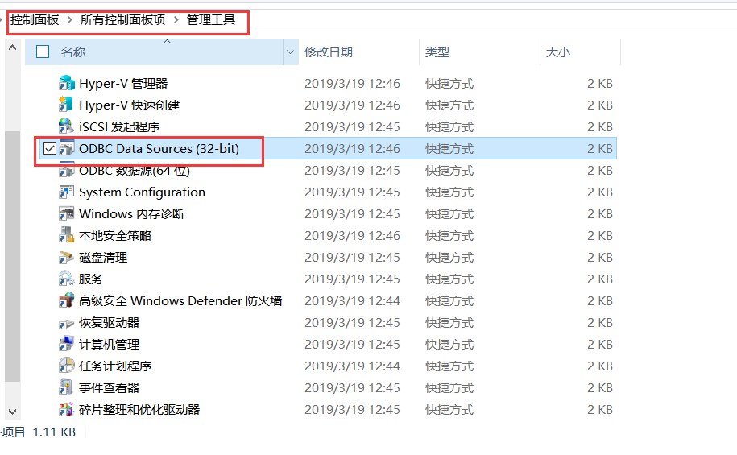


==点击Test==


看到上面这个就可以点击OK了

==添加成功==


**接下来进行EA里面的操作**

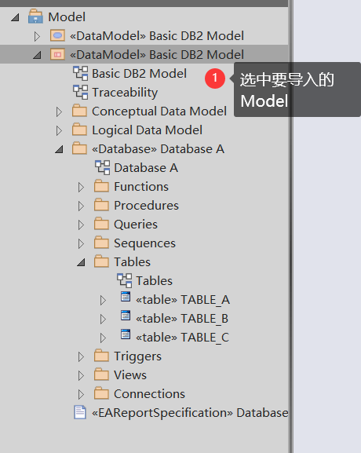


==


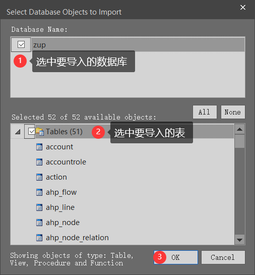

==导入成功==


如果想看外键之间的联系，将Database A图中的所有复制到Tables图中


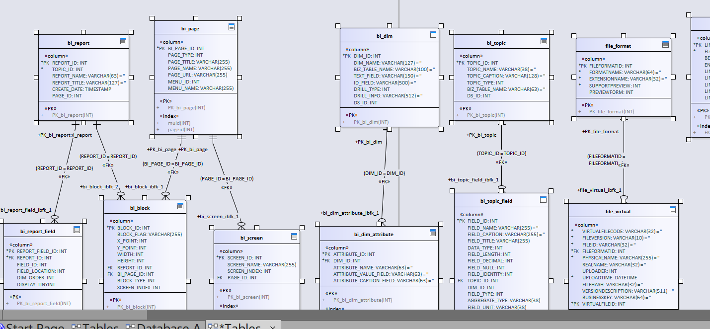

#### 6 EA文件合并

1. 导出xml文件


2. 导入xml文件

   

3. 合并

   注意经过测试XML File也需要选择 和Merge相同的文件。

   
   
   ### 附录5：原型工具安装与使用
   
   
   
   