# 企业应用框架开发：
zhouyi


## 0.总体设计


### 1. 设计思路

采用主流开源技术框架，建设满足企业级应用的框架，能够适应企业高并发、复杂业务处理、扩展性、便于运维的要求，保证可持续性发展。课程包括典型企业应用框架介绍、系统开发部署环境搭建、系统需求分析与建模、企业数据库设计方案、企业主流技术好开发框架选型与应用、物联网平台框架设计与应用等内容。通过本课程，学生能够独立的搭建开发环境，根据需求设计技术方案，选择合适的技术框架、组件，完成系统功能的开发。


### 2. 主要内容

| 单元  | **主要内容**                                                 | **学时** |
| ----- | ------------------------------------------------------------ | -------- |
| **1** | 典型企业架构讲解：信息化系统(ERP/MIS)、物联网平台(设备监控)、电商平台。 | 4        |
| **2** | 系统开发与部署（DevOps）：主流开发工具IDEA、PyCharm的安装与应用；Docker +微服务在企业应用开发、运维中应用；Jenkins+Git /Gitlab 系统开发部署与发布于禅道进行项目管理与缺陷跟踪；JMeter进行压力性能测试。 | 4        |
| **3** | 系统分析与设计：需求分析与建模工具EA、原型设计工具  Axure、数据库设计工具  ERStudio/EA/navicat的掌握与应用。 | 4        |
| **4** | 主流企业开发框架搭建：Spring Boot + Maven+  Spring MVC+MyBatis+MySQL+Redis + 前端框架+商务智能(BI)。 | 4        |
| **5** | 企业级数据库设计：企业业务（组织岗位职责；规章制度业务规范、业务流程、业务场景）基础信息（组织架构、权限体系、日志）建设、业务信息（举例ERP/监控平台）建设。数据介绍（数据库MySQL/HBase/redis）+数据概念（数据资源）。 | 4        |
| **6** | 平台技术选型与框架搭建：操作系统、应用服务器、负载均衡、缓存、数据存储、文件存储、消息队列、搜索设计、开发框架。 | 4        |
| **7** | 物联网平台设计：高并发通信服务(Netty)+消息队列(RabbitMQ /Kafka)+ Redis + MySQL集群+ 组态软件。高并发系统的设计与优化（Nginx 集群+ MySQL集群/Hadoop + 高并发通信+  缓存）。 | 4        |
| **8** | 企业平台Demo设计与开发（基于开源框架，数据库设计、框架搭建、部分功能开发、系统部署、系统运行）。 | 4        |


### 3.技术路线

1. 典型的企业应用讲解

2. 学员进入实战，引导学生进行开发

3. 学员能够独立的搭建开发环境，根据需求设计技术方案，选择合适的技术框架、组件，完成系统功能的开发。


### 4. 具体操作

1. [计划用EA 使用一个原型项目，体系化的 从用例分析、领域模型、 架构设计（业务架构 应用架构 技术架构 数据架构）、业务流程、状态转换、类、接口走一遍。支撑课程建设。]()

2. 大家在设计、开发时，各种工具一起上(axure viso ea/rose 思维导图  wps）画出各种图形，分不清阶段（需求 设计  开发  测试？），找不准讨论的对象（用户 开发人员 专家 设计人员？）。
   UML中类图 状态图在不同的阶段如何使用，也不是非常清晰。需要梳理。

3. 这样学习者学习后，至少知道什么是架构设计，应该在什么阶段出什么样的图，如何指导开发。

   

   


## 1. 系统分析与设计

### 1.1系统开发的阶段

**特点：集百家之长，从系统开发阶段划分、实际案例讲解、UML图的应用场景分析三个方面进行阐述。**


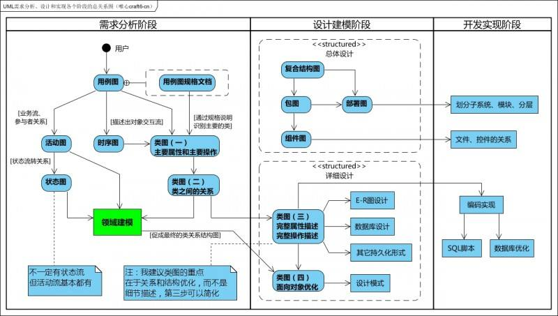


UML图可以应用于需求分析、设计建模、开发实施多个应用场景，只是侧重点不同，细化程度不同。

在需求分析阶段可以用使用用例图、活动图、时序图、类图进行建模。

```
软件工程的一般开发过程：愿景分析、业务建模，需求分析，健壮性设计，关键设计，最终设计，实现……
```


### 1.2 需求分析

需求分析阶段要业务用例图，活动图，对象状态复杂时需要画状态图。

#### 1.2.1 基本概念

用例是用户期望具备的功能，每一个用例说明一个系统提供给它的使用者的一种服务或功能。用例的目标是要定义系统的一个行为，但并不显示系统的内部结构。用例名一般为动宾短语，符号是椭圆加用例。

用例图是指由参与者（Actor）、用例（Use Case），边界以及它们之间的关系构成的用于描述系统功能的视图。 用例图（User Case）是外部用户（被称为参与者）所能观察到的系统功能的模型图。

#### 1.2.2 用例要素构成


#### 1.2.3 用例的关系

a）参与者与用例间的关联关系：参与者与用例之间的通信，也成为关联或通信关系。


##### 1.2.3.1 用例的关系

a）参与者与用例间的关联关系：参与者与用例之间的通信，也成为关联或通信关系。

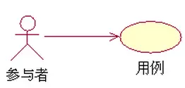

b）用例与用例之间的关系：包含关系（include）、扩展关系（extend）、泛化关系。


##### 1.2.3.2 包含关系

用例A,用例B都包含用例C。

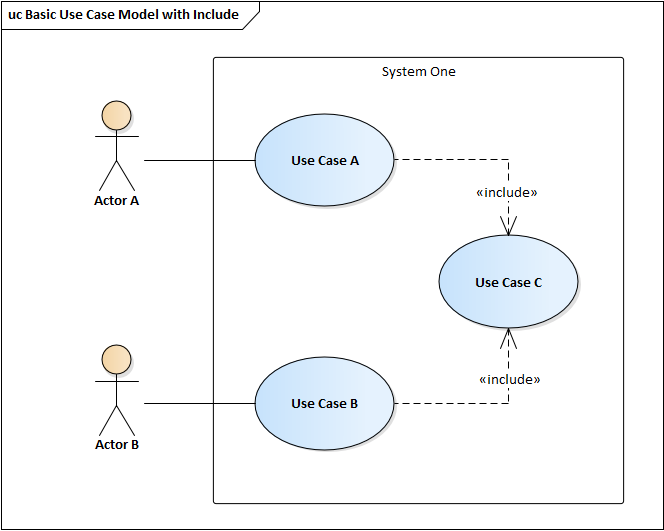

2.3.2 扩展关系

用例A 为基本用例，用例B为扩展用例。


##### 1.2.3.3 泛化关系

用例B从从里A继承。


#### 1.2.4 用例的确定

###### 1.2.4.1用例图建模及应用

创建用例图模型主要包含3部分内容：

- 识别系统中的角色和用例
- 区分用例之间的先后次序
- 创建用例图模型结构

###### 1.2.4.2识别系统中的角色和用例

这部分工作通常由系统分析员通过和客户沟通来完成。

要获取系统的用例，首先要找出系统的角色。

要获取系统角色可以在与客户沟通时，询问用户一些问题来识别角色。可以参考下列问题：

- 谁将使用系统的主要功能？
- 是需要系统的支持以完成日常工作？
- 谁负责维护、管理系统并保持系统正常运行？
- 系统需要与哪些外部系统交互？
- 系统需要处理哪些硬件设备？
- 谁对系统运行产生的结果比较感兴趣？

当我们获取到系统角色后，我们可以通过角色来列出它的用例。可以通过回答下列问题来识别用例：

- 每个角色执行的操作有什么？
- 什么角色将要创建、存储、改变、删除或者读取系统中的信息？
- 什么用例会创建、存储、改变、删除或读取这个信息？
- 角色需要通知外部系统的突然变化嘛？
- 系统需要通知角色正在发生的事情吗？
- 什么用例将支持和维护系统？

#### 1.2.5 业务用例与系统用例

分清业务用例和系统用例，是做需求分析的第一步:

用例 use case，或译使用案例、用况，是软件工程或系统工程中对系统如何反应外界请求的描述，是一种通过用户的使用场景来获取需求的技术。每个用例提供了一个或多个场景，该场景说明了系统是如何和最终用户或其它系统互动，也就是谁可以用系统做什么，从而获得一个明确的业务目标。

**业务用例：属于业务范围的概念。顾名思义，在具体用户所接触的真实业务中总结出来的例子，体现了需求，属于功能性需求，需要actor来实现的**

**系统用例：属于系统范围的概念。也可理解为要实现某个业务用例的系统级实现**

系统用例并不是业务需求的细分

最常见的例子就是档案管理，从业务用例来说，添加档案，修改档案，删除档案，对于系统用例。可能修改档案比较麻烦，就只是添加档案，删除档案就可以实现业务层面的功能性需求。

比如点菜：在业务层面，点菜人员只需要点菜，或者是取消点菜，但是在需求用例中需要体现增加菜品，减少菜品，取消点单

 

以下是百度结果：

业务用例是用来捕获功能性需求的，功能性需求是由actor的业务目标来体现的。也就是对于actor来说，他所负责的业务需要由一系列的业务目标组成。比如一个档案管理员，他的业务目标就是维护档案。比如论坛管理员，他的业务目标有维护用户，维护帖子等..这些业务目标构成actor职责的全部。业务用例体现了需求。
而需求的实现有多种方式。如何实现它，是由系统用例来体现的，它们并不是一个简单的细分关系，虽然看上去象。就说维护档案吧，这样一个业务目标，会有多种不同的用例场景去完成它，这些场景包括如何增加档案，如何修改档案，如何删除档案....对于系统用例来说，就是通过分析这些场景，来决定哪些场景中的哪些部分是要纳入系统建设范围的。比如维护档案业务用例中，假设由于某个原因，修改档案很困难，只能通过先删除，再全部重建的方式来实现，那么系统用例就增加档案，删除档案，而没有修改档案。
业务用例和系统用例是分别站在客户的业务视角和系统建设视角来规划的。业务用例不是接近，而是完全的直接需求，系统用例也不是业务逻辑的详细划分，而是系统对需求的实现方式，但不是与程序设计无关，它只是说，要建设的系统功能性需求由这些系统用例构成。
所以业务用例和系统用例都是需求范畴，它们分别代表了业务范围和系统范围。

```

```


#### 1.2.6领域模型设计

##### 1.2.6.1建模背景

```
按照一般的项目管理过程，“需求”之后是“分析”，领域模型（ domain model（业务对象模型））是完成从需求分析（自然语言）到面向对象设计的一座桥梁。用例是没有类的概念的，是纯自然的语言（比如英语、汉语）写的，因为用例实际上由客户口述给我们、然后由我们形成文档化的用例文档，无法完成从自然语言到面向对象语言的转换。

领域模型，顾名思义就是显示最重要的业务概念和它们之间关系，是真实世界各个事物的表示（现实世界的可视化抽象字典）。是描述业务领域（业务实体）的静态结构，而不是软件中各构件的表示（类：表示业务概念，通常只包含重要属性；关联、泛化：表达概念之间的关系）。用来帮助我们理解相关领域知识的模型，是描述业务用例实现的对象模型。

领域模型过程中识别出来的对象和具体的语言无关，也没有方法。换句话说，public、private、函数这些面向对象的属性在领域模型阶段不需要分析出来。
参考:
https://www.cnblogs.com/ppgeneve/p/5089113.html
```

##### 1.2.6.2 如何建设模型

领域模型”阶段我们要做什么、该怎么做。**领域建模的三字经方法:找名词、定属性、连关系。** 

（1）找出用例模型中的名词，尽可能多的找出概念类（识别方法：概念类分类列表、名词性短语）。

```
a.概念分类列表：人、事物、地点、组织、概念、事件、规则、抽象名词、交易项目、角色、设备、组织结构（对用例进行识别：实体、过程中的信息、角色的输入输出、操作设备等）

b.名词分析法：识别问题域和用例描述中的名词和名词性短语作为候选的概念类和属性，从候选项中，摒弃多余的名词，确定最终的对象（注意是作为类还是属性，类可以是一种标识、状态和行为）
```

（2）然后识别这些名词本身的相关信息，定属性。

```
a.语法：
      可见性 属性名：类型 多重性=默认值{特性表}  
      [可见性] 属性名 [：类型] [=初始值]
b.属性类型是简单的数据类型为佳，如果是复杂概念，考虑是否单独作为一个概念类
c.任何属性都不表示外键，即不应该用属性来联系概念类，区别于数据库设计中的外键
```

（3）以及名词之间的相互关联关系，关联、继承、依赖。

```
关联：类之间的某种语义关系包括聚合，组合
继承：一般到特殊
依赖：表明一个元素（源元素）的定义或实现依赖另一个元素（被依赖元素）的定义或实现
```


###### 1.找出用例模型中的名词

原有用例如下，用蓝色加黑标出名词（重复的就不标了）：

1）**顾客**携带**商品**到**收银台**；

2）**收银员**扫描**商品条形码**；

3）**系统**根据条形码获取并显示**商品信息**；

4）收银员重复2~3步，直到所有商品扫描完毕；

5）系统计算**商品总额**；

...

n）系统打出**商品清单**，完成**交易**。

这个用例中的名词有“顾客”、“商品”、“收银台”、“收银员”、“商品条形码”、“系统”、“商品信息”、“商品总额”、“商品清单”、“交易”。稍加整理：

1）“顾客”、“收银员”是系统的外部对象，不需要我们进行设计，但这些对象要和系统进行交互；

2）“商品”、“商品条形码”、“商品信息”、“商品总额”、“商品清单”、“交易”是领域对象，但“商品条形码”、“商品信息”可以算作“商品”的属性、“商品总额”可以算作“交易”的属性，最后从这个用例总结出来的领域对象有**“商品”、“商品清单”、“交易”**三个。

###### 2.识别这些名词本身的相关信息

一个对象的属性可能分布在多个用例中，因此可以通过迭代不断的完善一个对象的属性，大家可以看到，我们在第一步中的样例就已经分析了一部分了：“商品条形码”、“商品信息”可以算作“商品”的属性。

对象除了属性外，还有一些约束或者限制，这些在用例中可能有，也可能没有，这就需要分析人员来发现了。比如说交易金额必须大于0.1元小于99999元这种约束，用例中不一定会体现，可能需要分析人员向客户咨询。

###### 3.识别对象间的关系

面向对象设计就是依靠对象间的互相协作来配合完成相应的功能，因此识别出对象和对象本身的属性外，还要识别对象间的关系，例如1对多、1对1、依赖等，详细的各种关系可以参考UML的标准定义。

我们以第一步识别的三个对象为例：“商品清单”包含多个“商品”、一次“交易”对应一个“商品清单”、一个“商品”只能属于一个“交易”等。

###### 4.画出领域模型UML图

结合前三步的分析，画出UML领域模型图。

 参考领域模型：

https://wenku.baidu.com/view/e5ca5879773231126edb6f1aff00bed5b9f37324.html


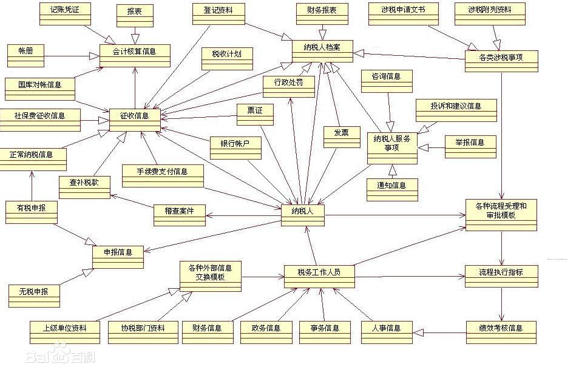


#### 1.2.7 活动图进行需求分析

​     活动图是状态机的一个变体，用来描述执行算法的工作流程中涉及的活动。活动状态代表了一个活动：一个工作流步骤或一个操作的执行。活动图描述了一组顺序的或并发的活动。活动视图用活动图来体现。

​    活动图（Activity Diagram）可以实现对系统动态行为的建模，主要是将用例细化，即用例内部的细节可以以活动图的方式描述。活动图描述活动的顺序，主要表活动之间的控制流，是内部处理驱动的流程，在本质上是一种流程图。先看一下基本图标。


​	 活动图可以认为是用例的细化。

1. 购物场景：


2. 支付场景


#### 1.2.8 用序列图画业务流程

在潘加宇的《软件方法》[7]中比较了活动图和序列图，推崇使用序列图来表达业务，称之为业务序列图，然后基于业务序列图来识别系统用例（区别于业务用例，即是本文所称用例）。可以发现当处理多个业务角色时，序列图确实拥有与活动图相当的表现力。那么，序列图如果用在用例规约中，将是什么景象？ 


​																图片来源于网络

可以看到序列图表达的内容与基本流文字是一样的，更加直观，但显然的需要更多时间，而且并不能充分说明交互细节，毕竟在图片上不适宜打上密密麻麻的字。更关键的上述这幅图中有“银行主机”，这就超出了单个用例的范畴。

总的来说，序列图不是用例的标准配置，在用例规约中使用序列图可以更好的呈现事件流，但其将花费更多时间，如果在单个用例内再考虑其它角色和其它用例，那么所费时间更多，而且有可能与前期业务分析重复，也有可能与后续设计分析重复。

在编写有效用例一书中，明确指出在用例规约中画序列图是不合适的。

参考：

```
https://www.cnblogs.com/kubixuesheng/p/5156492.html
https://wenku.baidu.com/view/0123d837abea998fcc22bcd126fff705cd175c45.html
```


```
业务序列图的组成：业务执行者、业务工人、业务实体，以及三者间的交互，以完成某个业务用例的实现流程。业务工人[Business worker]——位于业务组织内部，负责业务流程中某些工作的人员。比如银行柜员，诊所的医生。业务实体[Business Entity]——在业务用例的实现流程中，业务工人所使用的“系统”。例如银行的数钞机，学校的校园卡系统。业务实体可以和业务工人相互取代各自的职责。


采用序列图来描述业务现状的步骤：

　　1.识别业务对象：业务执行者、业务工人、业务实体；

　　2.确定业务对象间的职责、协作及交互顺序

　　3.绘制业务序列图。

　　其中绘制图的时候，生命线（Lifeline）是一条垂直的虚线，用来表示序列图中的对象在一段时间内的存在

　　

　　示例：比如为某家招聘公司进行业务建模——画出业务现状序列图，招聘的业务用例描述：招聘公司在XXX市人才交流中心前台，要求发布招聘信息，并向工作人员出示公司资质证明，工作人员核实资质的有效性，招聘公司将招聘简介给工作人员。工作人员在招聘记彔本上填写公司招聘职位，招聘条件，以及公司简介等信息，并要求招聘公司核实，招聘公司核实无误后，工作人员将招聘信息用彩纸张贴在招聘信息栏内，工作人员向招聘公司收取一定费用。（注意：在现实工作中，类似如上的信息都是分析师与组织的业务专家深入沟通后才能获得的）。本例的业务对象是，招聘公司（业务执行者），工作人员（业务工人），找到业务对象之后，开始确定各个对象之间的职责，交互……
```


### 1.3架构设计

#### 1.3.1生产力与架构

架构可分为**业务架构、应用架构、技术架构**，业务架构是**生产力**（战略），应用架构是**生产关系**（战术），技术架构是**生产工具**（装备）。业务架构决定应用架构，应用架构需要适配业务架构，并随着业务架构不断进化，同时应用架构依托技术架构最终落地。 

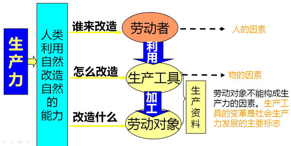

1. 生产力：指具有一定生产经验和劳动技能的**劳动者**和所使用的**生产资料**结合起来, 从而在**物质资料生产过程中所发生的力量**, 也就是人类在生产过程中征服和改造自然界, 并获得适合自己需要的物质资料的能力。

2. 生产关系：指人们在物质资料生产过程中结成的**社会关系**。它的具体内容包括人们在物质资料的生产、交换、分配、消费等方面的关系。生产资料所有制是生产关系的基础。一定的生产资料所有制形式, 决定人们在生产中一定的地位和相互关系、一定的换关系、一定的产品分配和消费关系。

   生产力决定生产关系，生产关系要适应生产力的发展，生产关系是生产力发展的形式，生产关系会反作用于生产力。这是唯物史观的基本原理。 生产关系有两种基本类型：一是以[公有制](https://baike.baidu.com/item/公有制)为基础的生产关系，二是以[私有制](https://baike.baidu.com/item/私有制)为基础的生产关系

3. 生产工具：又称劳动工具，是人们在生产过程中用来直接对劳动对象进行加工的物件。它被用于劳动者和劳动对象之间，起传导劳动的作用。是劳动资料的基本的和主要的部分，是机械性的劳动资料。从原始人的石斧、弓箭，到现代化的各种各样的机器、工具、技术设备等，都同样起着传导劳动的作用，均属生产工具。


#### 1.3.2 架构划分

1. 系统架构：指的完整系统的组成架构。**包括业务规划，业务模块、业务流程，对整个系统的业务进行拆分，对领域模型进行设计，把现实的业务转化成抽象对象。**例如系统分成几个部分？服务平台、管理门户、终端门户、ATM门户、外部系统以及接口、支撑系统等，将这些系统进行合理的划分。然后再进行功能分类细分，例如服务平台内部划分为系统管理、用户管理、帐号管理、支付管理、接口层、统计分析等逻辑功能。总之，将整个系统业务分解为逻辑功能模块，并且科学合理，就是系统架构。

   

2. 应用架构：应用架构定义系统有哪些应用、以及应用之间如何分工和合作。应用作为独立可部署的单元，为系统划分了明确的边界（生产关系，各司其职）。应用架构深刻影响系统功能组织、代码开发、部署和运维等各方面。这里所谓应用就是各个逻辑模块或者子系统。主要考虑部署，例如不同的应用如何分别部署，如何支持灵活扩展、大并发量、安全性等，需要画出物理网络部署图。按照应用进行划分的话，还需要考虑是否支持分布式SOA。

3. 技术架构：从技术层面描述，主要是分层模型，例如持久层、数据层、逻辑层、应用层、表现层等，然后每层使用什么技术框架，确定组成应用系统的实际运行组件（lvs，nginx，tomcat，php-fpm等），这些运行组件之间的关系，以及部署到硬件的策略。系统架构的设计要求架构师具备软件和硬件的功能和性能的过硬知识，这也是架构设计工作中最为困难的工作。

4. 数据架构：

5. 代码架构：

6. 部署拓扑架构（物理架构）：

#### 1.3.3战略与战术设计

系统架构是战略设计与战术设计的完美结合：

- **战略设计**：业务架构用于指导架构师如何进行系统架构设计。

- **战术设计**：应用架构要根据业务架构来设计。

- **战术实施**：应用架构确定以后，就是技术选型。

  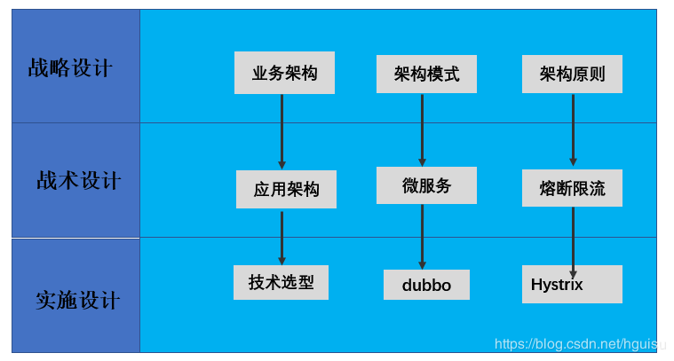

#### 1.3.4业务架构

1. 总体架构图（京东业务架构）

   

2. 业务模块（功能结构图）

3. 业务流程

#### 1.3.5 应用架构

1、职责划分:   明确应用（各个逻辑模块或者子系统）边界
   1）逻辑分层
   2）子系统、模块定义。
   3）关键类。
2、职责之间的协作：
   1）接口协议：应用对外输出的接口。
   2）协作关系：应用之间的调用关系。

    应用分层有两种方式：
    
    一种是水平分（横向），按照功能处理顺序划分应用，比如把系统分为web前端/中间服务/后台任务，这是面向业务深度的划分。
    
    另一种是垂直分（纵向），按照不同的业务类型划分应用，比如进销存系统可以划分为三个独立的应用，这是面向业务广度的划分。
    
     应用的合反映应用之间如何协作，共同完成复杂的业务case，主要体现在应用之间的通讯机制和数据格式，通讯机制可以是同步调用/异步消息/共享DB访问等，数据格式可以是文本/XML/JSON/二进制等。
    
     应用的分偏向于业务，反映业务架构，应用的合偏向于技术，影响技术架构。分降低了业务复杂度，系统更有序，合增加了技术复杂度，系统更无序。
    
     应用架构的本质是通过系统拆分，平衡业务和技术复杂性，保证系统形散神不散。
    
     系统采用什么样的应用架构，受业务复杂性影响，包括企业发展阶段和业务特点；同时受技术复杂性影响，包括IT技术发展阶段和内部技术人员水平。业务复杂性（包括业务量大）必然带来技术复杂性，应用架构目标是解决业务复杂性的同时，避免技术太复杂，确保业务架构落地。

#### 1.3.6 技术架构

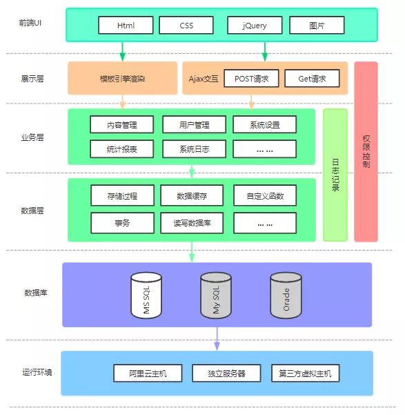


#### 1.3.7 物理架构

 拓扑架构，包括架构部署了几个节点，节点之间的关系，服务器的高可用，网路接口和协议等，决定了应用如何运行，运行的性能，可维护性，可扩展性，是所有架构的基础。这个图主要是运维工程师主要关注的对象。


## 2. 典型企业应用框架


### 2.1业务应用场景


1. 业务需求：


2. 物联网监控平台业务场景

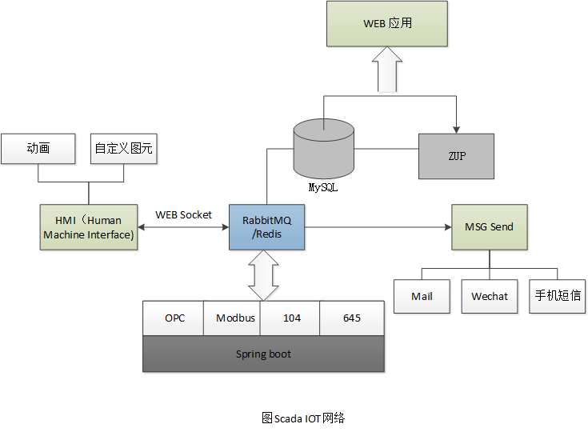


### 2.2大数据平台架构

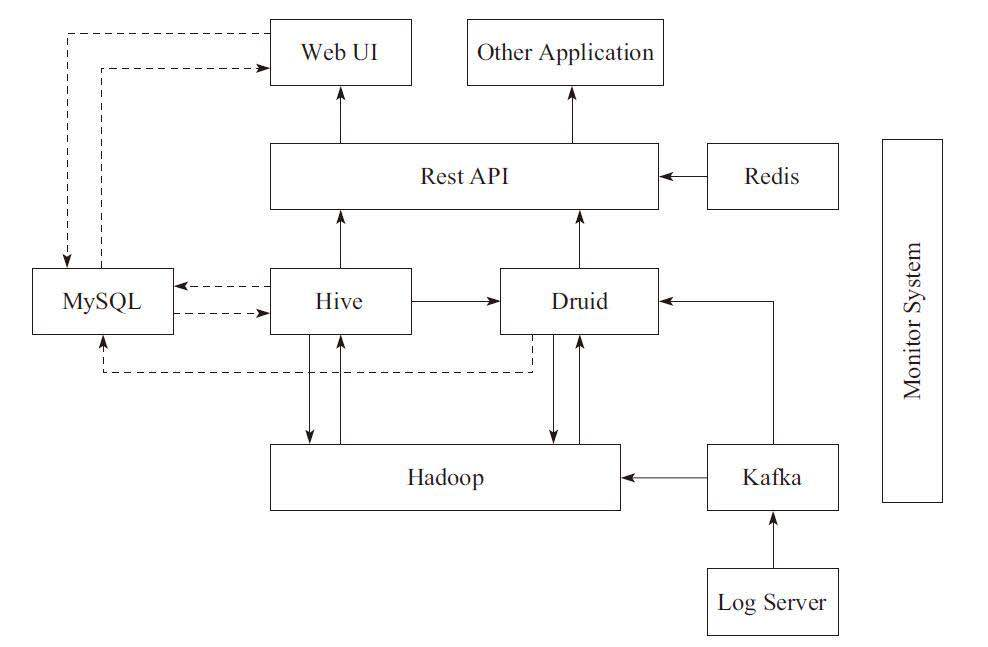

​							图1. 基础技术框架


#### 2.2.1 Lamda架构


```
在这张架构图中，大数据平台里面向用户的在线业务处理组件用褐色标示出来，这部分是属于互联网在线应用的部分，其他蓝色的部分属于大数据相关组件，使用开源大数据产品或者自己开发相关大数据组件。你可以看到，大数据平台由上到下，可分为三个部分：数据采集、数据处理、数据输出与展示。

1.数据采集

将应用程序产生的数据和日志等同步到大数据系统中，由于数据源不同，这里的数据同步系统实际上是多个相关系统的组合。数据库同步通常用 Sqoop，日志同步可以选择 Flume，打点采集的数据经过格式化转换后通过 Kafka 等消息队列进行传递。

不同的数据源产生的数据质量可能差别很大，数据库中的数据也许可以直接导入大数据系统就可以使用了，而日志和爬虫产生的数据就需要进行大量的清洗、转化处理才能有效使用。

2.数据处理

这部分是大数据存储与计算的核心，数据同步系统导入的数据存储在 HDFS。MapReduce、Hive、Spark 等计算任务读取 HDFS 上的数据进行计算，再将计算结果写入 HDFS。

MapReduce、Hive、Spark 等进行的计算处理被称作是离线计算，HDFS 存储的数据被称为离线数据。在大数据系统上进行的离线计算通常针对(某一方面的)全体数据，比如针对历史上所有订单进行商品的关联性挖掘，这时候数据规模非常大，需要较长的运行时间，这类计算就是离线计算。

除了离线计算，还有一些场景，数据规模也比较大，但是要求处理的时间却比较短。比如淘宝要统计每秒产生的订单数，以便进行监控和宣传。这种场景被称为大数据流式计算，通常用 Storm、Spark Steaming 等流式大数据引擎来完成，可以在秒级甚至毫秒级时间内完成计算。

3.数据输出与展示

大数据计算产生的数据还是写入到 HDFS 中，但应用程序不可能到 HDFS 中读取数据，所以必须要将 HDFS 中的数据导出到数据库中。数据同步导出相对比较容易，计算产生的数据都比较规范，稍作处理就可以用 Sqoop 之类的系统导出到数据库。

这时，应用程序就可以直接访问数据库中的数据，实时展示给用户，比如展示给用户关联推荐的商品。

除了给用户访问提供数据，大数据还需要给运营和决策层提供各种统计报告，这些数据也写入数据库，被相应的后台系统访问。很多运营和管理人员，每天一上班，就是登录后台数据系统，查看前一天的数据报表，看业务是否正常。如果数据正常甚至上升，就可以稍微轻松一点;如果数据下跌，焦躁而忙碌的一天马上就要开始了。

将上面三个部分整合起来的是任务调度管理系统，不同的数据何时开始同步，各种 MapReduce、Spark 任务如何合理调度才能使资源利用最合理、等待的时间又不至于太久，同时临时的重要任务还能够尽快执行，这些都需要任务调度管理系统来完成。

上面讲的这种大数据平台架构也叫 Lambda 架构，是构建大数据平台的一种常规架构原型方案。
```


#### 2.2.2 Kappa架构


Jay Kreps认为通过非常，非常快地增加并行度和重播历史来处理重新处理实时数据，避免在实时数据处理系统上再“粘粘”一个离线数据处理系统。于是，他提出了这样的架构：


```
Kafka或者其他消息中间件，具备保留多日数据的能力。正常情况下kafka都是吐出实时数据，经过实时处理系统，进入服务数据库（Serving DB）。

当系统需要数据订正时，重放消息，修正实时处理代码，扩展实时处理系统的并发度，快速回溯过去历史数据。

这样的架构简单，避免了维护两套系统还需要保持结果一致的问题，也很好解决了数据订正问题。

但它也有它的问题：

1、消息中间件缓存的数据量和回溯数据有性能瓶颈。通常算法需要过去180天的数据，如果都存在消息中间件，无疑有非常大的压力。同时，一次性回溯订正180天级别的数据，对实时计算的资源消耗也非常大。

2、在实时数据处理时，遇到大量不同的实时流进行关联时，非常依赖实时计算系统的能力，很可能因为数据流先后顺序问题，导致数据丢失。

例如：一个消费者在淘宝网上搜索商品。正常来说，搜索结果里，商品曝光数据应该早于用户点击数据产出。然而因为可能会因为系统延迟，导致相同商品的曝光数据晚于点击数据进入实时处理系统。如果开发人员没意识到这样的问题，很可能会代码设计成曝光数据等待点击数据进行关联。关联不上曝光数据的点击数据就很容易被一些简单的条件判断语句抛弃。

对于离线处理来说，消息都是批处理，不存在关联不上的情况。在Lambda架构下，即使实时部分数据处理存在一定丢失，但因为离线数据占绝对优势，所以对整体结果影响很小。即使当天的实时处理结果存在问题，也会在第二天被离线处理的正确结果进行覆盖。保证了最终结果正确。
```


```
Kappa在抛弃了离线数据处理模块的时候，同时抛弃了离线计算更加稳定可靠的特点。Lambda虽然保证了离线计算的稳定性，但双系统的维护成本高且两套代码带来后期运维困难。

为了实现流批处理一体化，Blink采用的将流处理视为批处理的一种特殊形式。因此在内部维持了若干张张流表。通过缓存时间进行约束，限定在一个时间段内的数据组成的表，从而将实时流转为微批处理。

理论上只要把时间窗口开的足够大，Flink的流表可以存下上百日的数据，从而保证微批处理的“微”足够大可以替换掉离线处理数据。

但这样做存在几个问题：

1.Flink的流表是放在内存中，不做持久化处理的。一旦任务发生异常，内存数据丢失，Flink是需要回溯上游消息流，从而转为Kappa的结构。

2.数据窗口开的越大，内存成本越高。受限于成本，对大量数据处理仍然有可支持的物理空间上限。

3.下游接收的通常都是处理结果，对于内存中的流表数据是无法直接访问的。这样无形中增加了开发成本。
```


#### 2.2.3 Lambda和Kappa架构优缺点


## 3. 系统开发与部署

### 3.1 远程连接工具


一般进行服务运行和人工智能，都是在Linux机器上运行。

为了进行远程服务的开发、测试与应用部署，需要掌握xshell ,cuteftp等工具。为了学习，大家可以自己搭建Centos或者Ubutu服务器，二者区别不是非常大。

   xx317  Wifi    

1. cuteftp

   用来连接服务器，进行文件的传输。

   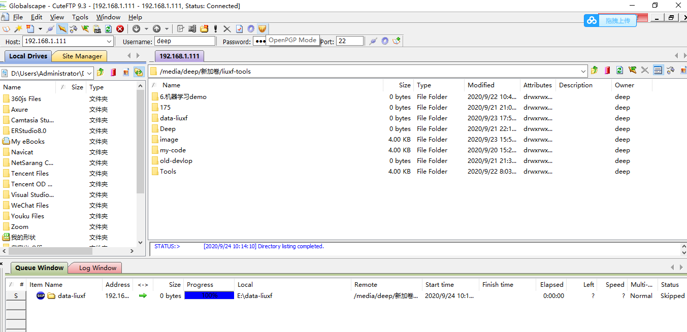

2. xShell

   

掌握基本的命令（ubuntu 田）

```
ls 

pwd

ifconfig

mv

mkdir

cp

cd

su 
chmod
chown
useradd
apt-get  /yum install(centos)

docker 

```


​                        


### 3.2 开发运行环境

 1.  Linux/Ubuntu安装/Docker的使用/Tomcat /Nginx集群(docker)
 2. JDK
 3. IDEA安装、配置	
 4. Kafka 安装    
 5. Redis安装    
 6. FastFS安装
 7. MySQL安装/Navicat安装

### 2.2  配置与部署工具安装

 1. jenkins(系统部署)

    

 2. GITHub使用(参加附录)

### 3.3  设计工具安装

 1. ERStudio数据库设计

    

 2. EAxito系统建模

    

 3. Axure原型界面

    

    https://ke.qq.com/course/1645555?taid=10365907865508851&tuin=25363a4e

    

 4. VISO安装

    


## 4. SpringBoot构建企业开发框架

```

 **Spring Boot是由Pivotal团队提供的全新框架，其设计目的是用来简化新Spring应用的初始搭建以及开发过程。该框架使用了特定的方式来进行配置，从而使开发人员不再需要定义样板化的配置。通过这种方式，Spring Boot致力于在蓬勃发展的快速应用开发领域(rapid application development)成为领导者。从最根本上来讲，Spring Boot就是一些库的集合，它能够被任意项目的构建系统所使用。简便起见，该框架也提供了命令行界面，它可以用来运行和测试Boot应用。框架的发布版本，包括集成的CLI（命令行界面），可以在Spring仓库中手动下载和安装。**
 
 企业框架搭建：
 
 https://blog.csdn.net/zongjinlong/article/details/107745286?utm_medium=distribute.pc_relevant.none-task-blog-title-2&spm=1001.2101.3001.4242
```


- **创建独立的Spring应用程序**
- **嵌入的Tomcat，无需部署WAR文件**
- **简化Maven配置**
- **自动配置Spring**
- **提供生产就绪型功能，如指标，健康检查和外部配置**
- **绝对没有代码生成并且对XML也没有配置要求**

1. springBoot初步

   ```
   https://docs.spring.io/spring-boot/docs/1.5.8.RELEASE/reference/htmlsingle/#getting-started-installing-spring-boot
   
   
   https://www.cnblogs.com/toutou/p/9650939.html
   ```

   

2. 基于Mybatis连接数据库

3. 构建Redis缓存

4. FastFS文件服务器

5. Tomcat+Nginx集群

6. UI LayUI/VUE/MUI

7. 


```
Maven约定优于配置：它提出这一概念，为项目提供合理的默认行为，无需不必要的配置。提供了默认的目录 

src                   ——>       源代码和测试代码的根目录

main                            应用代码的源目录

Java                 源代码

resources           项目的资源文件

test                测试代码的源目录

java                测试代码

resources           测试的资源文件

target              编译后的类文件、jar文件等

 

    对于Maven约定优于配置的理解，一方面对于小型项目基本满足我们的需要基本不需要自己配置东西，使用Maven已经配置好的，快速上手，学习成本降低；另一方面，对于不满足我们需要的还可以自定义设置，体现了灵活性。配置大量减少了，随着项目变的越复杂，这种优势就越明显。
```


### 4.3 构建多Module模块

```
参考：

https://blog.csdn.net/weixin_44421461/article/details/107218689?utm_medium=distribute.pc_relevant.none-task-blog-title-7&spm=1001.2101.3001.4242
```

一个层次分明的多模块工程结构不仅方便维护，而且有利于后续微服务化。在此结构的基础上还可以扩展common层（公共组件）、server层（如dubbo对外提供的服务）。此为项目重构的第一步，后续还会的框架中集成logback、disconf、redis、kafka等组件。


###  

### 4.4 Spring boot 生产开发环境配置


一、简单介绍
在项目的开发中，有些配置文件在开发、测试或者生产等不同环境中可能是不同的，例如数据库连接、redis的配置等等。那我们如何在不同环境中自动实现配置的切换呢？Spring给我们提供了profiles机制，下面看看在Spring Boot中是如何使用Profiles功能的。

在Spring Boot中多环境配置文件名需要使用application-{profile}.properties的格式，这里的**{profile}**对应的是你的环境标识。例如：

```
application-dev.properties — 这是开发环境
开发环境是windows
application-prod.properties — 这是生产环境
```


二、激活指定profile
我们在首先在Resource目录下新建两个配置文件，分别命名为application-dev.properties以及application-prod.properties，为了方便看到区别，我们分别在三个配置文件中分别指定tomcat启动端口：


application.properties

server.port=8081
1
application-dev.properties

server.port=8082

application-prod.properties

server.port=8083

这个时候我们没有指定任何profile,执行启动类的main方法，可以看到:

Tomcat started on port(s): 8081 (http) with context path ''


程序会默认加载application.properties中的配置，我们想要使用对应的环境，只需要在application.properties中使用spring.profiles.active属性来设置，值对应上面提到的{profile}，这里就是指dev、prod:

server.port=8081
spring.profiles.active=dev

重新启动Main方法：

Tomcat started on port(s): 8082 (http) with context path ''

可以看到tomcat启动端口为8082。

####从上面的结果可以看出，application-dev.properties中的配置覆盖了application.propertie中的配置。我们在配置文件中可以将与环境无关的属性放到application.propertie中进行配置，而根据环境的变化而变化的配置放到各个application-{profile}.properties文件中。

三、激活profile的方式
上面展示了第一种激活profile的方式，即在application.properties中指定属性spring.profiles.active的值。但是这种方式在实际项目中的使用并不合适，因为你每次提交代码还要手动修改pring.profiles.active的值。

第二种可以使用命令行的方式，Spring Boot的程序一般是打成jar包，在使用java -jar 执行jar包的时候，可以再后面加上：

--spring.profiles.active=dev；

例如

java -jar target/spring-boot-helloworld-0.0.1.jar --spring.profiles.active=prod

可以看到启动端口为：

Tomcat started on port(s): 8083 (http) with context path ''

若是使用IDEA进行开发的话，还可以修改启动配置：


之后执行Main方法，依然激活了dev的配置。

第三种是修改虚拟机的配置，在虚拟机配置哪里加上：

-Dspring.profiles.active=dev

### 4.4 Springboot集成ES检索

```
https://blog.csdn.net/pyfysf/article/details/100810846
```


#### Springboot WebSockt


### 基于IDEA自动部署系统

IntelliJ IDEA自动部署如下：
打开IntelliJ IDEA点击Tools/Deployment/Configuration（或者File-Settings-Build,Execution,Deployment-Deployment都行）,界面如下所示：


填写远程服务器信息，并测试远程服务器连接成功(下图表示测试连接成功)；


填写本地和远程服务器项目路径；


基本设置完成，最后用IntelliJ IDEA打开项目，右键点击Deployment，Unpload to 配置名(或者Tools，Deployment，Unpload to)， 上传、运行项目即可！！！


可能配置的时候有些复杂，但是如果你能配置好，测试部署方便很多 ！！！


### 4.6 springboot-附近的人-陈梦雅

找附近的人

```
https://www.cnblogs.com/toutou/p/9771386.html      陈宸
```


做一遍，录制一个小视频（10分钟以内） FastStone

### 4.7 springboot 错误异常处理-陈宸

```
SpringBoot入门教程(六)SpringBoot2.0统一处理404,500等http错误跳转页

https://www.cnblogs.com/toutou/p/9802800.html

```


```
[SpringBoot入门教程(十九)@ControllerAdvice+@ExceptionHandler全局捕获Controller异常](https://www.cnblogs.com/toutou/p/9907401.html)
```


### 4.8 springboot 过滤器和拦截器 -田玉超

```
[过滤器和拦截器](https://www.cnblogs.com/toutou/p/9831678.html)
```


### 4.9 常用注解（宸）

```
[SpringBoot入门教程(十六)@Autowired、@Inject、@Resource](https://www.cnblogs.com/toutou/p/9907381.html)
```


```
[SpringBoot入门教程(十七)@Service、@Controller、@Repository、@Component](https://www.cnblogs.com/toutou/p/9907392.html)
```


```
[SpringBoot入门教程(十八)@value、@Import、@ImportResource、@PropertySource](https://www.cnblogs.com/toutou/p/9907753.html)
```


### 4.10  整合Redis(程宏豪)


```
[SpringBoot进阶教程(五十二)整合Redis](https://www.cnblogs.com/toutou/p/spring_boot_redis.html)
```

```
pringBoot进阶教程(五十四)整合Redis之共享Session](https://www.cnblogs.com/toutou/p/redis_session.html)
```


### 4.11 整合Kafka消息队列


### 4.7 安全管理实现

1. 账户登录
2. 单点登录
3. SQL注入过滤器
4. 日志记录

### 4.8  业务组件实现

1. 基于Srpingboot构建服务Service(流程引擎)
   1. 消息队列
   2. 计算服务
   3. 通信服务(Netty)
   4. 构建实时库
2. 商务智能 BI
3. 流程引擎workflow
4. 权限体系Rbac


## 5. 构建物联网框架


### 5.1高并发通信Netty


### 5.2消息队列Kafka


```
https://www.cnblogs.com/gongshiyun/p/12528000.html


https://www.cnblogs.com/toutou/p/springboot_kafka.html

```

https://www.cnblogs.com/toutou/p/springboot_kafka.html


kafka是一个分布式消息队列。具有高性能、持久化、多副本备份、横向扩展能力。生产者往队列里写消息，消费者从队列里取消息进行业务逻辑。一般在架构设计中起到解耦、削峰、异步处理的作用。kafka对外使用topic的概念，生产者往topic里写消息，消费者从读消息。为了做到水平扩展，一个topic实际是由多个partition组成的，遇到瓶颈时，可以通过增加partition的数量来进行横向扩容。单个parition内是保证消息有序。每新写一条消息，kafka就是在对应的文件append写，所以性能非常高。


Kafka是一种高吞吐量的分布式发布订阅消息系统，也是一个流式数据处理平台，具有高性能、持久化、多副本备份、横向扩展能力。Kafka最初由LinkedIn公司开发的，之后成为Apache项目的一部分。具备下面三个特点：

- 类似消息系统，提供事件流的发布和订阅，即具备数据注入功能
- 存储时间流数据的节点具有故障容错的特点，即具备数据存储功能
- 能够对实时的事件流进行流式的处理和分析，即具备流处理功能


#### 4.2.1 Kafka基础架构与术语


**Producer：**发布消息的对象称为生产者

**Consumer：**订阅消息并处理发布的消息的种子的对象称为消费者

**Consumer Group**：我们可以将多个消费者组成一个消费者组，在kafka的设计中同一个分区的数据只能被消费者组中的某一个消费者消费。同一个消费者组的消费者可以消费同一个topic的不同分区的数据，这也是为了提高kafka的吞吐量

**Kafka cluster ：**已发布的消息保存在一组服务器中，称之为Kafka集群

**Broker：**Kafka集群中的每一个服务器都是一个代理(Broker). 消费者可以订阅一个或多个主题（topic），并从Broker拉数据，从而消费这些已发布的消息。

**Topic**：消息的主题，可以理解为消息的分类，kafka的数据就保存在topic。在每个broker上都可以创建多个topic

**Partition：**Topic的分区，每个topic可以有多个分区，分区的作用是做负载，提高kafka的吞吐量。同一个topic在不同的分区数据是不重复的，partition的表现形式就是一个一个的文件夹

**Replication：**每一个分区都有多个副本，副本的作用是做备胎。当主分区（Leader）故障的时候会选择一个备胎（Follower）上位，成为Leader。在kafka中默认副本的最大数量是10个，且副本的数量不能大于Broker的数量，follower和leader绝对是在不同的机器，同一机器对同一个分区也只可能存放一个副本（包括自己）。

**Zookeeper**：kafka集群依赖zookeeper来保存集群的的元信息，来保证系统的可用性


#### 4.2.2 Kafka角色以及应用场景

- **消息系统**

  Kafka和传统的消息系统（也称作消息中间件）都具备系统解耦、冗余存储、流量削峰、缓冲、异步通信、扩展性、可恢复性等功能。与此同时， Kafka 还提供了大多数消息系统难以实现的**消息顺序性保障及回溯消费**的功能。

- **存储系统**

  Kafka 把**消息持久化到磁盘**，相比于其他基于内存存储的系统而言，有效地降低了数据丢失的风险。也正是得益于Kafka 的消息持久化功能和多副本机制，我们可以把Kafka 作为长期的数据存储系统来使用，只需要把对应的数据保留策略设置为“永久”或启用主题的日志压缩功能即可。

- **流式处理平台**

  Kafka 不仅为每个流行的流式处理框架提供了可靠的数据来源，还提供了一个完整的**流式处理类库**，比如窗口、连接、变换和聚合等各类操作。


应用场景：

**1 消息队列**

> 比起大多数的消息系统来说，**Kafka**有更好的吞吐量，内置的分区，冗余及容错性，这让**Kafka**成为了一个很好的大规模消息处理应用的解决方案。消息系统 一般吞吐量相对较低，但是需要更小的端到端延时，并尝尝依赖于**Kafka**提供的强大的持久性保障。在这个领域，**Kafka**足以媲美传统消息系统，如ActiveMR或RabbitMQ。

**2 行为跟踪**

> **Kafka**的另一个**应用场景**是跟踪用户浏览页面、搜索及其他行为，以发布-订阅的模式实时记录到对应的topic里。那么这些结果被订阅者拿到后，就可以做进一步的实时处理，或实时监控，或放到hadoop/离线数据仓库里处理。

**3 元信息监控**

> 作为操作记录的监控模块来使用，即汇集记录一些操作信息，可以理解为运维性质的数据监控吧。

**4 日志收集**

> 日 志收集方面，其实开源产品有很多，包括Scribe、Apache Flume。很多人使用**Kafka**代替日志聚合（log aggregation）。日志聚合一般来说是从服务器上收集日志文件，然后放到一个集中的位置（文件服务器或HDFS）进行处理。然而**Kafka**忽略掉 文件的细节，将其更清晰地抽象成一个个日志或事件的消息流。这就让**Kafka**处理过程延迟更低，更容易支持多数据源和分布式数据处理。比起以日志为中心的 系统比如Scribe或者Flume来说，**Kafka**提供同样高效的性能和因为复制导致的更高的耐用性保证，以及更低的端到端延迟。

**5 流处理**

> 这 个场景可能比较多，也很好理解。保存收集流数据，以提供之后对接的Storm或其他流式计算框架进行处理。很多用户会将那些从原始topic来的数据进行 阶段性处理，汇总，扩充或者以其他的方式转换到新的topic下再继续后面的处理。例如一个文章推荐的处理流程，可能是先从RSS数据源中抓取文章的内 容，然后将其丢入一个叫做“文章”的topic中；后续操作可能是需要对这个内容进行清理，比如回复正常数据或者删除重复数据，最后再将内容匹配的结果返 还给用户。这就在一个独立的topic之外，产生了一系列的实时数据处理的流程。Strom和Samza是非常著名的实现这种类型数据转换的框架。

**6 事件源**

> 事件源是一种应用程序设计的方式，该方式的状态转移被记录为按时间顺序排序的记录序列。**Kafka**可以存储大量的日志数据，这使得它成为一个对这种方式的应用来说绝佳的后台。比如动态汇总（News feed）。

**7 持久性日志（commit log）**

> **Kafka**可以为一种外部的持久性日志的分布式系统提供服务。这种日志可以在节点间备份数据，并为故障节点数据回复提供一种重新同步的机制。**Kafka**中日志压缩功能为这种用法提供了条件。在这种用法中，**Kafka**类似于Apache BookKeeper项目。


#### 4.2.3Kafka与其他消息队列比较

与RabbitMQ、RocketMQ比较：

- Kafka是LinkedIn开源的分布式发布-订阅消息系统，目前归属于Apache定级项目。Kafka主要特点是基于Pull的模式来处理消息消费，追求高吞吐量，一开始的目的就是用于日志收集和传输。0.8版本开始支持复制，不支持事务，对消息的重复、丢失、错误没有严格要求，适合产生大量数据的互联网服务的数据收集业务。
- RabbitMQ是使用Erlang语言开发的开源消息队列系统，基于AMQP协议来实现。AMQP的主要特征是面向消息、队列、路由（包括点对点和发布/订阅）、可靠性、安全。AMQP协议更多用在企业系统内，对数据一致性、稳定性和可靠性要求很高的场景，对性能和吞吐量的要求还在其次。
- RocketMQ是阿里开源的消息中间件，它是纯Java开发，具有高吞吐量、高可用性、适合大规模分布式系统应用的特点。RocketMQ思路起源于Kafka，但并不是Kafka的一个Copy，它对消息的可靠传输及事务性做了优化，目前在阿里集团被广泛应用于交易、充值、流计算、消息推送、日志流式处理、binglog分发等场景。

| RabbitMQ           | Kafka                                                        |                                                              |
| ------------------ | ------------------------------------------------------------ | ------------------------------------------------------------ |
| 开发语言           | erlang                                                       | scala，Java                                                  |
| 架构模型           | ① 遵循AMQP；② 生产者、消费者、broker。③ broker由exchange、binding、queue组成；④ consumer消费位置由broker通过确认机制保存； | ① 不遵循AMQP；② 生产者、消费者、kafka集群、zookeeper集群；③ kafka集群由多个broker节点组成，消息按照topic分类，每个topic又划分为多个partition；④ broker无状态，offset由消费者指定； |
| 可靠性             |                                                              | RabbitMQ可靠性更好，支持事务，支持消息确认机制               |
| 高可用             | 采用镜像队列，即主从模式，数据是异步同步的，当消息过来，主从全部写完后，回ack，这样保障了数据的一致性。 | 每个分区都有一个或多个副本，这些副本保存在不同的broker上，其中有且仅有一个分区副本作为leader，其余的作为follower，当leader不可用时，会选举follower作为新leader继续提供服务。只有leader提供读写服务，follower从leader同步拉取数据然后备份。 |
| 吞吐量             | kafka更高                                                    |                                                              |
| 是否支持事务       | 支持                                                         | 不支持                                                       |
| 负载均衡           | 需要外部支持才能实现（如：loadbalancer）                     | kafka利用zk和分区机制实现负载均衡                            |
| 是否支持消费者Push | 不支持                                                       | 支持                                                         |
| 是否支持消费者Pull | 支持                                                         | 支持                                                         |
| 适用场景           | kafka的优势主要体现在吞吐量上，它主要用在高吞吐量的场景。比如日志采集。 | 具有较高的严谨性，数据丢失的可能性更小，同时具备较高的实时性，用在对实时性、可靠性要求较高的消息传递上。 |


#### 4.2.4 Kafka安装

##### 1. centos安装Kafka


1. 版本信息

```
操作系统：Centos7
docker：17.03.2-ce
docker-compose：1.23.2
kafka：0.11.0.3
zookeeper：3.4.9
JDK：1.8.0_191
spring boot：1.5.9.RELEASE
spring-kafka：1.3.8.RELEASE
```

2. 安装流程

```
1. 安装JDK
2.  wget https://downloads.apache.org/kafka/2.6.0/kafka_2.12-2.6.0.tgz
3. tar -xzvf kafka_2.12-2.4.0.tgz
4.启动 zookeeper

　　　　kafka 在设计上就是依赖于 zookeeper 的，所以启动 kafka 前需要启动 zookeeper。依赖 zookeeper 有两种选择：使用独立的 zookeeper 和 使用 kafka 自带的 zookeeper（高版本的 kafka 已经自带了 zookeeper）。如果使用独立的 zookeeper，就需要修改 kafka 安装目录下的 config/server.properties 文件中的 zookeeper.connect 配置项（zookeeper 对外服务地址）。本例中使用自带的 zookeeper。

　　　　nohup ./bin/zookeeper-server-start.sh config/zookeeper.properties >> zookeeper.nohup &

　　　　检查 zookeeper 进程是否已经启动：ps -ef|grep zookeeper

5.启动 kafka
　nohup ./bin/kafka-server-start.sh config/server.properties >> kafka.nohup &
　　
　7.验证

　　7.1. 启动 producer

　　　　sh bin/kafka-console-producer.sh --broker-list localhost:9092 --topic test

　　7.2.启动 consumer，在另一个终端窗口执行

　　　　sh bin/kafka-console-consumer.sh --bootstrap-server localhost:9092 --topic test --from-beginning

　　7.3.从 producer 终端窗口发送消息，并查看 consumer 窗口的输出，结果如下：　　
　　
```

producer窗口发送消息：


consumer 窗口接收消息：


##### 2. 基于docker镜像


```
version: '2'
services:
  zookeeper:
    image: wurstmeister/zookeeper
    ports:
      - "2181:2181"
  kafka:
    image: wurstmeister/kafka
    ports:
      - "9092-9095:9092"
    environment:
      KAFKA_ADVERTISED_LISTENERS: PLAINTEXT://localhost:9092
      KAFKA_ADVERTISED_HOST_NAME: 192.168.18.101
      KAFKA_LISTENERS: PLAINTEXT://:9092
      KAFKA_ZOOKEEPER_CONNECT: zookeeper:2181
    volumes:
    # 使容器内可以执行docker ps、docker port等命令
      - /var/run/docker.sock:/var/run/docker.sock
```


1. 创建和启动docker容器

```powershell
docker-compose up -d
```

1. 扩展kafka节点为3个

```powershell
docker-compose scale kafka=3
```


#### 4.2.5 Kafka可视化工具

```
https://www.kafkatool.com/download.html
```


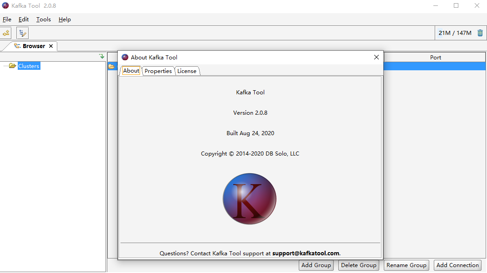


#### 4.2.6  基于Kafka进行开发-陈宸


```
https://blog.csdn.net/boling_cavalry/article/details/85528519
```


```
[SpringBoot进阶教程(六十二)整合Kafka](https://www.cnblogs.com/toutou/p/springboot_kafka.html)

```


```
https://blog.csdn.net/yuanlong122716/article/details/105160545/

```


### 5.3 Redis进行实时数据展示


redis是Nosql数据库中使用较为广泛的非关系型内存数据库，redis内部是一个key-value存储系统。它支持存储的value类型相对更多，包括string(字符串)、list(链表)、set(集合)、zset(sorted set –有序集合)和hash（哈希类型，类似于Java中的map）。Redis基于内存运行并支持持久化的NoSQL数据库，是当前最热门的NoSql数据库之一，也被人们称为数据结构服务器。

1. 物联网实时数据库，存储当前数据
2. RdisTimeSerials 构建时序数据库，存储物联网序列数据。
3. 构建消息中间件，进行消息的收发。
4. 缓存构建，加快采集速度。
4. Nginx+tomcat+redis构建集群


### 5.4系统互联


#### 5.4.1 基于RESTFUL系统互联


#### 5.4.2 Get与Post协议简介

GET和POST是什么？HTTP协议中的两种发送请求的方法。 

HTTP的底层是TCP/IP。所以GET和POST的底层也是TCP/IP，也就是说，GET/POST都是TCP链接。GET和POST能做的事情是一样一样的。你要给GET加上request body，给POST带上url参数，技术上是完全行的通的。  

CP就像汽车，我们用TCP来运输数据，它很可靠，从来不会发生丢件少件的现象。但是如果路上跑的全是看起来一模一样的汽车，那这个世界看起来是一团混乱，送急件的汽车可能被前面满载货物的汽车拦堵在路上，整个交通系统一定会瘫痪。为了避免这种情况发生，交通规则HTTP诞生了。HTTP给汽车运输设定了好几个服务类别，有GET, POST, PUT, DELETE等等，HTTP规定，当执行GET请求的时候，要给汽车贴上GET的标签（设置method为GET），而且要求把传送的数据放在车顶上（url中）以方便记录。如果是POST请求，就要在车上贴上POST的标签，并把货物放在车厢里。当然，你也可以在GET的时候往车厢内偷偷藏点货物，但是这是很不光彩；也可以在POST的时候在车顶上也放一些数据，让人觉得傻乎乎的。HTTP只是个行为准则，而TCP才是GET和POST怎么实现的基本。
但是，我们只看到HTTP对GET和POST参数的传送渠道（url还是requrest body）提出了要求。“标准答案”里关于参数大小的限制又是从哪来的呢？


在我大万维网世界中，还有另一个重要的角色：运输公司。不同的浏览器（发起http请求）和服务器（接受http请求）就是不同的运输公司。 虽然理论上，你可以在车顶上无限的堆货物（url中无限加参数）。但是运输公司可不傻，装货和卸货也是有很大成本的，他们会限制单次运输量来控制风险，数据量太大对浏览器和服务器都是很大负担。业界不成文的规定是，（大多数）浏览器通常都会限制url长度在2K个字节，而（大多数）服务器最多处理64K大小的url。超过的部分，恕不处理。如果你用GET服务，在request body偷偷藏了数据，不同服务器的处理方式也是不同的，有些服务器会帮你卸货，读出数据，有些服务器直接忽略，所以，虽然GET可以带request body，也不能保证一定能被接收到哦。 


GET和POST还有一个重大区别，简单的说：GET产生一个TCP数据包；POST产生两个TCP数据包。

长的说：对于GET方式的请求，浏览器会把http header和data一并发送出去，服务器响应200（返回数据）；而对于POST，浏览器先发送header，服务器响应100 continue，浏览器再发送data，服务器响应200 ok（返回数据）。 也就是说，GET只需要汽车跑一趟就把货送到了，而POST得跑两趟，第一趟，先去和服务器打个招呼“嗨，我等下要送一批货来，你们打开门迎接我”，然后再回头把货送过去。 

因为POST需要两步，时间上消耗的要多一点，看起来GET比POST更有效。因此Yahoo团队有推荐用GET替换POST来优化网站性能。但这是一个坑！跳入需谨慎。为什么？

1. GET与POST都有自己的语义，不能随便混用。
2. 据研究，在网络环境好的情况下，发一次包的时间和发两次包的时间差别基本可以无视。而在网络环境差的情况下，两次包的TCP在验证数据包完整性上，有非常大的优点。
3. 并不是所有浏览器都会在POST中发送两次包，Firefox就只发送一次。

#### 5.4.3 例子

```
package cn.zup.data.main;

import cn.zup.data.db.dao.DataDao;
import cn.zup.data.db.model.*;
import cn.zup.data.db.service.RedisService;
import cn.zup.data.util.CThread;
import com.alibaba.fastjson.JSONException;
import net.sf.json.JSONArray;
import net.sf.json.JsonConfig;
import net.sf.json.util.CycleDetectionStrategy;
import org.apache.http.HttpEntity;
import org.apache.http.HttpResponse;
import org.apache.http.client.methods.HttpGet;
import org.apache.http.client.methods.HttpPost;
import org.apache.http.entity.StringEntity;
import org.apache.http.impl.client.HttpClients;
import org.apache.http.util.EntityUtils;
import org.json.JSONObject;
import org.slf4j.Logger;
import org.slf4j.LoggerFactory;
import org.springframework.beans.factory.annotation.Autowired;
import org.springframework.stereotype.Component;

import java.io.IOException;
import java.util.Calendar;
import java.util.List;
import java.util.Map;
import java.util.Set;

/*
数据发布线程
 */
@Component
public class CHttpRequestThread extends CThread {

	private static Logger logger = LoggerFactory.getLogger(CHttpRequestThread.class);

	@Autowired
	CObjectManager m_pObjManager;// = CObjectManager.getInstance();	//取全局管理对象指针

	@Autowired
	private DataDao dataDao;

	@Autowired
	private RedisService redisService;

	@Override
	public void run() {

		System.out.println("Http数据请求线程开始\n");
		while (GetNeedExitFlag() == false) {
			try {
				Calendar nowTime = Calendar.getInstance();
				if (nowTime.get(Calendar.MINUTE) % 2 == 0 && nowTime.get(Calendar.SECOND) == 0) {
					getDataUrl();
					sleep(2000);
				}
			} catch (Exception ex) {
				ex.printStackTrace();
			}
		}
		System.out.println("Http数据请求线程退出!\n");
		SetExitFlag();

	}

	void getDataUrl() {
		List<jk_Conn> jk_connList = init_Conn();
		for (int i = 0; i < jk_connList.size(); i++) {
			List<conn_param> paramList = jk_connList.get(i).getParamList();
			jk_Conn jk_conn = jk_connList.get(i);
			String url = jk_conn.getReq_url() + "?" + jk_conn.getReq_param();
			String result = get(url, null);
			JSONObject jsonObjectResult = null;
			try {
				jsonObjectResult = new JSONObject(result);
				String status = jsonObjectResult.getString("status");
				if(status.matches(jk_conn.getReq_result())){
					System.out.println(jk_conn.getConn_id()+"号请求成功");
					String result_Name = jk_conn.getResult_name();
					org.json.JSONArray jsonAarry = new org.json.JSONArray();
					//如果结果名称中含有-，则表示结果处在第二层，先取出第一层array，然后再取出第二层array；
					//json中中括号[]下的数据需要转化成jsonArray数组，大括号{}下的数据转化为object；
					if(result_Name.contains("-")){
						String[] params = result_Name.split("-");
						org.json.JSONArray firstFloorAarry = jsonObjectResult.getJSONArray(params[0]);
						for(int z=0;z<firstFloorAarry.length();z++){
							JSONObject jsono = (JSONObject)firstFloorAarry.get(z);
							org.json.JSONArray secondFloorAarry = firstFloorAarry.getJSONObject(z).getJSONArray(params[1]);
							resultProc(secondFloorAarry,jk_conn,paramList);
						}
					}else{
						org.json.JSONArray firstFloorAarry = jsonObjectResult.getJSONArray(result_Name);
						resultProc(firstFloorAarry,jk_conn,paramList);
					}
				}
			} catch (JSONException e1) {
				// TODO Auto-generated catch block
				e1.printStackTrace();
			}

			//System.out.println(result);
		}

	}

	void resultProc(org.json.JSONArray jasonResultAarry,jk_Conn jk_conn,List<conn_param> paramList){
		for(int firNum=0;firNum<jasonResultAarry.length();firNum++){

			JSONObject jsono = (JSONObject)jasonResultAarry.get(firNum);
			int bujianId = 0;
			//判断部件标识,如果标识带*，表示此部件id固定，即返回结果均是这个设备的数据，不是设备list。
			if(jk_conn.getI_device_label().contains("*"))
			{
				bujianId = Integer.parseInt(jk_conn.getI_device_label().replace("*",""));
			}
			else
			{
				bujianId = Integer.parseInt(jk_conn.getDeviceMap().get(jsono.getString(jk_conn.getI_device_label())));
			}
			for(int k=0;k<paramList.size();k++){
				int dataType = paramList.get(k).getData_type();
				int bjParam = paramList.get(k).getBjparam();
				int bjType =  jk_conn.getBjtype();
				double fCoef = paramList.get(k).getFCoef();
				double value = 0.0d;
				switch (paramList.get(k).getData_format()){
					case 0://表示数据格式为原始数据
						double dData = jsono.getDouble(paramList.get(k).getI_param_label());
						value = Double.valueOf(dData)*fCoef;
						break;
					case 1://表示数据为字符串格式，或由空格隔开，在前
						String sData = jsono.getString(paramList.get(k).getI_param_label());
						value = Double.valueOf(sData.split(" ")[0])*fCoef;
						break;
					default:
						break;
				}
				SetLiveTime(System.currentTimeMillis());
				Calendar calTime=Calendar.getInstance();
				String redisKey = dataType+"-"+bjType+"-"+bujianId+"-"+bjParam+"-save";
				DataStructure dataStructure = new DataStructure();
				dataStructure.setTime(calTime.getTimeInMillis());
				dataStructure.setValue(value);
				redisService.set(redisKey, dataStructure);
			}
		}
	}
	List<jk_Conn> init_Conn() {
		//获取接口配置信息 jk_conn表
		List<jk_Conn> jk_connList = dataDao.getJkConnInfo();
		jk_Conn conn = new jk_Conn();
		for (int i = 0; i < jk_connList.size(); i++) {
			conn.setConn_id(jk_connList.get(i).getConn_id());
			jk_connList.get(i).setDeviceMap(dataDao.getConnDeviceInfo(conn));
			jk_connList.get(i).setParamList(dataDao.getConnParamInfo(conn));
		}
		return jk_connList;
	}

	/*Author By ZhangSC
	 *post请求
	 *url_param为application/json 的时候 为json（字符串）格式
	 *如果为post请求，param格式需要为：String param = "[{\"userid\":\"585\",\"lan\":\"en-us！\"}]";
	 */
	public static String post(String url, String url_param, Map<String, String> heads) {

		org.apache.http.client.HttpClient httpClient = HttpClients.createDefault();

		HttpResponse httpResponse = null;
		String result = "";

		HttpPost httpPost = new HttpPost(url);
		if (heads != null) {
			Set<String> keySet = heads.keySet();
			for (String s : keySet) {
				httpPost.addHeader(s, heads.get(s));
			}
		}
		try {
			JsonConfig jsonConfig = new JsonConfig();
			jsonConfig.setCycleDetectionStrategy(CycleDetectionStrategy.LENIENT);
			JSONArray jsonArray = JSONArray.fromObject(url_param);
			String jsonstr = jsonArray.toString();
			jsonstr = jsonstr.substring(1, jsonstr.length() - 1);

			HttpPost post = new HttpPost(url);
			StringEntity postingString = new StringEntity(jsonstr);// json传递
			post.setEntity(postingString);
			post.setHeader("Content-type", "application/json");
			HttpResponse response = httpClient.execute(post);
			HttpEntity httpEntity = response.getEntity();
			if (httpEntity != null) {
				result = EntityUtils.toString(httpEntity, "utf-8");
			}
		} catch (IOException e) {
			e.printStackTrace();

		}
		return result;

	}

	//get请求
	public static String get(String url, Map<String, String> heads) {
		org.apache.http.client.HttpClient httpClient = HttpClients.createDefault();
		HttpResponse httpResponse = null;
		String result = "";
		HttpGet httpGet = new HttpGet(url);
		if (heads != null) {
			Set<String> keySet = heads.keySet();
			for (String s : keySet) {
				httpGet.addHeader(s, heads.get(s));
			}
		}
		try {
			httpResponse = httpClient.execute(httpGet);
			HttpEntity httpEntity = httpResponse.getEntity();
			if (httpEntity != null) {
				result = EntityUtils.toString(httpEntity, "utf-8");
			}

		} catch (IOException e) {
			e.printStackTrace();

		}
		return result;
	}

	public JSONObject getJSON(String sb) throws JSONException {
		return new JSONObject(sb);
	}
}

```


## 6.企业级数据库设计


```
数据分析（Data Analytics）从来都不是一个寂寞的领域，每一个时代都赋予数据分析更丰富的内容和精尖的技术。数据分析是指通过数据的收集，进行数据处理和分析，将数据整理成有用的信息，包括有价值的洞察和可以付之于行动的建议。数据分析的目的就是帮助我们把数据（Data）变成信息（Information），再从信息变成知识（Knowledge），最后从知识变成智慧（Wisdom）。在数据分析领域，商务智能（Business Intelligence，BI）、数据挖掘（Data Mining，DM）、联机分析处理（On-Line Analytical Processing，OLAP）等概念在名称上和数据分析方面非常接近，容易混淆，下面做个简单介绍。

商务智能：商务智能（BI）是在商业数据上进行价值挖掘的过程。商务智能的历史很长，很多时候会特别指通过数据仓库技术进行业务报表制作和分析的过程，在分析方法上通常使用聚合（Aggregation）、分片（Slice）等方式进行数据处理。在技术上，商务智能包括ETL（数据的抽取、转换、加载）、数据仓库（Data Warehouse）、OLAP（联机分析处理）、数据挖掘（Data Mining）等技术。

数据挖掘：数据挖掘（DM）是指在大量数据中自动搜索隐藏于其中有着特殊关系（属于Association rule learning）信息的过程。很多年前，它一直是一个热门的研究生专业，直到信息检索专业的出现。

联机分析处理：联机分析处理（OLAP）是一种建立数据系统的方法，其核心思想即建立多维度的数据立方体，以维度（Dimension）和度量（Measure）为基本概念，辅以元数据实现可以钻取（Drill-down/up）、切片（Slice）、切块（Dice）等灵活、系统和直观的数据展现。
```


​	Hadoop，Storm和Spark是目前最重要的三大分布式计算系统，Hadoop常用于离线的复杂的大数据分析处理，Spark常用于离线的快速的大数据处理，而Storm常用于在线的实时的大数据处理。本文主要介绍三大分布式系统的各自特点和其应用场景。

​	其实我们要知道大数据的实质特性：针对增量中海量的结构化，非结构化，半结构数据，在这种情况下，如何快速反复计算挖掘出高效益的市场数据?带着这个问题渗透到业务中去分析，就知道hadoop需要应用到什么业务场景了!!!如果关系型数据库都能应付的工作还需要hadoop吗?

(1)银行的信用卡业务，当你正在刷卡完一笔消费的那一瞬间，假如在你当天消费基础上再消费满某个额度，你就可以免费获得某种令你非常满意的利益等 等，你可能就会心动再去消费，这样就可能提高银行信用卡业务，那么这个消费额度是如何从海量的业务数据中以秒级的速度计算出该客户的消费记录，并及时反馈 这个营销信息到客户手中呢?这时候关系型数据库计算出这个额度或许就需要几分钟甚至更多时间，就需要hadoop了，这就是所谓的“秒级营销”. 针对真正的海量数据，一般不主张多表关联。

(2)在淘宝，当你浏览某个商品的时候，它会及时提示出你感兴趣的同类商品的产品信息和实时销售情况，这或许也需要用到hadoop。

(3)就是报表用到的年度报告或者年度环比数据报告的时候也会用到hadoop去计算。

(4)搜索引擎分析的时候应该也会用到。一个网友说过，其实还是看big data能否带来多大的效益!比如银行在躺着都赚钱的情况下，big data不一定是银行的项目. 况且hadoop是新兴技术，银行业对新技术还是相对保守的。


### 6.1数据库系统分类

​	   数据库系统一般分为两种类型：OLTP、OLAP：


```
a. 数据表要求前缀，代表命名空间。即命名空间_表名字。例如 project_plan
b. 字段统一小写，中间用下划线分割
c. 一个字段不要超过三个word，一般两个字段。
d. id,name 等字段的命名要和表明关联，意义清晰，便于做表连接。例如plan_id,plan_name ,一般不要带上命名空间。
e. 针对flag ,type,一定不要单独作为一个字段，加上有意义的名字，例如fund_type,valid_flag
```


　　1. OLTP（On-Line Transaction Processing，联机事务处理）系统：也称为生产系统，它是事件驱动的、面向应用的，比如电子商务网站的交易系统就是一个典型的OLTP系统。OLTP的基本特点：

　　数据在系统中产生
　　基于交易的处理系统（Transaction-Based）
　　每次交易牵涉的数据量很小
　　对响应时间要求非常高
　　用户数量非常庞大，主要是操作人员
　　数据库的各种操作主要基于索引进行


　　2. OLAP（On-Line Analytical Processing，联机分析处理）系统：是基于数据仓库的信息分析处理过程，是数据仓库的用户接口部分。是跨部门的、面向主题的。OLAP的基本特点是：

　　本身不产生数据，其基础数据来源于生产系统中的操作数据（OperationalData）
　　基于查询的分析系统
　　复杂查询经常使用夺标联结、全表扫描等，牵涉的数据量往往十分庞大
　　响应时间与具体查询有很大关系
　　用户数量相对较小，其用户主要是业务人员与管理人员
　　优于业务问题不固定，数据库的各种操作不能完全基于索引进行


### 6.2 关系数据库与NoSQL


#### 6.2.1mysql

#### 6.2.2postgresql

#### 6.2.3Redis


### 6.3 时序数据库的选型


6.3.1 时序数据库概念


时序数据库时序数据库用于记录过去时间的各个数据点的信息，典型的应用是服务器的各种性能指标，例如CPU、内存使用情况等。目前时序数据库也广泛应用于各种传感器的数据收集分析工作中，这些数据的收集都有一个特点，就是对时间的依赖非常大，每天产生的数据量非常大，因此写入的量非常大，一般的关系型数据库无法满足这些场景。因此，时序数据库在设计上需要支持高吞吐、高效数据压缩，支持历史查询、分布式部署等。虽然Druid 更加接近数据仓库的角色，但是在很多特性上它也属于一种时序数据库。

```
http://hbasefly.com/2017/11/19/timeseries-database-2/
```


时序数据库有着独特的特点（如下面列表所示），如果与其他数据库一起管理的话，通常会是非常低效的：

1. **高速的数据摄入**：不管是IoT使用场景还是市场分析数据，我们都会有一个稳定的数据流，数据以很快的速度抵达，而且常常是爆发性的。对于大多数解决方案，一年中365天，24/7之内都有数据抵达。
2. **数据不可变**：一旦插入到数据库之中，在过期或删除之前，数据点不会进行任何修改。数据通常是带有时间戳和多个数据点的日志。
3. **非结构化的标签**：时序数据通常是在一定的时间范围内有很多源连续生成的。例如，在IoT使用场景中，每个传感器都是时序数据的源。在这样的场景中，序列中的每个数据点都以标签的形式存储源信息和其他传感器测量数据。来自每个源的数据标签可能并不符合相同的结构或顺序。
4. **数据的价值随时间递减**：只有恰当时间范围内的聚合汇总数据才会对未来产生价值。例如，在一年之后，大多数用户都不需要毫秒范围内存储的每个数据点。只有按照分钟、小时或每天聚合和汇总起来的数据才有意义。
5. **查询要根据时间间隔进行聚合**：基于时序数据生成图表能够让我们放大和缩小查询。之所以能够实现这一点是因为它们的数据是根据间隔聚合而成的。一般而言，时序数据查询是聚合的。这与从数据库检索单条记录是截然不同的。

  

```
https://cloud.tencent.com/developer/news/491464
```

时序数据库技术体系中一个非常重要的技术点是时序数据模型设计，不同的时序系统有不同的设计模式，不同的设计模式对时序数据的读写性能、数据压缩效率等各个方面都有不同程度的影响。这篇文章笔者将会分别针对OpenTSDB、Druid、InfluxDB以及Beringei这四个时序系统中的时序数据模型设计进行介绍。


上图是一个典型的时序数据示意图，由图中可以看出，时序数据由两个维度坐标来表示，横坐标表示时间轴，随着时间的不断流逝，数据也会源源不断地吐出来；和横坐标不同，纵坐标由两种元素构成，分别是数据源和metric，数据源由一系列的标签（tag，也称为维度）唯一表示，图中数据源是一个广告数据源，这个数据源由publisher、advertiser、gender以及country四个维度值唯一表示，metric表示待收集的数据源指标。一个数据源通常会采集很多指标（metric），上图中广告数据源就采集了impressions、clicks以及revenue这三种指标，分别表示广告浏览量、广告点击率以及广告收入。

看到这里，相信大家对时序数据已经有了一个初步的了解，可以简单的概括为：一个时序数据点（point）由datasource(tags)+metric+timestamp这三部分唯一确定。然而，这只是逻辑上的概念理解，那具体的时序数据库到底是如何将这样一系列时序数据点进行存储的呢？

比较有名的几个开源数据库：

流计算：

```
流数据，没有边界的数据。
比如车辆的位置信息，设备的运行状态报告，网站的用户点击信息等。尽管它的定义很简单，流数据有几个比较重要的特点。第一个是流数据从产生到处理，存在延迟。因此流数据有两个时间属性：事件时间和处理时间。而处理时间的延迟，并没有严格要求，可能很大，可能很小，可能时大时小变化很大；而这是流数据区别于实时数据的重要方面。流数据不是实时数据，实时数据不考虑事件时间和处理时间的差别。尽管随着硬件性能的提升，很多原生的流处理引擎已经可以支持部分软实时的应用场景，但流数据和实时数据本身并没有什么必然联系，二者之间有交集，但属于不同的应用范畴。流数据第二个特点，它本身是可以做到强一致性的。认为流数据是不可靠的是一种偏见，或者只是为技术上难以实现强一致性找到借口。但根据具体使用场景的不同，应用可以根据实际需求，来决定自己需要达到的一致性目标，比如强一致，最终一致，或者最多一次，最少一次等等。
```


时序数据已用于越来越多的应用中，包括物联网、DevOps、金融、零售、物流、石油天然气、制造业、汽车、太空、SaaS，乃至机器学习和人工智能。虽然当前时序数据库仅局限于采集度量和监控，但是软件开发人员已经逐渐明白，他们的确需要一款时序数据库，真正设计用于运行多种工作负载。主流的实时库timescalDB  OpenTSDB   TiDB  Influxdb  

数据库对比：

```
https://db-engines.com/de/system/InfluxDB%3BOpenTSDB%3BTimescaleDB
```


性能对比（https://www.cnblogs.com/WeaRang/p/12421842.html）

|                    | Timescale | InfluxDB | OpenTSDB | Druid    | Elasticsearch | Beringei |
| ------------------ | --------- | -------- | -------- | -------- | ------------- | -------- |
| write(single node) | 15K/sec   | 470k/sec | 32k/sec  | 25k/sec  | 30k/sec       | 10m/sec  |
| write(5 node)      |           |          | 128k/sec | 100k/sec | 120k/sec      |          |

选择推荐：

```
可以按照以下需求自行选择合适的存储：

小而精，性能高，数据量较小(亿级): InfluxDB

简单，数据量不大（千万级），有联合查询、关系型数据库基础：timescales

数据量较大，大数据服务基础，分布式集群需求： opentsdb、KairosDB

分布式集群需求，olap实时在线分析，资源较充足：druid

性能极致追求，数据冷热差异大：Beringei

兼顾检索加载，分布式聚合计算： elsaticsearch

如果你兼具索引和时间序列的需求。那么Druid和Elasticsearch是最好的选择。其性能都不差，同时满足检索和时间序列的特性，并且都是高可用容错架构。
```


```
InfluxDB 从一开始曾试图使用 Go 完整地重写整个数据库。事实上在 0.9 版发布后，InfluxDB 更加坚定了这一决策方向，进而完全重写了后端存储引擎（Influx 的早期版本意图发展为可插拔使用 LevelDB，RocksDB 等后端）。该决策的确提供了一些切实的优点。例如，开发人员可以构建特定于问题域的压缩算法，以更适合特定用例。InfluxDB 就使用了 Facebook 的 Gorilla 编码。

然而，这些设计决策对可靠性造成了很严重的影响。首先，InfluxDB 必须自己实现全套的容错机制，包括复制，高可用性和备份 / 恢复等。其次，InfluxDB 必须负责其磁盘可靠性。例如，确保其所有数据结构都是持久的，能够抵御出现故障时的数据损坏问题（甚至抵御在故障恢复期间出现故障）。

另一方面，TimescaleDB 的架构决策使得其可以利用过去 25 年多艰苦、细致的工程成果。整个 PostgreSQL 社区已经构建了坚如磐石的数据库，可真正支持关键任务应用。

事实上，这是 TimescaleDB 联合创始人曾发帖“变无趣为有趣”（https://blog.timescale.com/when-boring-is-awesome-building-a-scalable-time-series-database-on-postgresql-2900ea453ee2） 所阐述的一个核心理念。无状态微服务可能会崩溃并重启，或是易于向上和向下扩展。事实上，这正是整个“面向可恢复的计算”（recovery-oriented computing） 的理念，也是新的“无服务器”设计模式背后的理念。一个数据库需要实际去保存数据，并且不应因处于某种被破坏的状态而在凌晨 3 点叫醒用户。

回头对比这两种可靠性

首先，程序可能崩溃，服务器可能会碰上硬件或电源故障，磁盘可能出现故障或遭受损坏。我们可以缓解这些风险，例如采用强大的软件工程实践、不间断的电源、磁盘 RAID 等。但是风险是不可能彻底消除的，这正是系统运行的真实情况。为此，数据库已构建了一系列机制以进一步降低此类风险，包括：流复制为副本、完整的快照备份和恢复、流备份、强大的数据导出工具等。

TimescaleDB 在设计上考虑了利用 Postgres 生态系统提供的全套工具，它们经过了严格的测试，并且均可用于开源系统中。其中包括：流复制实现高可用性和只读副本、pg_dump 和 pg_recovery 实现完整的数据库快照、pg_basebackup 和日志传送 / 流传输实现增量备份和任意时间点恢复，WAL-E 实现连续存档到云存储，以及强大的 COPY FROM 和 COPY TO 工具实现快速导入 / 导出各种格式的数据。

另一方面，InfluxDB 则必须从零开始构建所有这些工具。事实上，时至今日 InfluxDB 依然没有提供所有这些功能。虽然它一开始在其开源版本中提供了复制和高可用性，但随后将此从开源版本中抽取出来，置于企业版产品中。它的备份工具能够执行完整快照和基于时间点的恢复，最近才增加了对手动增量备份的一些支持（也就是说，基于数据库时间范围执行增量备份的方法风险更大，因为时间戳数据可能会无序到达，因此从某一时间段开始的增量备份可能并未反映出晚到的数据）。InfluxDB 在易于安全输出大量数据上的能力也非常有限。我们听过许多用户（包括一些曾有此经历的 Timescale 工程师）必须编写自定义脚本才能安全地导出数据。如果请求超过数万个数据点，就会导致数据库出现内存不足错误和崩溃。

其次，数据库需要提供基于磁盘的强大可靠性和持久性。一旦数据库提交写入存储，那么数据就会安全地保存到磁盘上。实际上，对于数据量非常大的数据，同一观点也适用于索引结构，否则索引可能需要数小时乃至数日才能恢复。鉴于此，文件系统从令人痛苦的 fsck 恢复转向日志机制，这是有十分充分的理由的。

在 TimescaleDB 中，我们决定不从最底层更改 PostgreSQL 的存储，也不干涉其预写日志的正常功能（WAL 确保了一旦写入被接受，就会被写入到磁盘日志，以确保安全性和持久性，甚至在数据写入到最终位置并且所有索引均安全更新之前）。这些数据结构对确保一致性和原子性至关重要，它们可以防止数据丢失或损坏，并确保可安全恢复。这正是数据库社区（和 PostgreSQL）的努力结果。想象一下，如果数据库正处于崩溃中恢复的过程中，再次发生了崩溃（随后尝试恢复），那么这时会发生什么？

而 InfluxDB 必须从零开始设计和实现所有这些功能。 这在数据库领域中是一个众所周知的难题，通常需要几年甚至几十年时间才能得到正确的解决方案。一些度量存储尽管会偶尔丢失数据，但这完全是可以接受的。我们已经看到在一些不能接受度量存储丢失数据的环境中使用了 TimescaleDB。事实上，在我们所有的用户和部署中只有一份数据被破坏的报告，而调查结果表明这是由用户所使用的商业 SAN 存储导致的错误，而非 TimescaleDB 本身，并且用户继而从备份中成功恢复。而 InfluxDB 论坛则充斥着大量抱怨，例如“数据库在重启后丢失”，“高吞吐率期间发生数据丢失”，“InfluxDB 数据库发生数据丢失”，“因磁盘损坏发生崩溃后，数据库无响应”，“恢复多个数据库后，发生数据混乱”，不胜枚举。

参考资料：

https://blog.csdn.net/dechen6073/article/details/102062347?utm_medium=distribute.pc_relevant.none-task-blog-BlogCommendFromMachineLearnPai2-3.nonecase&depth_1-utm_source=distribute.pc_relevant.none-task-blog-BlogCommendFromMachineLearnPai2-3.nonecase
```


GreePlum是专业的时序数据库吗

```
GP是不能取代专门的时序数据库的，因为专业的时序数据库整个底层的数据存储的方式经过特殊设计，这和传统的数据库是完全不一样的，时序数据库为高并发持续写入优化，不需要考虑数据更新的问题。专业的时序数据库只适合部分特殊的场景使用，并不适合通用性的数据分析场景，更加无法实现Greenplum平台这种对数据的综合性应用。
参考
https://www.sohu.com/a/287913453_747818
```


#### 6.3.1 timescaleDB (on postgresql)

```
https://blog.csdn.net/chouxing7777/article/details/100811491?utm_medium=distribute.pc_relevant.none-task-blog-baidujs-1
```


TimescaleDB 具有以下特点

```


1. 基于时序优化

2. 自动分片（自动按时间、空间分片(chunk)）

3. 全 SQL 接口

4. 支持垂直于横向扩展

5. 支持时间维度、空间维度自动分区。空间维度指属性字段（例如传感器 ID，用户 ID 等）

6. 支持多个 SERVER，多个 CHUNK 的并行查询。分区在 TimescaleDB 中被称为 chunk。

7. 自动调整 CHUNK 的大小

8. 内部写优化（批量提交、内存索引、事务支持、数据倒灌）。

内存索引，因为 chunk size 比较适中，所以索引基本上都不会被交换出去，写性能比较好。

数据倒灌，因为有些传感器的数据可能写入延迟，导致需要写以前的 chunk，timescaleDB 允许这样的事情发生(可配置)。

9. 复杂查询优化（根据查询条件自动选择 chunk，最近值获取优化(最小化的扫描,类似递归收敛)，limit 子句 pushdown 到不同的 server,chunks，并行的聚合操作）

10. 利用已有的 PostgreSQL 特性（支持 GIS，JOIN 等），方便的管理（流复制、PITR）

11. 支持自动的按时间保留策略（自动删除过旧数据）
```

基于Docker安装：

```
https://docs.timescale.com/latest/getting-started/installation/docker/installation-docker
```


#### 6.3.2 OpenTSDB(on HBase+hdfs)

```
  OpenTSDB是一个分布式、可伸缩的时序数据库，支持高达每秒百万级的写入能力，支持毫秒级精度的数据存储，不需要降精度也可以永久保存数据。其优越的写性能和存储能力，得益于其底层依赖的Hbase，Hbase采用LSM树结构存储引擎加上分布式的架构，提供了优越的写入能力，底层依赖的完全水平扩展的HDFS提供了优越的存储能力。OpenTSDB对Hbase深度依赖，并且根据Hbase底层存储结构的特性，做了很多巧妙的优化。关于存储的优化，我在这篇文章中有详细的解析。在最新的版本中，还扩展了对BigTable和Cassandra的支持。
```


```
OpenTSDB采用按指标建模的方式，一个数据点会包含以下组成部分：

metric：时序数据指标的名称，例如sys.cpu.user，stock.quote等。
timestamp：秒级或毫秒级的Unix时间戳，代表该时间点的具体时间。
tags：一个或多个标签，也就是描述主体的不同的维度。Tag由TagKey和TagValue组成，TagKey就是维度，TagValue就是该维度的值。
value：该指标的值，目前只支持数值类型的值。
```


#### 6.3.3 Druid

和HBase和Kudu这类KV数据库不同，Druid是另一种玩法。Druid是一个不折不扣的列式存储系统，没有HBase的主键。上述时序数据在Druid中表示是下面这个样子的：


#### 6.3.4 InfluxDB(on mpp)


#### 6.3.5 RedisTimeSeries 

Redis[模块](https://redis.io/modules) RedisTimeSeries 在经过 6 个月的预览版后正式进入[ GA 版](https://redislabs.com/blog/redistimeseries-ga-making-4th-dimension-truly-immersive/)。该模块旨在为[ Redis ](https://www.infoq.com/redis/)中的[时间序列](https://www.infoq.com/time-series-data/)数据提供分析函数。它具有聚合函数等基本的时间序列工具，并利用了Redis 现有的存储[架构](https://docs.redislabs.com/latest/rs/concepts/)。目前还没有同已有时间序列数据库（TSDB，如[ OpenTSDB ](http://opentsdb.net/)和[ InfluxDB ](https://www.infoq.com/influxdb/)）的基准测试对比。

作为一个键值存储，Redis 之前[已经](https://www.infoq.com/articles/redis-time-series/)在其内部使用其它的数据结构来存储时间序列，如[排序集](https://www.talkunafraid.co.uk/2010/12/time-series-data-in-redis/)、哈希和流等。这些方法有一些[限制](https://blog.yugabyte.com/extending-redis-api-with-a-native-time-series-data-type/)，比如没有时间序列工具集，而且还不清楚如何实现 TSDB 的一些特性（如[标签](https://prometheus.io/docs/concepts/data_model/#metric-names-and-labels)）。RedisTimeseries 本身源于 Redis 的内部需求，即存储和分析来自 Redis 所管理集群的时间序列的度量。现有的命令行接口与该模块兼容。

作为一个动态库加载，该模块把[固定大小的内存块](https://oss.redislabs.com/redistimeseries/#memory-model)排列成链表。每个块的样本数量都是预定义好的，并且具有和[ Streams ](https://www.infoq.com/news/2018/10/Redis-5-Released/)相同的索引实现。它具有基本的时间序列功能，如查询、聚合、保留策略、下采样以及压缩等。但是，[这里的压缩](https://oss.redislabs.com/redistimeseries/configuration/#compaction_policy-policy)似乎与其他时间序列数据库（如[ OpenTSDB ](http://opentsdb.net/docs/build/html/user_guide/definitions.html#compaction)）中的[压缩](https://fabxc.org/tsdb/)不同。时间序列数据中的标签也为该序列添加了上下文信息。在这里，它们被实现为辅助索引。当使用毫秒级精度存储数据时，需要注意一些[问题](https://github.com/RedisTimeSeries/RedisTimeSeries/issues/94)。

该模块的第一次集成是作为 Prometheus 的远程写适配器，Prometheus 将 RedisTimeSeries 作为其后端数据库。有一个数据源[ Grafana ](https://github.com/RedisTimeSeries/grafana-redistimeseries)，并将 Telegraf[配置](https://github.com/influxdata/telegraf/pull/5275/files)为指标收集器。虽然有报告称，与现有 Redis 存储时间序列的方式相比，该模块具有更好的性能，但是还没有针对其他时间序列数据库的基准对比。

该模块是开源的，具体代码详见[ Github ](https://github.com/RedisTimeSeries/RedisTimeSeries)。Redis 目前还没有将该模块与核心产品合并的[计划](https://twitter.com/davenielsen/status/1146661209954930688)，未来将会集成更多的可视化工具和数据流供应商。


https://blog.csdn.net/weixin_34400525/article/details/88003590


### 6.4常用的OLAP平台


```

Hive，Hawq，Impala - 基于SQL on Hadoop
Presto和Spark SQL类似 - 基于内存解析SQL生成执行计划

Kylin - 用空间换时间，预计算
Druid - 一个支持数据的实时摄入  kafka  
ClickHouse - OLAP领域的Hbase，单表查询性能优势巨大
Greenpulm - OLAP领域的Postgresql

场景定位：

1.如果你的场景是基于HDFS的离线计算任务，那么Hive，Hawq和Imapla就是你的调研目标；

2.如果你的场景解决分布式查询问题，有一定的实时性要求，那么Presto和SparkSQL可能更符合你的期望；

3.如果你的汇总维度比较固定，实时性要求较高，可以通过用户配置的维度+指标进行预计算，那么不妨尝试Kylin和Druid；

4.ClickHouse则在单表查询性能上独领风骚，远超过其他的OLAP数据库；

5.Greenpulm作为关系型数据库产品，性能可以随着集群的扩展线性增长，更加适合进行数据分析（Greenplum基于Postgresql，也就是说GreenPulm和TiDB的定位类似，想要在OLTP和OLAP上进行统一）

参考：常用数据仓库的比较
https://blog.csdn.net/valada/article/details/100868039

```


#### 6.4.1 Greenplum


```
Greenplum 是最成熟的开源分布式分析型数据库（今年6月份预计发布的 Greenplum 6 之OLTP性能大幅提升，将成为一款真正的HTAP数据库，评测数据将于近期发布），Gartner 2019 最新评测显示 Greenplum 在经典数据分析领域位列全球第三，在实时数据分析领域位列并列第四。两个领域中前十名中唯一一款开源数据库产品。这意味着如果选择一款基于开源的产品，前十名中别无选择，唯此一款。Gartner 报告原文。那么 Greenplum 分布式数据库是如何炼成？众所周知 Greenplum 基于 PostgreSQL。PostgreSQL 是最先进的单节点数据库，其相关内核文档、论文资源很多。而有关如何将单节点 PostgreSQL 改造成分布式数据库的资料相对较少。本文从6个方面介绍将单节点 PostgreSQL 数据库发展成分布式 MPP 数据库所涉及的主要工作。当然这些仅仅是极简概述，做到企业级产品化耗资数亿美元，百人规模的数据库尖端人才团队十几年的研发投入结晶而成。

作者：蓝色麻雀
链接：https://zhuanlan.zhihu.com/p/100703300
来源：知乎
著作权归作者所有。商业转载请联系作者获得授权，非商业转载请注明出处。

```


```
据说很多互联网公司采用Mysql来做OLTP的同时，却采用Postgresql来做内部的OLAP分析数据库，甚至对新的OLTP系统也直接采用Postgresql。

PostGre(关系数据库）  +  TimeScaleDB（实时库）+  Greeplum （数据仓库）提供了完整的解决方案，

```


#### 6.4.2 Druid

和HBase和Kudu这类KV数据库不同，Druid是另一种玩法。Druid是一个不折不扣的列式存储系统，没有HBase的主键。上述时序数据在Druid中表示是下面这个样子的：


### 6.5 应用案例


#### 滴滴Druid

```
参考： http://bigdata.it168.com/a2018/0605/3207/000003207091.shtml
```

　　Druid目前在滴滴使用规模大概为多个集群百余台机器，日原始数据写入量在千亿级别，日落盘数据在TB级别，数百实时数据源、千级实时写入任务，日查询量近千万级。主要承接业务有

**监控、实时报表，大屏展示**等。

#### 　1. 业务监控案例：


　　我们的监控体系大概可以分为三层：

1. 顶层为业务监控，主要由业务方定义指标，然后配置相应的查询和报警。主要目的在于及时发现业务问题并告警;
2. 中层的监控体系是对各服务网关调用的监控日志，主要为了发现某业务问题造成的影响范围和具体影响对象;
3. 底层运维体系主要对网络、机器各方面指标进行监控。

　　**之所以业务监控适用Druid，是因为业务指标通常具有较为复杂多变的业务逻辑。Druid本身是一个OLAP引擎，定义一个数据源就可衍生出众多聚合指标，所以很适合这类灵活查询的配置。**

#### 　2.实时报表类应用

实时报表类应用主要用于运营数据分析，客户端网络性能分析以及客服应答实时统计等。这些用户通常是从Hive数据仓库迁移过来的，因为希望获得实时用户体验而Hive查询速度太慢，所以选择迁移。典型应用场景比如快速获取某下雨区域的用户单据，对用户进行优惠券投放进而刺激用户打车。


#### 　3.大屏展示类应用

​		这类应用主要用于呈现业务性关键结果，通常是PV、UV或TOP N查询，非常适合Druid。


根据配置的指标进行告警，分为两大类，一类是阈值告警;一类是模型告警。通常对规律性不太强的数值配置阈值告警，对规律性较强的指标配置模型告警。如滴滴每天的订单呼叫量基本上呈现一个早高峰、一个晚高峰，中间较平稳的状态。通常会选取过去一段时间的数据进行模型训练，由用户在得到的预测基线上设置置信区间。如果数据超过置信区间，就会报警。当然，也会存在一些较难处理的特殊情况，比如突然下雨、热门电影首映结束等导致的订单激增，需要额外去考虑一些情况。

## 7.系统开发与调试


### 7.1 Chrome调试js帮助文档


#### 1.Chrome 调试常用板块：


打开要调试的页面，按F12进入控制台，选择Source Tab框


添加断点：选中要设置断点的代码行，在行号的位置单击鼠标左键即可

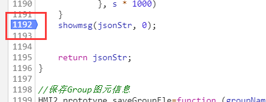

下面主要介绍几个常用板块：

##### 1.1 Nerwork

Network是网络工具，可以查看请求数据的状态，类型，大小，时间等，如下图。可以查看发送的请求是否正确，返回的数据是否正常等。


##### 1.2 Elements

元素面板，查看Web页面的HTML与CSS，最重要的是可以双击元素，对当前页面进行修改，调试页面样式会非常非常方便。


 

##### 1.3 Sources

Sources可以用来查看页面的源文件，包括JS文件和Html文件。找到想要调试的JS代码，在代码前单击，即可设置断点。当运行JS代码时，会自动进入到断点执行,可以单步运行、进入函数体内调试、直接运行到下一断点等。


当设置断点运行暂停后，我们需要手动控制代码的执行，

Sources有五个按钮来方便我们调试js问题，从左到右依次是恢复执行，跳过下一个函数，跳入下一个函数和跳出下一个函数以及逐步执行下一行


1）恢复执行

点击恢复执行按钮，代码就会跳到下一个断点处

2）跳过下一个函数

如果觉得代码中调用的某个函数是值得信任的，那么当代码执行到这一行时，可以点击跳过

3）跳入下一个函数

如果代码执行到某行调用了某个函数，可以点击跳入函数，继续执行

5）跳出下一个函数

如果不想继续查看调用函数的内部代码，可以点击跳出按钮，回到调用该函数的主流程中

6）逐步执行下一行

如果不知道哪里出了问题，希望一行行的查找问题，这个时候可以点击逐步执行按钮，这样代码就会按照执行逻辑一行一行的运行。


#### 2.代码调试


##### 

我们点击Sources中的Javascript代码文件，可以看出，这些代码是经过压缩的。如果直接阅读这一块代码，很快就会感到理解困难了。

我们点击下方的大括号｛｝图标，即可使用Pretty Print功能了。


会在一个新标签页面打开反压缩后并经过重新排版美化的Javascript代码。

#### 3.Network查看

```
如图所示，Chrome的Network面板主要由5个部分组成，包括控制器、过滤器、概览、请求列表、概要，下面简单介绍下这5个部分的作用。

控制器：控制面板的外观与功能

过滤器：过滤请求列表中显示的资源

按住Command（Mac）或Ctrl（Window/Linux），然后点击过滤器可以同时选择多个过滤器。
概览：显示HTTP请求、响应的时间轴。

请求列表：默认时间排序，可选择显示列。

概要：请求总数、总数据量、总花费时间等。
```

Network用来


```
initiator 标记请求是由哪个对象或进程发起的(请求源)
parser: 请求由 chrome 的 HTML 解析器发起
redirect: 请求是由 http 页面发起的重定向
script: 请求是由 script 脚本发起的
other: 请求是由其他进程发起的,比如用户点击一个链接跳转到另一个页面或者在地址栏输入 URL 地址
```


##### 3.3 查看资源详情

通过点击某个资源的Name可以查看该资源的详细信息，根据选择的资源类型显示的信息也不太一样，可能包括如下Tab信息：

Headers 该资源的HTTP头信息。
Preview 根据你所选择的资源类型（JSON、图片、文本）显示相应的预览。
Response 显示HTTP的Response信息。
Cookies 显示资源HTTP的Request和Response过程中的Cookies信息。
Timing 显示资源在整个请求生命周期过程中各部分花费的时间。


###### 3.3.1 资源HTTP头信息

在Headers标签里面可以看到HTTP Request URL、HTTP Method、Status Code、Remote Address等基本信息和详细的Response Headers 、Request Headers以及Query String Parameters或者Form Data等信息。

1. Request请求方法

```
1   GET     请求指定的页面信息，并返回实体主体。
2   HEAD    类似于get请求，只不过返回的响应中没有具体的内容，用于获取报头
3   POST    向指定资源提交数据进行处理请求（例如提交表单或者上传文件）。数据被包含在请求体中。POST请求可能会导致新的资源的建立和/或已有资源的修改。
4   PUT     从客户端向服务器传送的数据取代指定的文档的内容。
5   DELETE  请求服务器删除指定的页面。
6   CONNECT HTTP/1.1协议中预留给能够将连接改为管道方式的代理服务器。
7   OPTIONS 允许客户端查看服务器的性能。
8   TRACE   回显服务器收到的请求，主要用于测试或诊断。
9   PATCH   实体中包含一个表，表中说明与该URI所表示的原内容的区别。
10  MOVE    请求服务器将指定的页面移至另一个网络地址。
11  COPY    请求服务器将指定的页面拷贝至另一个网络地址。
12  LINK    请求服务器建立链接关系。
13  UNLINK  断开链接关系。
14  WRAPPED 允许客户端发送经过封装的请求。
15  Extension-mothed    在不改动协议的前提下，可增加另外的方法。
```


Status Code HTTP 状态码
Remote Address 服务器远程地址

Referrer
referrer是HTTP请求header的报文头，用于指明当前流量的来源参考页面。通过这个信息，我们可以知道访客是怎么来到当前页面的。这对于Web Analytics非常重要，可以用于分析不同渠道流量分布、用户搜索的关键词等。
但是，这个字段同时会造成用户敏感信息泄漏（如：带有敏感信息的重置密码URL，若被Web Analytics收集，则存在密码被重置的危险）。

Referrer Policy States
No Referrer：任何情况下都不发送Referrer信息

No Referrer When Downgrade：仅当协议降级（如HTTPS页面引入HTTP资源）时不发送Referrer信息。是大部分浏览器默认策略。

Origin Only：发送只包含host部分的referrer.

Origin When Cross-origin：仅在发生跨域访问时发送只包含host的Referer，同域下还是完整的。与Origin Only的区别是多判断了是否Cross-origin。协议、域名和端口都一致，浏览器才认为是同域。

Unsafe URL：全部都发送Referrer信息。最宽松最不安全的策略。

```

```


###### 3.3.2 资源预览信息

在Preview标签里面可根据选择的资源类型（JSON、图片、文本、JS、CSS）显示相应的预览信息。下图显示的是当选择的资源是JSON格式时的预览信息。

###### 3.3.3 资源Response信息

在Response标签里面可根据选择的资源类型（JSON、图片、文本、JS、CSS）显示相应资源的Response响应内容(纯字符串)。下图显示的是当选择的资源是CSS格式时的响应内容。

###### 3.3.4 6资源Cookies信息

如果选择的资源在Request和Response过程中存在Cookies信息，则Cookies标签会自动显示出来，在里面可以查看所有的Cookies信息。

###### 3.3.5 时间消耗：

 分析资源在请求的生命周期内各部分时间花费信息
在Timing标签中可以显示资源在整个请求生命周期过程中各部分时间花费信息，可能会涉及到如下过程的时间花费情况：
Queuing 排队的时间花费。可能由于该请求被渲染引擎认为是优先级比较低的资源（图片）、服务器不可用、超过浏览器的并发请求的最大连接数（Chrome的最大并发连接数为6）.
Stalled 从HTTP连接建立到请求能够被发出送出去(真正传输数据)之间的时间花费。包含用于处理代理的时间，如果有已经建立好的连接，这个时间还包括等待已建立连接被复用的时间。
Proxy Negotiation 与代理服务器连接的时间花费。
DNS Lookup 执行DNS查询的时间。网页上每一个新的域名都要经过一个DNS查询。第二次访问浏览器有缓存的话，则这个时间为0。
Initial Connection / Connecting 建立连接的时间花费，包含了TCP握手及重试时间。
SSL 完成SSL握手的时间花费。
Request sent 发起请求的时间。
Waiting (Time to first byte (TTFB)) 是最初的网络请求被发起到从服务器接收到第一个字节这段时间，它包含了TCP连接时间，发送HTTP请求时间和获得响应消息第一个字节的时间。
Content Download 获取Response响应数据的时间花费。

```

```


3.4 Capture screenshots（捕捉网页截图） 

Capture screenshots是自动分析DOM树的变化，截下DOM树变化各个重要阶段时的页面。除了截图外，还能看到每个截图所对应的Network情况，通过横向比较，可以发现一些请求（图片、js、css、xhr等）对页面的影响。

ctr+shift+i或者F12打开开发者工具；

打开Network面板，点亮左上角那个像是摄像机的图标（鼠标移上去会提示Capture screenshots）。

[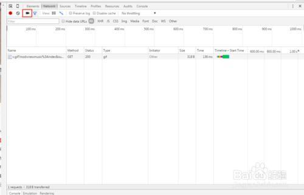](https://www.gwygd.com/upload/d/36/d36246f052acbc8a4de31d0efa017be5.jpg)

点亮该图标后，会打开新的一折叠面板，在该面板上会提示按Ctrl + R来启动截图。

[](https://www.gwygd.com/upload/2/8f/28f24d2e5af52dee59c972416538028b.jpg)

按Ctrl + R后，截图就自动完成了，如下图所示：

双击某截图就能看大图；

[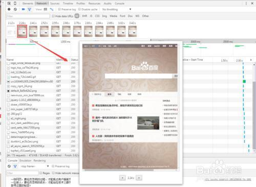](https://www.gwygd.com/upload/2/d4/2d4697117e63e58a61fe4009e15cd9e7.jpg)

点击选中某截图，就能查看该截图时刻的Network情况。

[](https://www.gwygd.com/upload/6/f0/6f0540c42c92191bb28d2466918409b5.jpg)


### 7.3 负载均衡


#### 四层负载均衡

四层负载均衡工作在 OSI 模型的传输层，由于在传输层，只有 TCP/UDP 协议，这两种协议中除了包含源 IP、目标 IP 以外，还包含源端口号及目的端口号。

四层负载均衡服务器在接受到客户端请求后，以后通过修改数据包的地址信息（ IP+端口号 ）将流量转发到应用服务器


#### 七层负载均衡

七层负载均衡工作在 OSI 模型的应用层，应用层协议较多，常用 HTTP、Radius、DNS 等。

七层负载就可以基于这些协议来负载。 这些应用层协议中会包含很多有意义的内容。


 

 

 


#### LVS

也就是 Linux 虚拟服务器，是一个由章文嵩博士发起的自由软件项目。 使用 LVS 技术要达到的目标是：通过 LVS 提供的负载均衡技术和 Linux 操作系统实现一个高性能、高可用的服务器群集，它具有良好可靠性、可扩展性和可操作性。从而以低廉的成本实现最优的服务性能。


 

 

阿里云当前提供四层和七层的负载均衡服务。

四层采用开源软件LVS（Linux Virtual Server）+ keepalived的方式实现负载均衡，并根据云计算需求对其进行了个性化定制。

七层采用Tengine实现负载均衡。Tengine是由淘宝网发起的Web服务器项目，它在Nginx的基础上，针对有大访问量的网站需求，添加了很多高级功能和特性

https://help.aliyun.com/document_detail/27544.html?spm=a2c4g.11186623.6.549.1e7969f7ADhDwE


 oot` 权限登录 Centos。确保 yum 包更新到最新。
